# SSIS Package: DCNterm

**Project:** HR_termDcn  
**Folder:** HR  

## Architecture Diagram

```mermaid
flowchart TD
    subgraph Connections
        dcnHeader_txt_conn(["dcnHeader.txt [FILE]"])
        DW_conn(["DW [OLEDB]"])
        Flat_File_Connection_Manager_conn(["Flat File Connection Manager [FLATFILE]"])
    end
    subgraph ControlFlow
        DCNterm_task["DCNterm"]
        Sequence_Container_task["Sequence Container"]
        DCNterm_task --> Sequence_Container_task
        Data_Flow_Task_task[/"Data Flow Task"/]
        Sequence_Container_task --> Data_Flow_Task_task
        Foreach_Loop_Container_task["Foreach Loop Container"]
        Data_Flow_Task_task --> Foreach_Loop_Container_task
        create_timestamped_file_task["create timestamped file"]
        Foreach_Loop_Container_task --> create_timestamped_file_task
        Execute_Process_task["Execute Process"]
        create_timestamped_file_task --> Execute_Process_task
        move_file_to_archive_task["move file to archive"]
        Execute_Process_task --> move_file_to_archive_task
        transfer_file_to_POS_server_task["transfer file to POS server"]
        move_file_to_archive_task --> transfer_file_to_POS_server_task
        RowCount_task["RowCount"]
        transfer_file_to_POS_server_task --> RowCount_task
    end
```

## Connection Managers

| Connection Name | Type |
|---|---|
| dcnHeader.txt | FILE |
| DW | OLEDB |
| Flat File Connection Manager | FLATFILE |

## Control Flow Tasks

| Task Name | Type |
|---|---|
| DCNterm | Microsoft.Package |
| Sequence Container | STOCK:SEQUENCE |
| Data Flow Task | Microsoft.Pipeline |
| Foreach Loop Container | STOCK:FOREACHLOOP |
| create timestamped file | Microsoft.FileSystemTask |
| Execute Process | Microsoft.ExecuteProcess |
| move file to archive | Microsoft.FileSystemTask |
| transfer file to POS server | Microsoft.FileSystemTask |
| RowCount | Microsoft.ExecuteSQLTask |

## Data Flow: Sources

| Component | Tables Referenced | SQL Preview |
|---|---|---|
|  |  | use dw  select 'Employee' as 'Employee', CAST(CAST(EepEEID AS INTEGER) AS VARCHAR) as 'number' from [dbo].[UHCMEmp] where EecOrgLvl1Code = 'STORE' and TerminatedEnteredDate > getdate()-1 and TerminatedEffectiveDate <= getdate() and EepCompanyCode = 'BABW' and EepEEID <> '0009999' order by EepEEID asc |

## Data Flow: Destinations

_No OLE DB data flow destinations detected._

