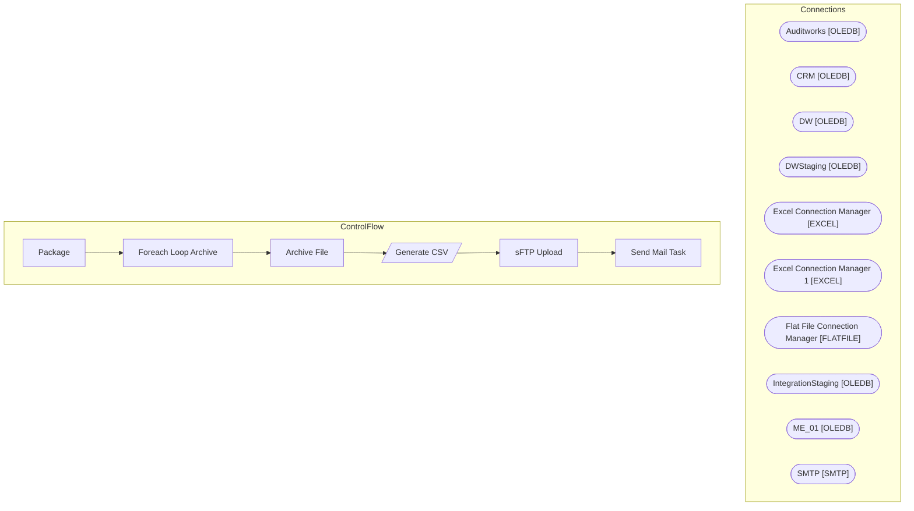

# SSIS Package: Package

**Project:** StoreForceLabor  
**Folder:** HR  

## Architecture Diagram

## Connection Managers

| Connection Name | Type |
|---|---|
| Auditworks | OLEDB |
| CRM | OLEDB |
| DW | OLEDB |
| DWStaging | OLEDB |
| Excel Connection Manager | EXCEL |
| Excel Connection Manager 1 | EXCEL |
| Flat File Connection Manager | FLATFILE |
| IntegrationStaging | OLEDB |
| ME_01 | OLEDB |
| SMTP | SMTP |

## Control Flow Tasks

| Task Name | Type |
|---|---|
| Package | Microsoft.Package |
| Foreach Loop Archive | STOCK:FOREACHLOOP |
| Archive File | Microsoft.FileSystemTask |
| Generate CSV | Microsoft.Pipeline |
| sFTP Upload | Microsoft.ExecuteSQLTask |
| Send Mail Task | Microsoft.SendMailTask |

## Data Flow: Sources

| Component | Tables Referenced | SQL Preview |
|---|---|---|
|  |  | With Dates as ( select Max(StartDate) as StartDate, Max(EndDate) as EndDate from PayPeriodDates Where StartDate < GetDate()  --and datediff(dd, StartDate, Getdate()) >= 14 and EndDate < GetDate() )  select *  from vwStoreForceLabor vw Join Dates d On vw.WorkDate between d.StartDate and d.EndDate |

## Data Flow: Destinations

| Component | Destination Table |
|---|---|
|  | [Azure].[DailyInvAvailToDist] |

