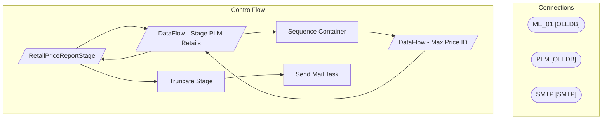

# SSIS Package: RetailPriceReportStage

**Project:** RetailPriceReportStage  
**Folder:** Merch  

## Architecture Diagram

## Connection Managers

| Connection Name | Type |
|---|---|
| ME_01 | OLEDB |
| PLM | OLEDB |
| SMTP | SMTP |

## Control Flow Tasks

| Task Name | Type |
|---|---|
| RetailPriceReportStage | Microsoft.Package |
| DataFlow - Stage PLM Retails | Microsoft.Pipeline |
| Sequence Container | STOCK:SEQUENCE |
| DataFlow - Max Price ID | Microsoft.Pipeline |
| DataFlow - Stage PLM Retails | Microsoft.Pipeline |
| RetailPriceReportStage | Microsoft.Pipeline |
| Truncate Stage | Microsoft.ExecuteSQLTask |
| Send Mail Task | Microsoft.SendMailTask |

## Data Flow: Sources

| Component | Tables Referenced | SQL Preview |
|---|---|---|
|  |  | select cast(style_code  as varchar) as Style from style with (nolock) where active_flag = 1 |
|  |  | SELECT cast(ap.babUSSKU as varchar(6)) AS 'SKU', 		   ap.babUSRetail AS 'Retail',  		   'US' AS PriceType, 		   ap._ExportedDate_ AS 'Last Export' 		FROM archive.products ap 		INNER JOIN 		(SELECT babUSSKU, MAX(_ExportedDate_) AS ed 		FROM archive.products 		GROUP BY babUSSKU) gap 		ON ap.babUSSKU = gap.babUSSKU 		AND ap._ExportedDate_ = gap.ED 		union 		SELECT cast(ap.BABDinoSKU as varchar(6)) AS |
|  |  | select  			cast(s.style_code as varchar(6)) as style_code, 			s.short_desc,   			ip.jurisdiction_id,  			max(ib_price_id) as ib_price_id  		  from dbo.style s (NOLOCK)   		  join ib_price ip (NOLOCK) on s.style_id = ip.style_id   		  join style_group sg (NOLOCK) on s.style_id = sg.style_id  		  join hierarchy_group hg (NOLOCK) on sg.hierarchy_group_id = hg.hierarchy_group_id  		  where  			left(IS |
|  |  | select cast(style_code  as varchar) as Style from style with (nolock) where active_flag = 1 |
|  |  | with  MaxExportDate as 	( 		SELECT  			babUSSKU,  			MAX(_ExportedDate_) AS ed 		FROM archive.products 		GROUP BY babUSSKU 	), US as 	( 		SELECT  			cast(ap.babUSSKU as varchar(6)) AS 'SKU', 			ap.babUSRetail AS 'Retail',  			'US' AS PriceType, 			ap._ExportedDate_ AS 'Last Export' 		FROM archive.products ap 		INNER JOIN MaxExportDate gap 			ON ap.babUSSKU = gap.babUSSKU 			AND ap._ExportedDate_ = |
|  |  | select   --data will return multiple rows until join enforced in the lookup to MerchMaxPriceIDStage 	j.jurisdiction_code, 	cast(s.style_code as varchar(6)) as style_code, 	s.short_desc,  	ecp.custom_property_value,   	case  		when ip.end_date is null   			then null   		else ip.document_number  	end as document_number,    	case  		when ip.end_date is null    			then null   		else ip.start_date   	e |

## Data Flow: Destinations

| Component | Destination Table |
|---|---|
|  | [PLMRetailsStage] |
|  | [MerchMaxPriceIDStage] |
|  | [PLMRetailsStage] |
|  | [RetailPriceReportDataStage] |

