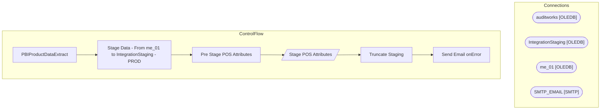

# SSIS Package: PBIProductDataExtract

**Project:** PBIProductDataExtract  
**Folder:** POS  

## Architecture Diagram

## Connection Managers

| Connection Name | Type |
|---|---|
| auditworks | OLEDB |
| IntegrationStaging | OLEDB |
| me_01 | OLEDB |
| SMTP_EMAIL | SMTP |

## Control Flow Tasks

| Task Name | Type |
|---|---|
| PBIProductDataExtract | Microsoft.Package |
| Stage Data - From me_01 to IntegrationStaging - PROD | STOCK:SEQUENCE |
| Pre Stage POS Attributes | Microsoft.ExecuteSQLTask |
| Stage POS Attributes | Microsoft.Pipeline |
| Truncate Staging | Microsoft.ExecuteSQLTask |
| Send Email onError | Microsoft.SendMailTask |

## Data Flow: Sources

| Component | Tables Referenced | SQL Preview |
|---|---|---|
|  |  | select * from [POS].[ProductCatalogMasterAttributesStage] |
|  |  | select * from [dbo].[vwPBIBundledSKU] |

## Data Flow: Destinations

| Component | Destination Table |
|---|---|
|  | [POS].[PBIProductCatalogMasterAttributesStage] |
|  | [dbo].[vwPBIProductCatalogWithHierarchyStage] |

