# SSIS Package: POS_ProductDataExtract

**Project:** POS_ProductDataExtract  
**Folder:** POS  

## Architecture Diagram

```mermaid
flowchart TD
    subgraph Connections
        auditworks_conn(["auditworks [OLEDB]"])
        IntegrationStaging_conn(["IntegrationStaging [OLEDB]"])
        me_01_conn(["me_01 [OLEDB]"])
        ProductsForPromotions_CSV_conn(["ProductsForPromotions CSV [FLATFILE]"])
        SMTP_EMAIL_conn(["SMTP_EMAIL [SMTP]"])
    end
    subgraph ControlFlow
        POS_ProductDataExtract_task["POS_ProductDataExtract"]
        Sequence_Container_task["Sequence Container"]
        POS_ProductDataExtract_task --> Sequence_Container_task
        SeqCont___Load_Tax_Item_Groups_Ref_Table_from_Auditworks_task["SeqCont - Load Tax Item Groups Ref Table from Auditworks"]
        Sequence_Container_task --> SeqCont___Load_Tax_Item_Groups_Ref_Table_from_Auditworks_task
        Stage_Tax_Ref_Table_task[/"Stage Tax Ref Table"/]
        SeqCont___Load_Tax_Item_Groups_Ref_Table_from_Auditworks_task --> Stage_Tax_Ref_Table_task
        Truncate_Stage_task["Truncate Stage"]
        Stage_Tax_Ref_Table_task --> Truncate_Stage_task
        Stage_Data___From_me_01_to_IntegrationStaging___DEV_task["Stage Data - From me_01 to IntegrationStaging - DEV"]
        Truncate_Stage_task --> Stage_Data___From_me_01_to_IntegrationStaging___DEV_task
        Pre_Stage_POS_Attributes_task["Pre Stage POS Attributes"]
        Stage_Data___From_me_01_to_IntegrationStaging___DEV_task --> Pre_Stage_POS_Attributes_task
        Stage_POS_Attributes_task[/"Stage POS Attributes"/]
        Pre_Stage_POS_Attributes_task --> Stage_POS_Attributes_task
        Truncate_Staging_task["Truncate Staging"]
        Stage_POS_Attributes_task --> Truncate_Staging_task
        Stage_Data___From_me_01_to_IntegrationStaging___PROD_task["Stage Data - From me_01 to IntegrationStaging - PROD"]
        Truncate_Staging_task --> Stage_Data___From_me_01_to_IntegrationStaging___PROD_task
        Merge_POS_ProductCatalogMasterAttributesStage_task["Merge POS ProductCatalogMasterAttributesStage"]
        Stage_Data___From_me_01_to_IntegrationStaging___PROD_task --> Merge_POS_ProductCatalogMasterAttributesStage_task
        Products_CSV_task[/"Products CSV"/]
        Merge_POS_ProductCatalogMasterAttributesStage_task --> Products_CSV_task
        Send_Mail_Task_task["Send Mail Task"]
        Products_CSV_task --> Send_Mail_Task_task
        spPOSSelectProductCatalogMasterAttributes_task["spPOSSelectProductCatalogMasterAttributes"]
        Send_Mail_Task_task --> spPOSSelectProductCatalogMasterAttributes_task
        spPosStagePOSProductCatalogWithHierarchyStage_task["spPosStagePOSProductCatalogWithHierarchyStage"]
        spPOSSelectProductCatalogMasterAttributes_task --> spPosStagePOSProductCatalogWithHierarchyStage_task
        Stage_POS_Attributes_task[/"Stage POS Attributes"/]
        spPosStagePOSProductCatalogWithHierarchyStage_task --> Stage_POS_Attributes_task
        Truncate_Staging_task["Truncate Staging"]
        Stage_POS_Attributes_task --> Truncate_Staging_task
        Send_Email_onError_task["Send Email onError"]
        Truncate_Staging_task --> Send_Email_onError_task
    end
```

## Connection Managers

| Connection Name | Type |
|---|---|
| auditworks | OLEDB |
| IntegrationStaging | OLEDB |
| me_01 | OLEDB |
| ProductsForPromotions CSV | FLATFILE |
| SMTP_EMAIL | SMTP |

## Control Flow Tasks

| Task Name | Type |
|---|---|
| POS_ProductDataExtract | Microsoft.Package |
| Sequence Container | STOCK:SEQUENCE |
| SeqCont - Load Tax Item Groups Ref Table from Auditworks | STOCK:SEQUENCE |
| Stage Tax Ref Table | Microsoft.Pipeline |
| Truncate Stage | Microsoft.ExecuteSQLTask |
| Stage Data - From me_01 to IntegrationStaging - DEV | STOCK:SEQUENCE |
| Pre Stage POS Attributes | Microsoft.ExecuteSQLTask |
| Stage POS Attributes | Microsoft.Pipeline |
| Truncate Staging | Microsoft.ExecuteSQLTask |
| Stage Data - From me_01 to IntegrationStaging - PROD | STOCK:SEQUENCE |
| Merge POS ProductCatalogMasterAttributesStage | Microsoft.ExecuteSQLTask |
| Products CSV | Microsoft.Pipeline |
| Send Mail Task | Microsoft.SendMailTask |
| spPOSSelectProductCatalogMasterAttributes | Microsoft.ExecuteSQLTask |
| spPosStagePOSProductCatalogWithHierarchyStage | Microsoft.ExecuteSQLTask |
| Stage POS Attributes | Microsoft.Pipeline |
| Truncate Staging | Microsoft.ExecuteSQLTask |
| Send Email onError | Microsoft.SendMailTask |

## Data Flow: Sources

| Component | Tables Referenced | SQL Preview |
|---|---|---|
|  |  | select 	upc.style_code, 	upc.style_short_description, 	c.class_description, 	tig.tax_item_group_description, 	tig.tax_item_group_id --into #StyleTaxItemGroup from upc_sa upc with (nolock) --these are views join sku_sa sku with (nolock) --these are views 	on upc.upc_lookup_division=sku.upc_lookup_division 	and upc.upc_no=sku.upc_no join class_sa c with (nolock) --these are views 	on upc.class_code= |
|  |  | select  	ph.StyleCode as ProductNumber, 	case  		when left(ph.StyleCode,1) in ('0','2','3') then 'US' 		when left(ph.StyleCode,1) in ('4','5','6') then 'UK' 		when Left(ph.StyleCode,1) = '1' then 'CA' 	end as ProductCountry, 	p.UPC,	 	--ph.short_desc as ProductDescription, 	p.AccessoryType,	 	p.AnimalSoldSeparately,	 	p.AsthmaFriendly,	 	p.ColorCode,	 	p.LicensedCollection,	 	p.BirthCertificateReq |
|  |  | select distinct  	StyleCode	 	,ItemName	 	,ProductCountry	 	,ItemType	 	,BaseID	 	,KeyStory	 	,Chain	 	,Division	 	,Department	 	,Class	 	,SubClass	 	,ChainCode	 	,DivisionCode	 	,DepartmentCode	 	,ClassCode	 	,SubClassCode	 	,AccessoryType	 	,AnimalSoldSeparately	 	,AsthmaFriendly	 	,LicensedCollection	 	,BirthCertificateRequired	 	,BodyType	 	,Bottoms	 	,Boy	 	,DisplayOnAmazon	 	,WebExclusive	 	 |
|  |  | select * from [dbo].[vwPBIBundledSKU] |

## Data Flow: Destinations

| Component | Destination Table |
|---|---|
|  | [dbo].[POSAwTaxGroupReferenceStage] |
|  | [POS].[ProductCatalogMasterAttributesStage] |
|  | [dbo].[vwPOSProductCatalogWithHierarchyStage] |
|  | [dbo].[tmpPOSProductCatalogWithHierarchyStage] |
|  | [POS].[ProductCatalogMasterAttributesPreStage] |

