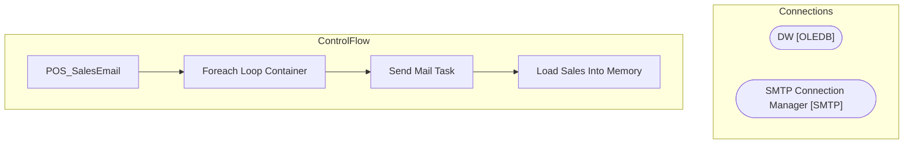

# SSIS Package: POS_SalesEmail

**Project:** POS_SalesEmail  
**Folder:** POS  

## Architecture Diagram

## Connection Managers

| Connection Name | Type |
|---|---|
| DW | OLEDB |
| SMTP Connection Manager | SMTP |

## Control Flow Tasks

| Task Name | Type |
|---|---|
| POS_SalesEmail | Microsoft.Package |
| Foreach Loop Container | STOCK:FOREACHLOOP |
| Send Mail Task | Microsoft.SendMailTask |
| Load Sales Into Memory | Microsoft.ExecuteSQLTask |

## Data Flow: Sources

_No OLE DB data flow sources detected._

## Data Flow: Destinations

_No OLE DB data flow destinations detected._

