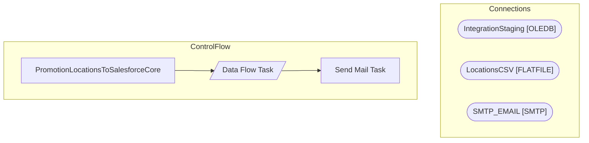

# SSIS Package: PromotionLocationsToSalesforceCore

**Project:** PromotionLocationsToSalesforceCore  
**Folder:** POS  

## Architecture Diagram

## Connection Managers

| Connection Name | Type |
|---|---|
| IntegrationStaging | OLEDB |
| LocationsCSV | FLATFILE |
| SMTP_EMAIL | SMTP |

## Control Flow Tasks

| Task Name | Type |
|---|---|
| PromotionLocationsToSalesforceCore | Microsoft.Package |
| Data Flow Task | Microsoft.Pipeline |
| Send Mail Task | Microsoft.SendMailTask |

## Data Flow: Sources

| Component | Tables Referenced | SQL Preview |
|---|---|---|
|  |  | select  	Code as LocationCode, 	case  		when Code >=2000  			then Code 		else concat(cast('1' as varchar), right(Code,3)) 	end as LocationNumber, 	LocationName, 	LocationType, 	Country  from web.LocationStage |

## Data Flow: Destinations

_No OLE DB data flow destinations detected._

