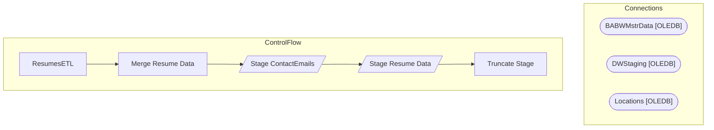

# SSIS Package: ResumesETL

**Project:** ResumesETL  
**Folder:** Papamart  

## Architecture Diagram

## Connection Managers

| Connection Name | Type |
|---|---|
| BABWMstrData | OLEDB |
| DWStaging | OLEDB |
| Locations | OLEDB |

## Control Flow Tasks

| Task Name | Type |
|---|---|
| ResumesETL | Microsoft.Package |
| Merge Resume Data | Microsoft.ExecuteSQLTask |
| Stage ContactEmails | Microsoft.Pipeline |
| Stage Resume Data | Microsoft.Pipeline |
| Truncate Stage | Microsoft.ExecuteSQLTask |

## Data Flow: Sources

_No OLE DB data flow sources detected._

## Data Flow: Destinations

| Component | Destination Table |
|---|---|
|  | [dbo].[vwContactEmails] |
|  | [ContactEmailStage] |
|  | [dbo].[ResumeStage] |

