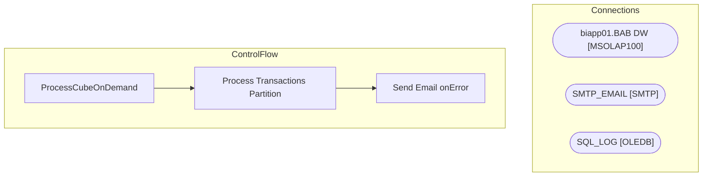

# SSIS Package: ProcessCubeOnDemand

**Project:** CUBE  
**Folder:** SSIS  

## Architecture Diagram

## Connection Managers

| Connection Name | Type |
|---|---|
| biapp01.BAB DW | MSOLAP100 |
| SMTP_EMAIL | SMTP |
| SQL_LOG | OLEDB |

## Control Flow Tasks

| Task Name | Type |
|---|---|
| ProcessCubeOnDemand | Microsoft.Package |
| Process Transactions Partition | Microsoft.DTSProcessingTask |
| Send Email onError | Microsoft.SendMailTask |

## Data Flow: Sources

_No OLE DB data flow sources detected._

## Data Flow: Destinations

_No OLE DB data flow destinations detected._

