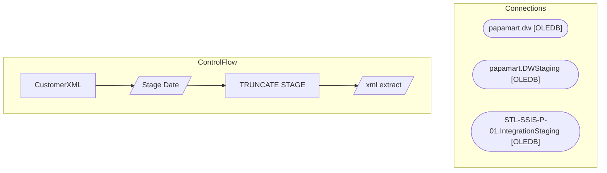

# SSIS Package: CustomerXML

**Project:** CustomerXMLExtract  
**Folder:** SSIS  

## Architecture Diagram

## Connection Managers

| Connection Name | Type |
|---|---|
| papamart.dw | OLEDB |
| papamart.DWStaging | OLEDB |
| STL-SSIS-P-01.IntegrationStaging | OLEDB |

## Control Flow Tasks

| Task Name | Type |
|---|---|
| CustomerXML | Microsoft.Package |
| Stage Date | Microsoft.Pipeline |
| TRUNCATE STAGE | Microsoft.ExecuteSQLTask |
| xml extract | Microsoft.Pipeline |

## Data Flow: Sources

| Component | Tables Referenced | SQL Preview |
|---|---|---|
|  |  | select p.EmailAddress, p.LastLoginTime, a2.text  from CustomerXMLExport_ProfileDataStage p join CustomerXMLExport_AttributeStage1 a1 on p.ProfileID = a1.profileID  join CustomerXMLExport_AttributeStage2 a2 on a1.AttributeID = a2.CustomAttributeID and a2.AttributeID = 'crmCustomerNumber' |

## Data Flow: Destinations

| Component | Destination Table |
|---|---|
|  | [dbo].[CustomerXMLExport] |
|  | [dbo].[CustomerXMLExport_AttributeStage1] |
|  | [dbo].[CustomerXMLExport_AttributeStage2] |
|  | [dbo].[CustomerXMLExport_ProfileDataStage] |

