# SSIS Package: PFTOpentoBuy

**Project:** ERPSuppliesProcessing  
**Folder:** SSIS  

## Architecture Diagram

```mermaid
flowchart TD
    subgraph Connections
        Inventory_Movement_Journal_Entries_conn(["Inventory Movement Journal Entries [FLATFILE]"])
        SMTP_EMAIL_conn(["SMTP_EMAIL [SMTP]"])
        SQL_LOG_conn(["SQL_LOG [OLEDB]"])
        Warehouse_on_Hand_conn(["Warehouse on Hand [FLATFILE]"])
    end
    subgraph ControlFlow
        PFTOpentoBuy_task["PFTOpentoBuy"]
        Sequence_Container_task["Sequence Container"]
        PFTOpentoBuy_task --> Sequence_Container_task
        FLC___Get_Inventory_Movement_from_dynsnc_task["FLC - Get Inventory Movement from dynsnc"]
        Sequence_Container_task --> FLC___Get_Inventory_Movement_from_dynsnc_task
        Move_Files_to_Stage_task["Move Files to Stage"]
        FLC___Get_Inventory_Movement_from_dynsnc_task --> Move_Files_to_Stage_task
        FLC___Get_Warehouse_On_Hand_from_dynsnc_task["FLC - Get Warehouse On Hand from dynsnc"]
        Move_Files_to_Stage_task --> FLC___Get_Warehouse_On_Hand_from_dynsnc_task
        Move_Files_to_Stage_task["Move Files to Stage"]
        FLC___Get_Warehouse_On_Hand_from_dynsnc_task --> Move_Files_to_Stage_task
        FLC___Process_Inventory_Movement_from_dynsnc_task["FLC - Process Inventory Movement from dynsnc"]
        Move_Files_to_Stage_task --> FLC___Process_Inventory_Movement_from_dynsnc_task
        DFT___Get_ERP_Supply_Movement_Data_task[/"DFT - Get ERP Supply Movement Data"/]
        FLC___Process_Inventory_Movement_from_dynsnc_task --> DFT___Get_ERP_Supply_Movement_Data_task
        Move_Files_to_Archive_task["Move Files to Archive"]
        DFT___Get_ERP_Supply_Movement_Data_task --> Move_Files_to_Archive_task
        FLC___Process_Warehouse_On_Hand_from_dynsnc_task["FLC - Process Warehouse On Hand from dynsnc"]
        Move_Files_to_Archive_task --> FLC___Process_Warehouse_On_Hand_from_dynsnc_task
        DFT___Get_Warehouse_On_Hand_Data_task[/"DFT - Get Warehouse On Hand Data"/]
        FLC___Process_Warehouse_On_Hand_from_dynsnc_task --> DFT___Get_Warehouse_On_Hand_Data_task
        Move_Files_to_Archive_task["Move Files to Archive"]
        DFT___Get_Warehouse_On_Hand_Data_task --> Move_Files_to_Archive_task
        Script_Task_task["Script Task"]
        Move_Files_to_Archive_task --> Script_Task_task
        Send_Email_onError_task["Send Email onError"]
        Script_Task_task --> Send_Email_onError_task
    end
```

## Connection Managers

| Connection Name | Type |
|---|---|
| Inventory Movement Journal Entries | FLATFILE |
| SMTP_EMAIL | SMTP |
| SQL_LOG | OLEDB |
| Warehouse on Hand | FLATFILE |

## Control Flow Tasks

| Task Name | Type |
|---|---|
| PFTOpentoBuy | Microsoft.Package |
| Sequence Container | STOCK:SEQUENCE |
| FLC - Get Inventory Movement from dynsnc | STOCK:FOREACHLOOP |
| Move Files to Stage | Microsoft.FileSystemTask |
| FLC - Get Warehouse On Hand from dynsnc | STOCK:FOREACHLOOP |
| Move Files to Stage | Microsoft.FileSystemTask |
| FLC - Process Inventory Movement from dynsnc | STOCK:FOREACHLOOP |
| DFT - Get ERP Supply Movement Data | Microsoft.Pipeline |
| Move Files to Archive | Microsoft.FileSystemTask |
| FLC - Process Warehouse On Hand from dynsnc | STOCK:FOREACHLOOP |
| DFT - Get Warehouse On Hand Data | Microsoft.Pipeline |
| Move Files to Archive | Microsoft.FileSystemTask |
| Script Task | Microsoft.ScriptTask |
| Send Email onError | Microsoft.SendMailTask |

## Data Flow: Sources

| Component | Tables Referenced | SQL Preview |
|---|---|---|
|  |  | select * from [ERP].[InventoryMovementJournalEntryStage] |
|  |  | select * from [ERP].[InventoryMovementJournalEntryStage] |
|  |  |  UPDATE [IntegrationStaging].[ERP].[InventoryMovementJournalEntryStage]   SET [productConfigurationId] = ?       ,[inventoryStatusId] = ?       ,[productSizeId] = ?       ,[itemSerialNumber] = ?       ,[fixedCostCharges] = ?       ,[inventoryQuantity] = ?       ,[unitCostQuantity] = ?       ,[costAmount] = ?       ,[itemBatchNumber] = ?       ,[unitCost] = ?       ,[productColorId] = ?       ,[cat |
|  |  | select * from [ERP].[WarehouseOnHand] |
|  |  | select * from [ERP].[WarehouseOnHand] |
|  |  |   UPDATE [IntegrationStaging].[ERP].[WarehouseOnHand]   SET  [ProductColorId] = ?       ,[ProductConfigurationId] = ?        ,[ProductSizeId] = ?       ,[ProductStyleId] = ?       ,[AvailableOrderedQuantity] = ?       ,[OnHandQuantity] = ?       ,[AvailableOnHandQuantity] = ?       ,[OnOrderQuantity] = ?       ,[TotalAvailableQuantity] = ?       ,[OrderedQuantity] = ?       ,[AreWarehouseManagemen |

## Data Flow: Destinations

| Component | Destination Table |
|---|---|
|  | [ERP].[InventoryMovementJournalEntryStage] |
|  | [ERP].[WarehouseOnHand] |

