# SSIS Package: ERP_ItemMasterToWM3PL

**Project:** ERP_ItemMasterToWM3PL  
**Folder:** SSIS  

## Architecture Diagram

```mermaid
flowchart TD
    subgraph Connections
        CNItemMasterCSV_conn(["CNItemMasterCSV [FLATFILE]"])
        IntegrationStaging_conn(["IntegrationStaging [OLEDB]"])
        SMTP_EMAIL_conn(["SMTP_EMAIL [SMTP]"])
        SQL_LOG_conn(["SQL_LOG [OLEDB]"])
        WCItemMasterCSV_conn(["WCItemMasterCSV [FLATFILE]"])
        WM_conn(["WM [OLEDB]"])
    end
    subgraph ControlFlow
        ERP_ItemMasterToWM3PL_task["ERP_ItemMasterToWM3PL"]
        Data_Flow_Task_task[/"Data Flow Task"/]
        ERP_ItemMasterToWM3PL_task --> Data_Flow_Task_task
        Generate_File_Sequence_task["Generate File Sequence"]
        Data_Flow_Task_task --> Generate_File_Sequence_task
        CN_File_Sequence_task["CN File Sequence"]
        Generate_File_Sequence_task --> CN_File_Sequence_task
        CN_ItemMasterCSV_task[/"CN ItemMasterCSV"/]
        CN_File_Sequence_task --> CN_ItemMasterCSV_task
        Count_CN_Items_task["Count CN Items"]
        CN_ItemMasterCSV_task --> Count_CN_Items_task
        Delete_Old_Files___CN_task["Delete Old Files - CN"]
        Count_CN_Items_task --> Delete_Old_Files___CN_task
        Foreach_Loop___CN_Files_task["Foreach Loop - CN Files"]
        Delete_Old_Files___CN_task --> Foreach_Loop___CN_Files_task
        Archive_File_task["Archive File"]
        Foreach_Loop___CN_Files_task --> Archive_File_task
        Move_File__to_CN_task["Move File  to CN"]
        Archive_File_task --> Move_File__to_CN_task
        UK_File_Sequence_task["UK File Sequence"]
        Move_File__to_CN_task --> UK_File_Sequence_task
        Count_UK_Items_task["Count UK Items"]
        UK_File_Sequence_task --> Count_UK_Items_task
        Delete_Old_Files___UK_task["Delete Old Files - UK"]
        Count_UK_Items_task --> Delete_Old_Files___UK_task
        Foreach_Loop___UK_Files_task["Foreach Loop - UK Files"]
        Delete_Old_Files___UK_task --> Foreach_Loop___UK_Files_task
        Archive_File_task["Archive File"]
        Foreach_Loop___UK_Files_task --> Archive_File_task
        Move_File__to_UK_task["Move File  to UK"]
        Archive_File_task --> Move_File__to_UK_task
        spOutputItemMasterUKxml_task["spOutputItemMasterUKxml"]
        Move_File__to_UK_task --> spOutputItemMasterUKxml_task
        WC_File_Sequence_task["WC File Sequence"]
        spOutputItemMasterUKxml_task --> WC_File_Sequence_task
        Count_WC_Items_task["Count WC Items"]
        WC_File_Sequence_task --> Count_WC_Items_task
        Delete_Old_Files___WC_task["Delete Old Files - WC"]
        Count_WC_Items_task --> Delete_Old_Files___WC_task
        Foreach_Loop___WC_Files_task["Foreach Loop - WC Files"]
        Delete_Old_Files___WC_task --> Foreach_Loop___WC_Files_task
        Archive_File_task["Archive File"]
        Foreach_Loop___WC_Files_task --> Archive_File_task
        Move_File__to_WC_task["Move File  to WC"]
        Archive_File_task --> Move_File__to_WC_task
        WC_ItemMaster_CSV_task[/"WC ItemMaster CSV"/]
        Move_File__to_WC_task --> WC_ItemMaster_CSV_task
        WM_File_Sequence_task["WM File Sequence"]
        WC_ItemMaster_CSV_task --> WM_File_Sequence_task
        Country_of_Origin_task[/"Country of Origin"/]
        WM_File_Sequence_task --> Country_of_Origin_task
        Delete_Old_Files___WM_task["Delete Old Files - WM"]
        Country_of_Origin_task --> Delete_Old_Files___WM_task
        Foreach_Loop___WM_Files_task["Foreach Loop - WM Files"]
        Delete_Old_Files___WM_task --> Foreach_Loop___WM_Files_task
        Archive_File_task["Archive File"]
        Foreach_Loop___WM_Files_task --> Archive_File_task
        Move_File__to_WM_task["Move File  to WM"]
        Archive_File_task --> Move_File__to_WM_task
        Item_Master_HTS_task[/"Item_Master_HTS"/]
        Move_File__to_WM_task --> Item_Master_HTS_task
        spOutputItemMasterWMxml_task["spOutputItemMasterWMxml"]
        Item_Master_HTS_task --> spOutputItemMasterWMxml_task
        Stage_Data_Sequence_task["Stage Data Sequence"]
        spOutputItemMasterWMxml_task --> Stage_Data_Sequence_task
        Merge_ItemMasterData_task["Merge ItemMasterData"]
        Stage_Data_Sequence_task --> Merge_ItemMasterData_task
        Stage_ItemMaster_Data_task[/"Stage ItemMaster Data"/]
        Merge_ItemMasterData_task --> Stage_ItemMaster_Data_task
        Truncate_Stage_task["Truncate Stage"]
        Stage_ItemMaster_Data_task --> Truncate_Stage_task
        Send_Email_onError_task["Send Email onError"]
        Truncate_Stage_task --> Send_Email_onError_task
    end
```

## Connection Managers

| Connection Name | Type |
|---|---|
| CNItemMasterCSV | FLATFILE |
| IntegrationStaging | OLEDB |
| SMTP_EMAIL | SMTP |
| SQL_LOG | OLEDB |
| WCItemMasterCSV | FLATFILE |
| WM | OLEDB |

## Control Flow Tasks

| Task Name | Type |
|---|---|
| ERP_ItemMasterToWM3PL | Microsoft.Package |
| Data Flow Task | Microsoft.Pipeline |
| Generate File Sequence | STOCK:SEQUENCE |
| CN File Sequence | STOCK:SEQUENCE |
| CN ItemMasterCSV | Microsoft.Pipeline |
| Count CN Items | Microsoft.ExecuteSQLTask |
| Delete Old Files - CN | Microsoft.ExecuteSQLTask |
| Foreach Loop - CN Files | STOCK:FOREACHLOOP |
| Archive File | Microsoft.FileSystemTask |
| Move File  to CN | Microsoft.FileSystemTask |
| UK File Sequence | STOCK:SEQUENCE |
| Count UK Items | Microsoft.ExecuteSQLTask |
| Delete Old Files - UK | Microsoft.ExecuteSQLTask |
| Foreach Loop - UK Files | STOCK:FOREACHLOOP |
| Archive File | Microsoft.FileSystemTask |
| Move File  to UK | Microsoft.FileSystemTask |
| spOutputItemMasterUKxml | Microsoft.ExecuteSQLTask |
| WC File Sequence | STOCK:SEQUENCE |
| Count WC Items | Microsoft.ExecuteSQLTask |
| Delete Old Files - WC | Microsoft.ExecuteSQLTask |
| Foreach Loop - WC Files | STOCK:FOREACHLOOP |
| Archive File | Microsoft.FileSystemTask |
| Move File  to WC | Microsoft.FileSystemTask |
| WC ItemMaster CSV | Microsoft.Pipeline |
| WM File Sequence | STOCK:SEQUENCE |
| Country of Origin | Microsoft.Pipeline |
| Delete Old Files - WM | Microsoft.ExecuteSQLTask |
| Foreach Loop - WM Files | STOCK:FOREACHLOOP |
| Archive File | Microsoft.FileSystemTask |
| Move File  to WM | Microsoft.FileSystemTask |
| Item_Master_HTS | Microsoft.Pipeline |
| spOutputItemMasterWMxml | Microsoft.ExecuteSQLTask |
| Stage Data Sequence | STOCK:SEQUENCE |
| Merge ItemMasterData | Microsoft.ExecuteSQLTask |
| Stage ItemMaster Data | Microsoft.Pipeline |
| Truncate Stage | Microsoft.ExecuteSQLTask |
| Send Email onError | Microsoft.SendMailTask |

## Data Flow: Sources

| Component | Tables Referenced | SQL Preview |
|---|---|---|
|  |  | select style, hts_nbr, orgn_cert_code from item_master  where store_dept = 'sup' |
|  |  | select  			style as Style, 			HTS, 			orgn_cert_code  		from erp.ItemMasterToWM with (nolock)  		where entity = 1100 |
|  |  | update item_master set orgn_cert_code = ? where style = ? |
|  |  | select cast(right(ProductNumber,6) as varchar) as Style, cast(FactoryCountry as varchar(2) ) as CountyOfOrigin from ERP.vwItemFactoryMaster where Entity = '1100' and left(ProductNumber,1) = 'S' |
|  |  | select  	cast(right(ProductNumber, 6) as varchar(6)) StyleCode, 	cast(HARMONIZEDSYSTEMCODE as varchar(7)) as	AE, 	cast(HARMONIZEDSYSTEMCODE as varchar(7)) as AU, 	cast(HARMONIZEDSYSTEMCODE as varchar(7)) as	BE, 	cast(HARMONIZEDSYSTEMCODE as varchar(7)) as CA, 	cast(HARMONIZEDSYSTEMCODE as varchar(7)) as	DE, 	cast(HARMONIZEDSYSTEMCODE as varchar(7)) as	DK, 	cast(HARMONIZEDSYSTEMCODE as varchar(7))  |
|  |  | select * from [dbo].[item_master_hts] |
|  |  | update item_master_hts set  	AE = ?,	 	AU = ?,	 	BE = ?,	 	CA = ?,	 	DE = ?,	 	DK = ?,	 	FR = ?,	 	IE = ?,	 	JP = ?,	 	KR = ?,	 	MX = ?,	 	NL = ?,	 	NO = ?,	 	RU = ?,	 	SE = ?,	 	G = ?,	 	TH = ?,	 	TW = ?,	 	UK = ?,	 	ZA = ? where style_code = ?   |

## Data Flow: Destinations

| Component | Destination Table |
|---|---|
|  | [ItemMasterUpdateStage] |
|  | [ERP].[vwItemMasterCN] |
|  | [ERP].[vwItemMasterWC] |
|  | [ERP].[vwItemFactoryMaster] |
|  | [dbo].[item_master_hts] |
|  | [ERP].[ItemMasterToWMStage] |
|  | [ERP].[vwItemMasterWM] |

