# SSIS Package: ERP_MasterData

**Project:** ERP_MasterDataETL  
**Folder:** SSIS  

## Architecture Diagram

```mermaid
flowchart TD
    subgraph Connections
        IntegrationStaging_conn(["IntegrationStaging [OLEDB]"])
        SMTP_EMAIL_conn(["SMTP_EMAIL [SMTP]"])
    end
    subgraph ControlFlow
        ERP_MasterData_task["ERP_MasterData"]
        Data_Load_Sequence_task["Data Load Sequence"]
        ERP_MasterData_task --> Data_Load_Sequence_task
        Foreach_Loop___Item_Master___Products_XML_task["Foreach Loop - Item Master - Products XML"]
        Data_Load_Sequence_task --> Foreach_Loop___Item_Master___Products_XML_task
        Archive_File_task["Archive File"]
        Foreach_Loop___Item_Master___Products_XML_task --> Archive_File_task
        Data_Flow___ItemMasterProducts_XML_task[/"Data Flow - ItemMasterProducts XML"/]
        Archive_File_task --> Data_Flow___ItemMasterProducts_XML_task
        Delete_Old_Files_task["Delete Old Files"]
        Data_Flow___ItemMasterProducts_XML_task --> Delete_Old_Files_task
        Error_File_task["Error File"]
        Delete_Old_Files_task --> Error_File_task
        Merge_ItemMasterProducts_task["Merge ItemMasterProducts"]
        Error_File_task --> Merge_ItemMasterProducts_task
        Products___Log_Start_task["Products - Log Start"]
        Merge_ItemMasterProducts_task --> Products___Log_Start_task
        Stage_File_task["Stage File"]
        Products___Log_Start_task --> Stage_File_task
        Truncate_Stage_task["Truncate Stage"]
        Stage_File_task --> Truncate_Stage_task
        Update_Log___Archive_File_task["Update Log - Archive File"]
        Truncate_Stage_task --> Update_Log___Archive_File_task
        Update_Log___Error_File_task["Update Log - Error File"]
        Update_Log___Archive_File_task --> Update_Log___Error_File_task
        Update_Log___Merge_Error_task["Update Log - Merge Error"]
        Update_Log___Error_File_task --> Update_Log___Merge_Error_task
        Update_Log___Success_task["Update Log - Success"]
        Update_Log___Merge_Error_task --> Update_Log___Success_task
        Foreach_Loop___Item_Master_UOM_XML_task["Foreach Loop - Item Master UOM XML"]
        Update_Log___Success_task --> Foreach_Loop___Item_Master_UOM_XML_task
        Archive_File_task["Archive File"]
        Foreach_Loop___Item_Master_UOM_XML_task --> Archive_File_task
        Data_Flow___Items_UOM_XML_task[/"Data Flow - Items UOM XML"/]
        Archive_File_task --> Data_Flow___Items_UOM_XML_task
        Delete_Old_Files_task["Delete Old Files"]
        Data_Flow___Items_UOM_XML_task --> Delete_Old_Files_task
        Error_File_task["Error File"]
        Delete_Old_Files_task --> Error_File_task
        Merge_Items_UOM_task["Merge Items UOM"]
        Error_File_task --> Merge_Items_UOM_task
        Stage_File_task["Stage File"]
        Merge_Items_UOM_task --> Stage_File_task
        Truncate_Stage_task["Truncate Stage"]
        Stage_File_task --> Truncate_Stage_task
        UOM___Log_Start_task["UOM - Log Start"]
        Truncate_Stage_task --> UOM___Log_Start_task
        Update_Log___Archive_File_task["Update Log - Archive File"]
        UOM___Log_Start_task --> Update_Log___Archive_File_task
        Update_Log___Error_File_task["Update Log - Error File"]
        Update_Log___Archive_File_task --> Update_Log___Error_File_task
        Update_Log___Merge_Error_task["Update Log - Merge Error"]
        Update_Log___Error_File_task --> Update_Log___Merge_Error_task
        Update_Log___Success_task["Update Log - Success"]
        Update_Log___Merge_Error_task --> Update_Log___Success_task
        Foreach_Loop___Item_Master_XML_task["Foreach Loop - Item Master XML"]
        Update_Log___Success_task --> Foreach_Loop___Item_Master_XML_task
        Archive_File_task["Archive File"]
        Foreach_Loop___Item_Master_XML_task --> Archive_File_task
        Data_Flow___Item_Master_XML_task[/"Data Flow - Item Master XML"/]
        Archive_File_task --> Data_Flow___Item_Master_XML_task
        Delete_Old_Files_task["Delete Old Files"]
        Data_Flow___Item_Master_XML_task --> Delete_Old_Files_task
        Error_File_task["Error File"]
        Delete_Old_Files_task --> Error_File_task
        ItemMaster___Log_Start_task["ItemMaster - Log Start"]
        Error_File_task --> ItemMaster___Log_Start_task
        Merge_ItemMaster_task["Merge ItemMaster"]
        ItemMaster___Log_Start_task --> Merge_ItemMaster_task
        Stage_File_task["Stage File"]
        Merge_ItemMaster_task --> Stage_File_task
        Truncate_Stage_task["Truncate Stage"]
        Stage_File_task --> Truncate_Stage_task
        Update_Log___Archive_File_task["Update Log - Archive File"]
        Truncate_Stage_task --> Update_Log___Archive_File_task
        Update_Log___Error_File_task["Update Log - Error File"]
        Update_Log___Archive_File_task --> Update_Log___Error_File_task
        Update_Log___Merge_Error_task["Update Log - Merge Error"]
        Update_Log___Error_File_task --> Update_Log___Merge_Error_task
        Update_Log___Success_task["Update Log - Success"]
        Update_Log___Merge_Error_task --> Update_Log___Success_task
        Foreach_Loop___Vendors_task["Foreach Loop - Vendors"]
        Update_Log___Success_task --> Foreach_Loop___Vendors_task
        Archive_File_task["Archive File"]
        Foreach_Loop___Vendors_task --> Archive_File_task
        Data_Flow___Vendor_XML_task[/"Data Flow - Vendor XML"/]
        Archive_File_task --> Data_Flow___Vendor_XML_task
        Delete_Old_Files_task["Delete Old Files"]
        Data_Flow___Vendor_XML_task --> Delete_Old_Files_task
        Error_File_task["Error File"]
        Delete_Old_Files_task --> Error_File_task
        Merge_VendorMaster_task["Merge VendorMaster"]
        Error_File_task --> Merge_VendorMaster_task
        Stage_File_task["Stage File"]
        Merge_VendorMaster_task --> Stage_File_task
        Truncate_Stage_task["Truncate Stage"]
        Stage_File_task --> Truncate_Stage_task
        Update_Log___Archive_File_task["Update Log - Archive File"]
        Truncate_Stage_task --> Update_Log___Archive_File_task
        Update_Log___Error_File_task["Update Log - Error File"]
        Update_Log___Archive_File_task --> Update_Log___Error_File_task
        Update_Log___Merge_Error_task["Update Log - Merge Error"]
        Update_Log___Error_File_task --> Update_Log___Merge_Error_task
        Update_Log___Success_task["Update Log - Success"]
        Update_Log___Merge_Error_task --> Update_Log___Success_task
        Vendors___Log_Start_task["Vendors - Log Start"]
        Update_Log___Success_task --> Vendors___Log_Start_task
        Foreach_Loop___Warehouse_task["Foreach Loop - Warehouse"]
        Vendors___Log_Start_task --> Foreach_Loop___Warehouse_task
        Archive_File_task["Archive File"]
        Foreach_Loop___Warehouse_task --> Archive_File_task
        Data_Flow___Warehouse_XML_task[/"Data Flow - Warehouse XML"/]
        Archive_File_task --> Data_Flow___Warehouse_XML_task
        Delete_Old_Files_task["Delete Old Files"]
        Data_Flow___Warehouse_XML_task --> Delete_Old_Files_task
        Error_File_task["Error File"]
        Delete_Old_Files_task --> Error_File_task
        Merge_WarehouseMaster_task["Merge WarehouseMaster"]
        Error_File_task --> Merge_WarehouseMaster_task
        Stage_File_task["Stage File"]
        Merge_WarehouseMaster_task --> Stage_File_task
        Truncate_Stage_task["Truncate Stage"]
        Stage_File_task --> Truncate_Stage_task
        Update_Log___Archive_File_task["Update Log - Archive File"]
        Truncate_Stage_task --> Update_Log___Archive_File_task
        Update_Log___Error_File_task["Update Log - Error File"]
        Update_Log___Archive_File_task --> Update_Log___Error_File_task
        Update_Log___Merge_Error_task["Update Log - Merge Error"]
        Update_Log___Error_File_task --> Update_Log___Merge_Error_task
        Update_Log___Success_task["Update Log - Success"]
        Update_Log___Merge_Error_task --> Update_Log___Success_task
        Warehouse___Log_Start_task["Warehouse - Log Start"]
        Update_Log___Success_task --> Warehouse___Log_Start_task
        Missing_Data_Check_Email_task["Missing Data Check Email"]
        Warehouse___Log_Start_task --> Missing_Data_Check_Email_task
        spEmailItemsMissingDimensionData_task["spEmailItemsMissingDimensionData"]
        Missing_Data_Check_Email_task --> spEmailItemsMissingDimensionData_task
        Send_Email_onError_task["Send Email onError"]
        spEmailItemsMissingDimensionData_task --> Send_Email_onError_task
    end
```

## Connection Managers

| Connection Name | Type |
|---|---|
| IntegrationStaging | OLEDB |
| SMTP_EMAIL | SMTP |

## Control Flow Tasks

| Task Name | Type |
|---|---|
| ERP_MasterData | Microsoft.Package |
| Data Load Sequence | STOCK:SEQUENCE |
| Foreach Loop - Item Master - Products XML | STOCK:FOREACHLOOP |
| Archive File | Microsoft.FileSystemTask |
| Data Flow - ItemMasterProducts XML | Microsoft.Pipeline |
| Delete Old Files | Microsoft.ExecuteSQLTask |
| Error File | Microsoft.FileSystemTask |
| Merge ItemMasterProducts | Microsoft.ExecuteSQLTask |
| Products - Log Start | Microsoft.ExecuteSQLTask |
| Stage File | Microsoft.FileSystemTask |
| Truncate Stage | Microsoft.ExecuteSQLTask |
| Update Log - Archive File | Microsoft.ExecuteSQLTask |
| Update Log - Error File | Microsoft.ExecuteSQLTask |
| Update Log - Merge Error | Microsoft.ExecuteSQLTask |
| Update Log - Success | Microsoft.ExecuteSQLTask |
| Foreach Loop - Item Master UOM XML | STOCK:FOREACHLOOP |
| Archive File | Microsoft.FileSystemTask |
| Data Flow - Items UOM XML | Microsoft.Pipeline |
| Delete Old Files | Microsoft.ExecuteSQLTask |
| Error File | Microsoft.FileSystemTask |
| Merge Items UOM | Microsoft.ExecuteSQLTask |
| Stage File | Microsoft.FileSystemTask |
| Truncate Stage | Microsoft.ExecuteSQLTask |
| UOM - Log Start | Microsoft.ExecuteSQLTask |
| Update Log - Archive File | Microsoft.ExecuteSQLTask |
| Update Log - Error File | Microsoft.ExecuteSQLTask |
| Update Log - Merge Error | Microsoft.ExecuteSQLTask |
| Update Log - Success | Microsoft.ExecuteSQLTask |
| Foreach Loop - Item Master XML | STOCK:FOREACHLOOP |
| Archive File | Microsoft.FileSystemTask |
| Data Flow - Item Master XML | Microsoft.Pipeline |
| Delete Old Files | Microsoft.ExecuteSQLTask |
| Error File | Microsoft.FileSystemTask |
| ItemMaster - Log Start | Microsoft.ExecuteSQLTask |
| Merge ItemMaster | Microsoft.ExecuteSQLTask |
| Stage File | Microsoft.FileSystemTask |
| Truncate Stage | Microsoft.ExecuteSQLTask |
| Update Log - Archive File | Microsoft.ExecuteSQLTask |
| Update Log - Error File | Microsoft.ExecuteSQLTask |
| Update Log - Merge Error | Microsoft.ExecuteSQLTask |
| Update Log - Success | Microsoft.ExecuteSQLTask |
| Foreach Loop - Vendors | STOCK:FOREACHLOOP |
| Archive File | Microsoft.FileSystemTask |
| Data Flow - Vendor XML | Microsoft.Pipeline |
| Delete Old Files | Microsoft.ExecuteSQLTask |
| Error File | Microsoft.FileSystemTask |
| Merge VendorMaster | Microsoft.ExecuteSQLTask |
| Stage File | Microsoft.FileSystemTask |
| Truncate Stage | Microsoft.ExecuteSQLTask |
| Update Log - Archive File | Microsoft.ExecuteSQLTask |
| Update Log - Error File | Microsoft.ExecuteSQLTask |
| Update Log - Merge Error | Microsoft.ExecuteSQLTask |
| Update Log - Success | Microsoft.ExecuteSQLTask |
| Vendors - Log Start | Microsoft.ExecuteSQLTask |
| Foreach Loop - Warehouse | STOCK:FOREACHLOOP |
| Archive File | Microsoft.FileSystemTask |
| Data Flow - Warehouse XML | Microsoft.Pipeline |
| Delete Old Files | Microsoft.ExecuteSQLTask |
| Error File | Microsoft.FileSystemTask |
| Merge WarehouseMaster | Microsoft.ExecuteSQLTask |
| Stage File | Microsoft.FileSystemTask |
| Truncate Stage | Microsoft.ExecuteSQLTask |
| Update Log - Archive File | Microsoft.ExecuteSQLTask |
| Update Log - Error File | Microsoft.ExecuteSQLTask |
| Update Log - Merge Error | Microsoft.ExecuteSQLTask |
| Update Log - Success | Microsoft.ExecuteSQLTask |
| Warehouse - Log Start | Microsoft.ExecuteSQLTask |
| Missing Data Check Email | STOCK:SEQUENCE |
| spEmailItemsMissingDimensionData | Microsoft.ExecuteSQLTask |
| Send Email onError | Microsoft.SendMailTask |

## Data Flow: Sources

_No OLE DB data flow sources detected._

## Data Flow: Destinations

| Component | Destination Table |
|---|---|
|  | [ERP].[ItemMasterProductsStage] |
|  | [ERP].[ItemsUOMStage] |
|  | [ERP].[ItemMasterStage] |
|  | [ERP].[VendorMasterStage] |
|  | [ERP].[WarehouseMasterStage] |

