# SSIS Package: ERP_PurchaseOrderFromD365

**Project:** ERP_PurchaseOrderFromD365  
**Folder:** SSIS  

## Architecture Diagram

```mermaid
flowchart TD
    subgraph Connections
        10_TPM_Order_XML_conn(["10_TPM_Order_XML [FILE]"])
        CN_Archive_conn(["CN_Archive [FILE]"])
        CN_PO_ASN_conn(["CN_PO_ASN [FLATFILE]"])
        CN_Stage_conn(["CN_Stage [FILE]"])
        IntegrationStaging_conn(["IntegrationStaging [OLEDB]"])
        me_01_conn(["me_01 [OLEDB]"])
        SMTP_EMAIL_conn(["SMTP_EMAIL [SMTP]"])
        SQL_LOG_conn(["SQL_LOG [OLEDB]"])
        TPM_IntegrationStagingArchive_conn(["TPM_IntegrationStagingArchive [FILE]"])
        UK_Archive_conn(["UK_Archive [FILE]"])
        UK_PO_ASN_conn(["UK_PO_ASN [FLATFILE]"])
        UK_Stage_conn(["UK_Stage [FILE]"])
    end
    subgraph ControlFlow
        ERP_PurchaseOrderFromD365_task["ERP_PurchaseOrderFromD365"]
        Stage_for_3rd_Party_Sequence_task["Stage for 3rd Party Sequence"]
        ERP_PurchaseOrderFromD365_task --> Stage_for_3rd_Party_Sequence_task
        PO_ASN_to_China_task["PO ASN to China"]
        Stage_for_3rd_Party_Sequence_task --> PO_ASN_to_China_task
        CN_PO_ASN_CSV_task[/"CN PO ASN CSV"/]
        PO_ASN_to_China_task --> CN_PO_ASN_CSV_task
        Count_CN_PO_task["Count CN PO"]
        CN_PO_ASN_CSV_task --> Count_CN_PO_task
        Foreach_Loop_Container_task["Foreach Loop Container"]
        Count_CN_PO_task --> Foreach_Loop_Container_task
        Copy_To_CN_Distro_Stage_task["Copy To CN_Distro Stage"]
        Foreach_Loop_Container_task --> Copy_To_CN_Distro_Stage_task
        FTP_and_Archive_task["FTP and Archive"]
        Copy_To_CN_Distro_Stage_task --> FTP_and_Archive_task
        PO_ASN_to_UK_task["PO ASN to UK"]
        FTP_and_Archive_task --> PO_ASN_to_UK_task
        Count_UK_PO_task["Count UK PO"]
        PO_ASN_to_UK_task --> Count_UK_PO_task
        Foreach_Loop_Container_task["Foreach Loop Container"]
        Count_UK_PO_task --> Foreach_Loop_Container_task
        Copy_To_UK_Distro_Stage_task["Copy To UK_Distro Stage"]
        Foreach_Loop_Container_task --> Copy_To_UK_Distro_Stage_task
        Move_To_Archive_task["Move To Archive"]
        Copy_To_UK_Distro_Stage_task --> Move_To_Archive_task
        UK_PO_ASN_CSV_task[/"UK PO ASN CSV"/]
        Move_To_Archive_task --> UK_PO_ASN_CSV_task
        Stage_for_DB_Schenker_Sequence_task["Stage for DB Schenker Sequence"]
        UK_PO_ASN_CSV_task --> Stage_for_DB_Schenker_Sequence_task
        Stage_PO_to_Merch_task[/"Stage PO to Merch"/]
        Stage_for_DB_Schenker_Sequence_task --> Stage_PO_to_Merch_task
        Truncate_DBS_Stage_task["Truncate DBS Stage"]
        Stage_PO_to_Merch_task --> Truncate_DBS_Stage_task
        Truncate_DBS_Stage_On_Merch_task["Truncate DBS Stage On Merch"]
        Truncate_DBS_Stage_task --> Truncate_DBS_Stage_On_Merch_task
        Stage_for_TPM_Sequence_task["Stage for TPM Sequence"]
        Truncate_DBS_Stage_On_Merch_task --> Stage_for_TPM_Sequence_task
        Foreach_Loop___Move_TPM_Files_task["Foreach Loop - Move TPM Files"]
        Stage_for_TPM_Sequence_task --> Foreach_Loop___Move_TPM_Files_task
        Copy_File_To_Archive_task["Copy File To Archive"]
        Foreach_Loop___Move_TPM_Files_task --> Copy_File_To_Archive_task
        Move_Files_To_TPM_task["Move Files To TPM"]
        Copy_File_To_Archive_task --> Move_Files_To_TPM_task
        Generate_TPM_PO_XML_task["Generate TPM PO XML"]
        Move_Files_To_TPM_task --> Generate_TPM_PO_XML_task
        Send_Email_onError_task["Send Email onError"]
        Generate_TPM_PO_XML_task --> Send_Email_onError_task
    end
```

## Connection Managers

| Connection Name | Type |
|---|---|
| 10_TPM_Order_XML | FILE |
| CN_Archive | FILE |
| CN_PO_ASN | FLATFILE |
| CN_Stage | FILE |
| IntegrationStaging | OLEDB |
| me_01 | OLEDB |
| SMTP_EMAIL | SMTP |
| SQL_LOG | OLEDB |
| TPM_IntegrationStagingArchive | FILE |
| UK_Archive | FILE |
| UK_PO_ASN | FLATFILE |
| UK_Stage | FILE |

## Control Flow Tasks

| Task Name | Type |
|---|---|
| ERP_PurchaseOrderFromD365 | Microsoft.Package |
| Stage for 3rd Party Sequence | STOCK:SEQUENCE |
| PO ASN to China | STOCK:SEQUENCE |
| CN PO ASN CSV | Microsoft.Pipeline |
| Count CN PO | Microsoft.ExecuteSQLTask |
| Foreach Loop Container | STOCK:FOREACHLOOP |
| Copy To CN_Distro Stage | Microsoft.FileSystemTask |
| FTP and Archive | Microsoft.ExecuteSQLTask |
| PO ASN to UK | STOCK:SEQUENCE |
| Count UK PO | Microsoft.ExecuteSQLTask |
| Foreach Loop Container | STOCK:FOREACHLOOP |
| Copy To UK_Distro Stage | Microsoft.FileSystemTask |
| Move To Archive | Microsoft.FileSystemTask |
| UK PO ASN CSV | Microsoft.Pipeline |
| Stage for DB Schenker Sequence | STOCK:SEQUENCE |
| Stage PO to Merch | Microsoft.Pipeline |
| Truncate DBS Stage | Microsoft.ExecuteSQLTask |
| Truncate DBS Stage On Merch | Microsoft.ExecuteSQLTask |
| Stage for TPM Sequence | STOCK:SEQUENCE |
| Foreach Loop - Move TPM Files | STOCK:FOREACHLOOP |
| Copy File To Archive | Microsoft.FileSystemTask |
| Move Files To TPM | Microsoft.FileSystemTask |
| Generate TPM PO XML | Microsoft.ExecuteSQLTask |
| Send Email onError | Microsoft.SendMailTask |

## Data Flow: Sources

| Component | Tables Referenced | SQL Preview |
|---|---|---|
|  |  | select  	ASN, 	PurchaseOrder, 	SupplierName, 	ShipToCode, 	ShipToName, 	FactoryName, 	StyleCode, 	StyleDescription, 	Units, 	cast(ExpectedReceiptDate as varchar(10)) as ExpectedReceiptDate, 	EstimatedCartons  from ERP.vwPurchaseOrderCN |
|  |  | update ERP.PurchaseOrderHeader set Exported_DBS = getdate()  where Exported_DBS is NULL  and cast(PurchaseOrderNumber as nvarchar) = ? |
|  |  | update ERP.PurchaseOrderLines set Exported_DBS = getdate()  where Exported_DBS is NULL  and cast(PurchaseOrderNumber as nvarchar) = ?  and LineNumber = ? |

## Data Flow: Destinations

| Component | Destination Table |
|---|---|
|  | [ERP].[vwPurchaseOrderCN] |
|  | [ERP].[vwPurchaseOrderUK] |
|  | [dbo].[tmpHoldDBSchenkerPO_FromD365] |
|  | [ERP].[vwPurchaseOrderDBSchenker] |

