# SSIS Package: ERP_WarehouseInventoryAdjustments

**Project:** ERP_WarehouseInventoryAdjustments  
**Folder:** SSIS  

## Architecture Diagram

```mermaid
flowchart TD
    subgraph Connections
        IntegrationStaging_conn(["IntegrationStaging [OLEDB]"])
        ME_01_conn(["ME_01 [OLEDB]"])
        SMTP_EMAIL_conn(["SMTP_EMAIL [SMTP]"])
        SQL_LOG_conn(["SQL_LOG [OLEDB]"])
        WM_conn(["WM [OLEDB]"])
    end
    subgraph ControlFlow
        ERP_WarehouseInventoryAdjustments_task["ERP_WarehouseInventoryAdjustments"]
        Generate_File_task["Generate File"]
        ERP_WarehouseInventoryAdjustments_task --> Generate_File_task
        Foreach_Loop_Container_task["Foreach Loop Container"]
        Generate_File_task --> Foreach_Loop_Container_task
        Copy_File_to_Dynamics_task["Copy File to Dynamics"]
        Foreach_Loop_Container_task --> Copy_File_to_Dynamics_task
        Move_File_To_Archive_task["Move File To Archive"]
        Copy_File_to_Dynamics_task --> Move_File_To_Archive_task
        Output_Adjustment_XML_task["Output Adjustment XML"]
        Move_File_To_Archive_task --> Output_Adjustment_XML_task
        Stage_Data_task["Stage Data"]
        Output_Adjustment_XML_task --> Stage_Data_task
        Merge_WarehouseInventoryAdjustment_task["Merge WarehouseInventoryAdjustment"]
        Stage_Data_task --> Merge_WarehouseInventoryAdjustment_task
        Sequence_Container_task["Sequence Container"]
        Merge_WarehouseInventoryAdjustment_task --> Sequence_Container_task
        MerchInfiniteInventory_task[/"MerchInfiniteInventory"/]
        Sequence_Container_task --> MerchInfiniteInventory_task
        MerchInfinitInventory_task[/"MerchInfinitInventory"/]
        MerchInfiniteInventory_task --> MerchInfinitInventory_task
        Stage_UK_CN_task[/"Stage UK CN"/]
        MerchInfinitInventory_task --> Stage_UK_CN_task
        Stage_WC_task[/"Stage WC"/]
        Stage_UK_CN_task --> Stage_WC_task
        Stage_WM_task[/"Stage WM"/]
        Stage_WC_task --> Stage_WM_task
        Truncate_Stage_task["Truncate Stage"]
        Stage_WM_task --> Truncate_Stage_task
        TEMP_FOR_TESTING___IMPORT_3PL_ADJ_FILES_task["TEMP FOR TESTING - IMPORT 3PL ADJ FILES"]
        Truncate_Stage_task --> TEMP_FOR_TESTING___IMPORT_3PL_ADJ_FILES_task
        Stage_CN_Data_task["Stage CN Data"]
        TEMP_FOR_TESTING___IMPORT_3PL_ADJ_FILES_task --> Stage_CN_Data_task
        Stage_UK_Data_task["Stage UK Data"]
        Stage_CN_Data_task --> Stage_UK_Data_task
        Stage_WC_Data_task["Stage WC Data"]
        Stage_UK_Data_task --> Stage_WC_Data_task
        Send_Email_onError_task["Send Email onError"]
        Stage_WC_Data_task --> Send_Email_onError_task
    end
```

## Connection Managers

| Connection Name | Type |
|---|---|
| IntegrationStaging | OLEDB |
| ME_01 | OLEDB |
| SMTP_EMAIL | SMTP |
| SQL_LOG | OLEDB |
| WM | OLEDB |

## Control Flow Tasks

| Task Name | Type |
|---|---|
| ERP_WarehouseInventoryAdjustments | Microsoft.Package |
| Generate File | STOCK:SEQUENCE |
| Foreach Loop Container | STOCK:FOREACHLOOP |
| Copy File to Dynamics | Microsoft.FileSystemTask |
| Move File To Archive | Microsoft.FileSystemTask |
| Output Adjustment XML | Microsoft.ExecuteSQLTask |
| Stage Data | STOCK:SEQUENCE |
| Merge WarehouseInventoryAdjustment | Microsoft.ExecuteSQLTask |
| Sequence Container | STOCK:SEQUENCE |
| MerchInfiniteInventory | Microsoft.Pipeline |
| MerchInfinitInventory | Microsoft.Pipeline |
| Stage UK CN | Microsoft.Pipeline |
| Stage WC | Microsoft.Pipeline |
| Stage WM | Microsoft.Pipeline |
| Truncate Stage | Microsoft.ExecuteSQLTask |
| TEMP FOR TESTING - IMPORT 3PL ADJ FILES | STOCK:SEQUENCE |
| Stage CN Data | Microsoft.ExecuteSQLTask |
| Stage UK Data | Microsoft.ExecuteSQLTask |
| Stage WC Data | Microsoft.ExecuteSQLTask |
| Send Email onError | Microsoft.SendMailTask |

## Data Flow: Sources

| Component | Tables Referenced | SQL Preview |
|---|---|---|
|  |  | select * from ERP.vwMerchandiseInventoryAdjustment  where entity = ? |
|  |  | select * from ERP.vwMerchandiseInventoryAdjustment  where entity = ? |
|  |  | select 	cast(case when LocationCode in ('0980', '0960') 			then '1100' 		 when LocationCode = '2970' 			then '2110' 		else '3001' 	end as nvarchar(10)) as Entity, 	LocationCode, 	Style,  	sum(Qty) as Qty, 	Description, 	cast(InsertDate as Date) as AdjustmentDate from ERP_InventoryAdjustmentLog with (nolock) where datediff(dd, InsertDate, getdate()) = 0 group by  	case when LocationCode in ('0980', |
|  |  | select WarehouseID, LocationCode, Entity from erp.vwWarehouseIDToLocationCode  where LocationCode in ('2970','3970', '3980','8502','8505') |
|  |  | select 	cast(case when LocationCode in ('0980', '0960') 			then '1100' 		 when LocationCode = '2970' 			then '2110' 		else '3001' 	end as nvarchar(10)) as Entity, 	LocationCode, 	Style,  	sum(Qty) as Qty, 	Description, 	cast(InsertDate as Date) as AdjustmentDate from ERP_InventoryAdjustmentLog with (nolock) where datediff(dd, InsertDate, getdate()) = 0 group by  	case when LocationCode in ('0980', |
|  |  | select WarehouseID, LocationCode, Entity from erp.vwWarehouseIDToLocationCode  where LocationCode in ('0960','2970','2970','3970', '3980') |
|  |  | select right(ItemNumber,6) as StyleCode, cast(ItemNumber as varchar(7)) as ItemNumber, Entity  from erp.ItemMaster  where left(ItemNumber,1) = 'S' |
|  |  | select WarehouseID, LocationCode, Entity from erp.vwWarehouseIDToLocationCode  where LocationCode in ('0980','0960') |
|  |  | select cast('1100' as nvarchar(10)) as Entity, '0980' as LocationCode, style, qty, cast(adjust as varchar(52))  as Description, InsertDate as AdjustmentDate from ERP_InventoryAdjustments with (nolock)  where datediff(dd, InsertDate, getdate()) <=3 |

## Data Flow: Destinations

| Component | Destination Table |
|---|---|
|  | [ERP].[WarehouseInventoryAdjustmentStage] |
|  | [ERP].[WarehouseInventoryAdjustmentStage] |
|  | [ERP].[WarehouseInventoryAdjustmentStage] |
|  | [ERP].[WarehouseInventoryAdjustmentStage] |
|  | [ERP].[WarehouseInventoryAdjustmentStage] |

