# SSIS Package: Exchange%20Rate%20Upsert

**Project:** Exchange Rate Update  
**Folder:** SSIS  

## Architecture Diagram

```mermaid
flowchart TD
    subgraph ControlFlow
        Exchange_Rate_Upsert_task["Exchange Rate Upsert"]
        File_System_Task_task["File System Task"]
        Exchange_Rate_Upsert_task --> File_System_Task_task
        Load_Data_task["Load Data"]
        File_System_Task_task --> Load_Data_task
        Add_Fake_ZUR_Rate_task[/"Add Fake ZUR Rate"/]
        Load_Data_task --> Add_Fake_ZUR_Rate_task
        Add_Inverse_rates_task[/"Add Inverse rates"/]
        Add_Fake_ZUR_Rate_task --> Add_Inverse_rates_task
        Load__to_Production_task[/"Load  to Production"/]
        Add_Inverse_rates_task --> Load__to_Production_task
        LoadToStaging_task[/"LoadToStaging"/]
        Load__to_Production_task --> LoadToStaging_task
        Set_Minimum_Date_task["Set Minimum Date"]
        LoadToStaging_task --> Set_Minimum_Date_task
        SetMaxDate_task["SetMaxDate"]
        Set_Minimum_Date_task --> SetMaxDate_task
        Parep_data_and_tables_task["Parep data and tables"]
        SetMaxDate_task --> Parep_data_and_tables_task
        Clear_staging_table_task["Clear staging table"]
        Parep_data_and_tables_task --> Clear_staging_table_task
        Find_and_move_latest_rate_file_task["Find and move latest rate file"]
        Clear_staging_table_task --> Find_and_move_latest_rate_file_task
        Process_Cube_task["Process Cube"]
        Find_and_move_latest_rate_file_task --> Process_Cube_task
        Analysis_Services_Execute_DDL_Task_task["Analysis Services Execute DDL Task"]
        Process_Cube_task --> Analysis_Services_Execute_DDL_Task_task
    end
```

## Connection Managers

_No connections found._

## Control Flow Tasks

| Task Name | Type |
|---|---|
| Exchange Rate Upsert | Microsoft.Package |
| File System Task | Microsoft.FileSystemTask |
| Load Data | STOCK:SEQUENCE |
| Add Fake ZUR Rate | Microsoft.Pipeline |
| Add Inverse rates | Microsoft.Pipeline |
| Load  to Production | Microsoft.Pipeline |
| LoadToStaging | Microsoft.Pipeline |
| Set Minimum Date | Microsoft.ExecuteSQLTask |
| SetMaxDate | Microsoft.ExecuteSQLTask |
| Parep data and tables | STOCK:SEQUENCE |
| Clear staging table | Microsoft.ExecuteSQLTask |
| Find and move latest rate file | Microsoft.ScriptTask |
| Process Cube | STOCK:SEQUENCE |
| Analysis Services Execute DDL Task | Microsoft.ASExecuteDDLTask |

## Data Flow: Sources

| Component | Tables Referenced | SQL Preview |
|---|---|---|
|  |  | SELECT        ConversionFactor, EndDate, 'ZUR' as FromCurrency, Rate, RateTypeDescription, RateTypeName, StartDate, ToCurrency FROM            StagingExchangeRate WHERE        (FromCurrency = 'eur') |
|  |  | select ConversionFactor,EndDate,ToCurrency AS FromCurrency2,1/Rate ASRate,RateTypeDescription,RateTypeName,StartDate,FromCurrency AS ToCurrency2,'Inverse' as InverseFlag  from StagingExchangeRate   Order by StartDate,EndDate,FromCurrency,ToCurrency,RateTypeDescription |
|  |  | select EndDate,FromCurrency,RateTypeDescription,StartDate,ToCurrency   from StagingExchangeRate |
|  |  | Insert into exchange_rate_facts (Date_key,From_Currency_key,To_Currency_key,actual_date, From_currency_code,To_Currency_code,bbw_rate, Fiscal_month_end_rate,fiscal_month_ave_rate) select  ?,?,?,?,?,?,?,?,? |
|  |  | select Actual_Date,FromCurrency,ToCurrency,Rate,RateTypeName  from  --truncate table  stagingExchangeRate E inner join (select actual_date from papamart.dw.dbo.date_dim where actual_Date between ? and ?) D on (D.Actual_Date between StartDate and EndDate) Order By Actual_Date,FromCurrency,ToCurrency |
|  |  | SELECT        exchange_rate_facts_key, date_key, from_currency_key, to_currency_key,actual_date, from_currency_code, to_currency_code, bbw_rate, actual_rate, fiscal_month_ave_rate, fiscal_month_end_rate,                           calendar_month_ave_rate, calendar_month_end_rate FROM            exchange_rate_facts  where actual_date between ? and ? ORDER BY actual_date, from_currency_code, to_curre |
|  |  | SELECT [currency_key]       ,CAST([currency_code] AS varCHAR(5))AS currency_code  FROM [currency_dim] WITH(NOLOCK)   WHERE [currency_key] > 0 |
|  |  | select Date_key, Actual_Date from date_dim |
|  |  | SELECT [currency_key]       ,CAST([currency_code] AS varCHAR(5))AS currency_code  FROM [currency_dim] WITH(NOLOCK)   WHERE [currency_key] > 0 order by currency_code |
|  |  | with EndRates AS( select MonthBegDate,MonthEndDate,FromCurrency,ToCurrency,Rate,'MonthEndRate' as RateTypeName  from  --truncate table  stagingExchangeRate E inner join (select actual_date from papamart.dw.dbo.date_dim where actual_Date between ?  and ?) D on (D.Actual_Date between StartDate and EndDate) inner join   (select fiscal_period,Max(Actual_Date)as MonthEndDate,Min(Actual_Date) as MonthBe |
|  |  | Update exchange_rate_facts  set BBW_rate = ?, Fiscal_month_end_rate = ?, Fiscal_month_ave_rate = ? where Date_key = ? and From_currency_key = ? and to_currency_key = ?  |

## Data Flow: Destinations

| Component | Destination Table |
|---|---|
|  | [dbo].[StagingExchangeRate] |
|  | [dbo].[StagingExchangeRate] |
|  | [dbo].[StagingExchangeRate] |

