# SSIS Package: PLM_ExtractedFilesProcessing

**Project:** PLM_ExtractedFilesProcessing  
**Folder:** SSIS  

## Architecture Diagram

```mermaid
flowchart TD
    subgraph Connections
        IntegrationStaging_conn(["IntegrationStaging [OLEDB]"])
        SMTP_conn(["SMTP [SMTP]"])
    end
    subgraph ControlFlow
        PLM_ExtractedFilesProcessing_task["PLM_ExtractedFilesProcessing"]
        SeqCont___Call_Batch_File_Method_task["SeqCont - Call Batch File Method"]
        PLM_ExtractedFilesProcessing_task --> SeqCont___Call_Batch_File_Method_task
        Execute_Process_Task___Copy_File_task["Execute Process Task - Copy File"]
        SeqCont___Call_Batch_File_Method_task --> Execute_Process_Task___Copy_File_task
        SeqCont___Scheduled_Task_Workaround_task["SeqCont - Scheduled Task Workaround"]
        Execute_Process_Task___Copy_File_task --> SeqCont___Scheduled_Task_Workaround_task
        Execute_Process_Task___Copy_File_task["Execute Process Task - Copy File"]
        SeqCont___Scheduled_Task_Workaround_task --> Execute_Process_Task___Copy_File_task
        Foreach_Loop_Container_task["Foreach Loop Container"]
        Execute_Process_Task___Copy_File_task --> Foreach_Loop_Container_task
        Rename_and_Archive_task["Rename and Archive"]
        Foreach_Loop_Container_task --> Rename_and_Archive_task
        Send_Mail_Task_task["Send Mail Task"]
        Rename_and_Archive_task --> Send_Mail_Task_task
        WinScp___Download_File_task["WinScp - Download File"]
        Send_Mail_Task_task --> WinScp___Download_File_task
        Send_Mail_Task_task["Send Mail Task"]
        WinScp___Download_File_task --> Send_Mail_Task_task
    end
```

## Connection Managers

| Connection Name | Type |
|---|---|
| IntegrationStaging | OLEDB |
| SMTP | SMTP |

## Control Flow Tasks

| Task Name | Type |
|---|---|
| PLM_ExtractedFilesProcessing | Microsoft.Package |
| SeqCont - Call Batch File Method | STOCK:SEQUENCE |
| Execute Process Task - Copy File | Microsoft.ExecuteProcess |
| SeqCont - Scheduled Task Workaround | STOCK:SEQUENCE |
| Execute Process Task - Copy File | Microsoft.ExecuteProcess |
| Foreach Loop Container | STOCK:FOREACHLOOP |
| Rename and Archive | Microsoft.FileSystemTask |
| Send Mail Task | Microsoft.SendMailTask |
| WinScp - Download File | Microsoft.ExecuteProcess |
| Send Mail Task | Microsoft.SendMailTask |

## Data Flow: Sources

_No OLE DB data flow sources detected._

## Data Flow: Destinations

_No OLE DB data flow destinations detected._

