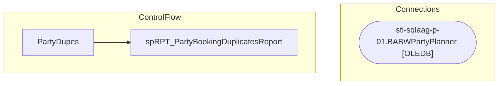

# SSIS Package: PartyDupes

**Project:** PartyReports  
**Folder:** SSIS  

## Architecture Diagram

## Connection Managers

| Connection Name | Type |
|---|---|
| stl-sqlaag-p-01.BABWPartyPlanner | OLEDB |

## Control Flow Tasks

| Task Name | Type |
|---|---|
| PartyDupes | Microsoft.Package |
| spRPT_PartyBookingDuplicatesReport | Microsoft.ExecuteSQLTask |

## Data Flow: Sources

_No OLE DB data flow sources detected._

## Data Flow: Destinations

_No OLE DB data flow destinations detected._

