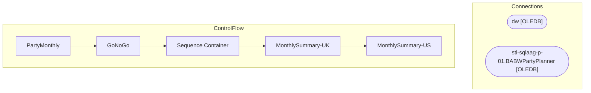

# SSIS Package: PartyMonthly

**Project:** PartyReports  
**Folder:** SSIS  

## Architecture Diagram

## Connection Managers

| Connection Name | Type |
|---|---|
| dw | OLEDB |
| stl-sqlaag-p-01.BABWPartyPlanner | OLEDB |

## Control Flow Tasks

| Task Name | Type |
|---|---|
| PartyMonthly | Microsoft.Package |
| GoNoGo | Microsoft.ExecuteSQLTask |
| Sequence Container | STOCK:SEQUENCE |
| MonthlySummary-UK | Microsoft.ExecuteSQLTask |
| MonthlySummary-US | Microsoft.ExecuteSQLTask |

## Data Flow: Sources

_No OLE DB data flow sources detected._

## Data Flow: Destinations

_No OLE DB data flow destinations detected._

