# SSIS Package: MerchDataLoad

**Project:** PowerBILoad  
**Folder:** SSIS  

## Architecture Diagram

```mermaid
flowchart TD
    subgraph ControlFlow
        MerchDataLoad_task["MerchDataLoad"]
        Clear_PO_Data_task["Clear PO Data"]
        MerchDataLoad_task --> Clear_PO_Data_task
        Load_PO_Headers_task[/"Load PO Headers"/]
        Clear_PO_Data_task --> Load_PO_Headers_task
        Load_Product_Atrributes_task[/"Load Product Atrributes"/]
        Load_PO_Headers_task --> Load_Product_Atrributes_task
        Sequence_Container_task["Sequence Container"]
        Load_Product_Atrributes_task --> Sequence_Container_task
        CreateCacheFiles_task[/"CreateCacheFiles"/]
        Sequence_Container_task --> CreateCacheFiles_task
        Load_On_Order__new__task[/"Load On Order (new)"/]
        CreateCacheFiles_task --> Load_On_Order__new__task
        Load_On_Order__orig__task[/"Load On Order (orig)"/]
        Load_On_Order__new__task --> Load_On_Order__orig__task
        Load_Sales_task[/"Load Sales"/]
        Load_On_Order__orig__task --> Load_Sales_task
        Load_Style_Attributes_task[/"Load Style Attributes"/]
        Load_Sales_task --> Load_Style_Attributes_task
        Sequence_Container_1_task["Sequence Container 1"]
        Load_Style_Attributes_task --> Sequence_Container_1_task
        Data_Flow_Task_task[/"Data Flow Task"/]
        Sequence_Container_1_task --> Data_Flow_Task_task
        Data_Flow_Task_1_task[/"Data Flow Task 1"/]
        Data_Flow_Task_task --> Data_Flow_Task_1_task
        Data_Flow_Task_1_1_task[/"Data Flow Task 1 1"/]
        Data_Flow_Task_1_task --> Data_Flow_Task_1_1_task
        Data_Flow_Task_2_task[/"Data Flow Task 2"/]
        Data_Flow_Task_1_1_task --> Data_Flow_Task_2_task
        Load_Dummy_records_task["Load Dummy records"]
        Data_Flow_Task_2_task --> Load_Dummy_records_task
        Sequence_Container_2_task["Sequence Container 2"]
        Load_Dummy_records_task --> Sequence_Container_2_task
        Data_Flow_Task_task[/"Data Flow Task"/]
        Sequence_Container_2_task --> Data_Flow_Task_task
        Data_Flow_Task_1_task[/"Data Flow Task 1"/]
        Data_Flow_Task_task --> Data_Flow_Task_1_task
        Data_Flow_Task_2_task[/"Data Flow Task 2"/]
        Data_Flow_Task_1_task --> Data_Flow_Task_2_task
        Set_Parameters_task["Set Parameters"]
        Data_Flow_Task_2_task --> Set_Parameters_task
        Assign_EndYear_task["Assign EndYear"]
        Set_Parameters_task --> Assign_EndYear_task
        AssignBegWeek1_task["AssignBegWeek1"]
        Assign_EndYear_task --> AssignBegWeek1_task
        AssignBegWeek2_task["AssignBegWeek2"]
        AssignBegWeek1_task --> AssignBegWeek2_task
        AssignBegYear_task["AssignBegYear"]
        AssignBegWeek2_task --> AssignBegYear_task
        AssignEndWeek1_task["AssignEndWeek1"]
        AssignBegYear_task --> AssignEndWeek1_task
        AssignEndWeek2_task["AssignEndWeek2"]
        AssignEndWeek1_task --> AssignEndWeek2_task
        AssignEndWeek3_task["AssignEndWeek3"]
        AssignEndWeek2_task --> AssignEndWeek3_task
        Send_Mail_Task_task["Send Mail Task"]
        AssignEndWeek3_task --> Send_Mail_Task_task
    end
```

## Connection Managers

_No connections found._

## Control Flow Tasks

| Task Name | Type |
|---|---|
| MerchDataLoad | Microsoft.Package |
| Clear PO Data | Microsoft.ExecuteSQLTask |
| Load PO Headers | Microsoft.Pipeline |
| Load Product Atrributes | Microsoft.Pipeline |
| Sequence Container | STOCK:SEQUENCE |
| CreateCacheFiles | Microsoft.Pipeline |
| Load On Order (new) | Microsoft.Pipeline |
| Load On Order (orig) | Microsoft.Pipeline |
| Load Sales | Microsoft.Pipeline |
| Load Style Attributes | Microsoft.Pipeline |
| Sequence Container 1 | STOCK:SEQUENCE |
| Data Flow Task | Microsoft.Pipeline |
| Data Flow Task 1 | Microsoft.Pipeline |
| Data Flow Task 1 1 | Microsoft.Pipeline |
| Data Flow Task 2 | Microsoft.Pipeline |
| Load Dummy records | Microsoft.ExecuteSQLTask |
| Sequence Container 2 | STOCK:SEQUENCE |
| Data Flow Task | Microsoft.Pipeline |
| Data Flow Task 1 | Microsoft.Pipeline |
| Data Flow Task 2 | Microsoft.Pipeline |
| Set Parameters | STOCK:SEQUENCE |
| Assign EndYear | Microsoft.ExecuteSQLTask |
| AssignBegWeek1 | Microsoft.ExecuteSQLTask |
| AssignBegWeek2 | Microsoft.ExecuteSQLTask |
| AssignBegYear | Microsoft.ExecuteSQLTask |
| AssignEndWeek1 | Microsoft.ExecuteSQLTask |
| AssignEndWeek2 | Microsoft.ExecuteSQLTask |
| AssignEndWeek3 | Microsoft.ExecuteSQLTask |
| Send Mail Task | Microsoft.SendMailTask |

## Data Flow: Sources

| Component | Tables Referenced | SQL Preview |
|---|---|---|
|  |  | With A as (  SELECT  a.style_code as Field_i, e.po_no as Field_l, c.receipt_date,  SUM(c.on_order_units) as Field_o, SUM(c.on_order_cost) as Field_q  FROM bedrockdb02.me_01.dbo.style a,  bedrockdb02.me_01.dbo.location b,  bedrockdb02.me_01.dbo.view_ib_on_order c,   bedrockdb02.me_01.dbo.hierarchy_group d01,    bedrockdb02.me_01.dbo.hierarchy_group d02,    bedrockdb02.me_01.dbo.hierarchy_group d03, |
|  |  | SELECT Distinct Cast(c.po_no as varchar(20)) as po_no ,  Cast(c.po_description as varchar(60)) as po_Description ,  convert(smalldatetime,convert(varchar, c.create_date,101)) CreateDate, Cast(c.fob_description as varchar(20) )as FreightOnBoard,   Cast(d.attribute_set_code as varchar(6) ) as PoAttributeCode,   Cast(d.attribute_set_label as varchar(20)) as PoAttributeLabel,    f.po_total_first_cost  |
|  |  | SELECT style_ID,attribute_ID,max(Attribute_set_ID) as setID   FROM Bedrockdb02.ma_01.dbo.view_style_attribute_outer where attribute_ID in (457,122,74)   group by style_ID,attribute_ID Order By style_ID,Attribute_ID,Max(Attribute_Set_ID) |
|  |  | Select Style_Code, Cast(attribute_set_code as varchar(50)) as FactoryCode , cast(attribute_set_label as varchar(75)) FactoryLabel,Primary_vendor_cur_cost ,Attribute_Set_ID,a.Style_ID,Attribute_ID 	  from Bedrockdb02.ma_01.dbo.view_style_attribute_outer b 	   inner join Bedrockdb02.ma_01.dbo.style a on b.style_ID = a.style_ID 	   	    where attribute_id = 122 Order by a.Style_ID,Attribute_ID,Attrib |
|  |  | Select Style_Code,Cast(attribute_set_code as varchar(50)) LicenseCode,Cast(attribute_set_label as varchar(75)) LicenseLabel,Primary_vendor_cur_cost ,Attribute_Set_ID,a.Style_ID,Attribute_ID 	  from Bedrockdb02.ma_01.dbo.view_style_attribute_outer b 	   inner join Bedrockdb02.ma_01.dbo.style a on b.style_ID = a.style_ID 	   	    where attribute_id = 457 Order by a.Style_ID,Attribute_ID,Attribute_Se |
|  |  | Select Style_Code,Cast(attribute_set_code as varchar(50) ) as MSTAT ,Attribute_Set_ID,a.Style_ID,Attribute_ID 	  from Bedrockdb02.ma_01.dbo.view_style_attribute_outer b 	   inner join Bedrockdb02.ma_01.dbo.style a on b.style_ID = a.style_ID 	   	    where attribute_id = 74 Order by a.Style_ID,Attribute_ID,Attribute_Set_ID |
|  |  | SELECT        style, ProductKey FROM            Azure.vwStyleToProdKey ORDER BY style |
|  |  | select * from azure.vwStyleToProdKey |
|  |  | select * from azure.vwLocationToStoreKey |
|  |  | select d.location_ID , cast( a.style_code  as varchar(20)) as Style_code , left(Merch_year_pd,4) as Fiscal_Year,    Right(Merch_year_pd,2) as Fiscal_Period, sum(On_Order_Units) as On_Order,((left(Merch_year_pd,4) - 2017) * 12) +  Right(Merch_year_pd,2) AS PeriodKey  from bedrockdb02.ma_01.dbo.oo_all_style_loc_pd d inner join bedrockdb02.ma_01.dbo.style a on d.style_ID = a.style_id where left(Merch |
|  |  | With D as (  select fiscal_Year,Fiscal_period,Min(Actual_Date) - 7 as NewStart,Max(Actual_date) -7 as NewEnd from date_dim group by Fiscal_year,Fiscal_period  )  select Cast(d.fiscal_Year as varchar(4)) as Fiscal_Year, right('0' + Cast(d.Fiscal_period as varchar(2)),2) as Fiscal_Period,t.Actual_Date as DateKey,DateDiff("d",t.Actual_Date,NewEnd) TotalFlag  from date_Dim t inner join D on NewStart < |
|  |  | select d.location_ID , cast( a.style_code  as varchar(20)) as Style_code , left(Merch_year_pd,4) as Fiscal_Year,    Right(Merch_year_pd,2) as Fiscal_Period, sum(On_Order_Units) as On_Order,((left(Merch_year_pd,4) - 2017) * 12) +  Right(Merch_year_pd,2) AS PeriodKey  from bedrockdb02.ma_01.dbo.oo_all_style_loc_pd d inner join bedrockdb02.ma_01.dbo.style a on d.style_ID = a.style_id where left(Merch |
|  |  | With D as (  select fiscal_Year,Fiscal_period,Min(Actual_Date) - 7 as NewStart,Max(Actual_date) -7 as NewEnd from date_dim group by Fiscal_year,Fiscal_period  )  select Cast(d.fiscal_Year as varchar(4)) as Fiscal_Year, right('0' + Cast(d.Fiscal_period as varchar(2)),2) as Fiscal_Period,t.Actual_Date as DateKey,DateDiff("d",t.Actual_Date,NewEnd) TotalFlag  from date_Dim t inner join D on NewStart < |
|  |  | select d.location_id,Cast(a.style_code as varchar(20)) as Style_code, Cast(Left(Merch_year_wk,4) as char(4)) as FiscalYear, Cast(Right(Merch_year_wk,2) as Char(2)) as FiscalWeek , sum(sales_total_units-return_units) as NetSalesUnits,sum(sales_total_retail_te-return_retail_te) as NetSalesRetail   from bedrockdb02.ma_01.dbo.hist_style_loc_wk d inner join bedrockdb02.ma_01.dbo.style a on d.style_ID = |
|  |  | Select Actual_date,right('00' + cast(fiscal_week as varchar(2)),2) as Fiscal_week,Cast(fiscal_year as varchar(4)) as Fiscal_Year from date_dim where datepart(dw,actual_date) = 7 and fiscal_Year >= 2017 |
|  |  | SELECT --DISTINCT  a.style_code as StyleCode, b03.attribute_set_code as RoyaltyStyle,  b02.attribute_set_code as WebStatus,  b01.attribute_set_code as WholesaleStatus FROM ma_01.dbo.style a, ma_01.dbo.view_style_attribute_outer b01,  ma_01.dbo.view_style_attribute_outer b02, ma_01.dbo.view_style_attribute_outer b03  WHERE a.style_id =b01.style_id and  b01.attribute_id = 632      AND a.style_id =b0 |
|  |  | select  	d.location_id, 	Cast(Style_Code as varchar(20)) as Style_Code,  	SUM(on_hand_units) as OnHand, 	Left(Merch_year_wk,4) as workYear, 	Right(Merch_year_wk,2) as workweek, Case  	when Inventory_status_ID = 1 then 'Available'     when Inventory_status_ID = 2 then 'In Transit' 	when Inventory_status_ID = 3 then 'Allocated' 	when Inventory_status_ID = 4 then 'Discrepancy' 	when Inventory_status_ |
|  |  | select d.location_id ,Cast(a.Style_Code as varchar(20)) as Style_Code,  SUM(on_hand_units) as OnHand , Case Inventory_status_ID 	when 1 then 'Available'     when 2 then 'In Transit' 	when 3 then 'Allocated' 	when 4 then 'Discrepancy' 	when 5 then 'Unavailable' 	when 6 then  'Unavailable' 	when 7 then 'Pending Shrink' 	when 8 then 'Damaged' 	when 9 then 'Reserved Cust Order' 	Else 'Unavailable' 	En |
|  |  | with FutureAlloc as 	( 		select  			d.location_id, 			Cast(a.Style_Code as varchar(20)) as Style_Code,  			SUM(Allocation_units) as OnHand, 			--Left(Merch_year_wk,4) as workYear, 			--Right(Merch_year_wk,2) as WorkWeek, 			'Allocated' as InventoryType, 			--0 as OnHandCost, 			Case t.location_type  				when 2 then 'ST'  				when 4 then 'WH'  				else 'HO'                  			end as LocType 		from |
|  |  | select  	d.location_id, 	Cast(a.Style_Code as varchar(20)) as Style_Code,  	SUM(case  			when merch_year_wk <= concat(datepart(yyyy,getdate()+7), datepart(wk,getdate()+7))  				then Allocation_units 			else 0 		end 		) as OnHand, 	Left(Merch_year_wk,4) as workYear, 	Right(Merch_year_wk,2) as WorkWeek, 	'Allocated' as InventoryType, 	0 as OnHandCost, 	Case t.location_type  		when 2 then 'ST'  		whe |
|  |  | Select Cast(s.Style_code as varchar(20)) as Style_code,'Home' as PriceType,Current_selling_retail, Original_Selling_Retail from me_01.dbo.style_retail sr with (nolock) join me_01.dbo.style s with (nolock) on sr.style_ID = s.style_ID where (left(style_code,1) in ('0','3') and Jurisdiction_ID = 1) or (left(style_code,1) = '1' and Jurisdiction_ID = 3) or (left(style_code,1) = '4' and Jurisdiction_ID  |
|  |  | Select Cast(s.Style_code as varchar(20)) as Style_code,'IE Price' as PriceType,Current_selling_retail, Original_Selling_Retail from bedrockdb02.me_01.dbo.style_retail sr inner join bedrockdb02.me_01.dbo.style s on sr.style_ID = s.style_ID where (left(style_code,1) = '4' and Jurisdiction_ID = 5) |
|  |  | Select Cast(s.Style_code as varchar(20)) as Style_code,'DK Price' as PriceType,Current_selling_retail, Original_Selling_Retail from bedrockdb02.me_01.dbo.style_retail sr inner join bedrockdb02.me_01.dbo.style s on sr.style_ID = s.style_ID where (left(style_code,1) = '4' and Jurisdiction_ID = 7) |

## Data Flow: Destinations

| Component | Destination Table |
|---|---|
|  | [Azure].[POHeader] |
|  | [Azure].[PODetails] |
|  | [Azure].[ProdMSTAT] |
|  | [Azure].[ProdFactory] |
|  | [Azure].[ProdLicense] |
|  | [Azure].[vwStyleToProdKey] |
|  | [Azure].[vwStyleToProdKey] |
|  | [Azure].[merchonOrder] |
|  | [dbo].[tmp_merchonOrder] |
|  | [Azure].[merchonOrder] |
|  | [Azure].[MerchSales] |
|  | [Azure].[StyleAttributes] |
|  | [Azure].[OnHand] |
|  | [Azure].[OnHand] |
|  | [Azure].[OnHand] |
|  | [Azure].[OnHand] |
|  | [Azure].[Price] |
|  | [Azure].[Price] |
|  | [Azure].[Price] |

