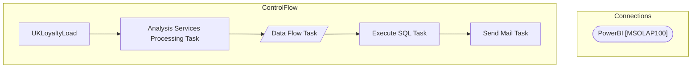

# SSIS Package: UKLoyaltyLoad

**Project:** PowerBILoad  
**Folder:** SSIS  

## Architecture Diagram

## Connection Managers

| Connection Name | Type |
|---|---|
| PowerBI | MSOLAP100 |

## Control Flow Tasks

| Task Name | Type |
|---|---|
| UKLoyaltyLoad | Microsoft.Package |
| Analysis Services Processing Task | Microsoft.DTSProcessingTask |
| Data Flow Task | Microsoft.Pipeline |
| Execute SQL Task | Microsoft.ExecuteSQLTask |
| Send Mail Task | Microsoft.SendMailTask |

## Data Flow: Sources

| Component | Tables Referenced | SQL Preview |
|---|---|---|
|  |  | SELECT  cast(th.Transaction_date as date) as DateKey,TH.Store_No as StoreNumber, count(distinct(th.customer_ID )) as ExistingEmail 	 FROM TRANSACTION_hEADER TH  	INNER JOIN customer_division cd WITH(NOLOCK) ON TH.CUSTOMER_id = CD.CUSTOMER_id AND cd.division_id = 89 	inner JOIN email_division e WITH(NOLOCK) ON th.customer_id = e.customer_id and cd.primary_email_id = e.email_id 	AND cast(e.modify_da |
|  |  | SELECT  cast(th.Transaction_date as date) as DateKey,TH.Store_No as StoreNumber, count(distinct(th.customer_ID )) as ExistingEmailNoChange FROM TRANSACTION_hEADER TH  	INNER JOIN customer_division cd WITH(NOLOCK) ON TH.CUSTOMER_id = CD.CUSTOMER_id AND cd.division_id = 89 	inner JOIN email_division e WITH(NOLOCK) ON th.customer_id = e.customer_id and cd.primary_email_id = e.email_id 	AND cast(e.mod |
|  |  | SELECT TH.STORE_NO as StoreNumber, cast(th.Transaction_date as date) as DateKey, 	count(distinct(th.customer_ID )) as ExistingGDPR FROM TRANSACTION_hEADER TH  	inner JOIN customer_attribute ca1 WITH(NOLOCK) on th.customer_ID = ca1.customer_ID and Cast(ca1.attribute_date as date)=th.transaction_date 	INNER JOIN customer_division cd WITH(NOLOCK) ON TH.CUSTOMER_id = CD.CUSTOMER_id AND cd.division_id  |
|  |  | SELECT TH.STORE_NO as StoreNumber,Cast(ca1.attribute_date as date) as DateKey, 	count(distinct(th.customer_ID )) as ExistingGDPTNoChange FROM TRANSACTION_hEADER TH  	inner JOIN customer_attribute ca1 WITH(NOLOCK) on th.customer_ID = ca1.customer_ID  	INNER JOIN customer_division cd WITH(NOLOCK) ON TH.CUSTOMER_id = CD.CUSTOMER_id AND cd.division_id = 89 		 AND CAST(cd.create_date as date) < CAST(TH |
|  |  | select  count(Distinct c.customer_id) as POSNew, cd.store_no as StoreNumber,Cast(cd.create_date as date) as DateKey  from customer c with (nolock)  	Left Join customer_division cd with (nolock) ON c.customer_id = cd.customer_id and cd.division_id = 89 	Left Join customer_attribute cs with (nolock) ON c.customer_id = cs.customer_id 	Left Join email_division ed with (nolock) ON c.customer_id = ed.cu |
|  |  | select Cast(Storeid as int) as StoreNumber,StoreKey,Date_Key as DateKey from azure.vwStores cross join  Azure.NewDateDim  where CountryNameAbbr = 'UK' and storeID <> '2013' and permclosestatus = 0 and bearRange = 'Europe' and Date_Key  between '01/01/19' and ? Order by Cast(Storeid as int),Date_Key |
|  |  | select  count(Distinct c.customer_id) as TabNewEmail, cd.store_no as StoreNumber,Cast(cd.create_date as date) as DateKey  from customer c with (nolock)  	Left Join customer_division cd with (nolock) ON c.customer_id = cd.customer_id and cd.division_id = 89 	Left Join customer_attribute cs with (nolock) ON c.customer_id = cs.customer_id 	Left Join email_division ed with (nolock) ON c.customer_id =  |
|  |  | select  count(Distinct c.customer_id) as TabNewGDPR, cd.store_no as StoreNumber,Cast(cd.create_date as date) as DateKey  from customer c with (nolock)  	Left Join customer_division cd with (nolock) ON c.customer_id = cd.customer_id and cd.division_id = 89 	Left Join customer_attribute cs with (nolock) ON c.customer_id = cs.customer_id 	Left Join email_division ed with (nolock) ON c.customer_id = e |

## Data Flow: Destinations

| Component | Destination Table |
|---|---|
|  | [Azure].[UKLoyatly] |

