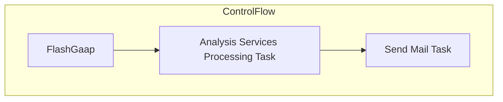

# SSIS Package: FlashGaap

**Project:** PowerBIProcessing  
**Folder:** SSIS  

## Architecture Diagram

## Connection Managers

_No connections found._

## Control Flow Tasks

| Task Name | Type |
|---|---|
| FlashGaap | Microsoft.Package |
| Analysis Services Processing Task | Microsoft.DTSProcessingTask |
| Send Mail Task | Microsoft.SendMailTask |

## Data Flow: Sources

_No OLE DB data flow sources detected._

## Data Flow: Destinations

_No OLE DB data flow destinations detected._

