# SSIS Package: UKStoreSalesAuditingETL

**Project:** UKStoreSalesAuditingETL  
**Folder:** SSIS  

## Architecture Diagram

```mermaid
flowchart TD
    subgraph Connections
        DW_conn(["DW [OLEDB]"])
        DWStaging_conn(["DWStaging [OLEDB]"])
        IntegrationStaging_conn(["IntegrationStaging [OLEDB]"])
        SMTP_conn(["SMTP [SMTP]"])
        TotalsCSV_conn(["TotalsCSV [FLATFILE]"])
        TransactionsCSV_conn(["TransactionsCSV [FLATFILE]"])
    end
    subgraph ControlFlow
        UKStoreSalesAuditingETL_task["UKStoreSalesAuditingETL"]
        Sequence___Generate_Files_task["Sequence - Generate Files"]
        UKStoreSalesAuditingETL_task --> Sequence___Generate_Files_task
        Foreach_Loop___Archive_Files_task["Foreach Loop - Archive Files"]
        Sequence___Generate_Files_task --> Foreach_Loop___Archive_Files_task
        Archive_Files_task["Archive Files"]
        Foreach_Loop___Archive_Files_task --> Archive_Files_task
        Foreach_Loop___CSV_Dataflow_task["Foreach Loop - CSV Dataflow"]
        Archive_Files_task --> Foreach_Loop___CSV_Dataflow_task
        DataFlow_CSV_Files_task[/"DataFlow CSV Files"/]
        Foreach_Loop___CSV_Dataflow_task --> DataFlow_CSV_Files_task
        Load_Store_and_Date_List_task["Load Store and Date List"]
        DataFlow_CSV_Files_task --> Load_Store_and_Date_List_task
        sFTP_Upload_Files_task["sFTP Upload Files"]
        Load_Store_and_Date_List_task --> sFTP_Upload_Files_task
        Sequence___Stage_Data_task["Sequence - Stage Data"]
        sFTP_Upload_Files_task --> Sequence___Stage_Data_task
        Load_Store_List_task["Load Store List"]
        Sequence___Stage_Data_task --> Load_Store_List_task
        Stage_Data_task["Stage Data"]
        Load_Store_List_task --> Stage_Data_task
        Stage_Data_SQL_task["Stage Data SQL"]
        Stage_Data_task --> Stage_Data_SQL_task
        Truncate_Stage_task["Truncate Stage"]
        Stage_Data_SQL_task --> Truncate_Stage_task
        Send_Mail_Task_task["Send Mail Task"]
        Truncate_Stage_task --> Send_Mail_Task_task
    end
```

## Connection Managers

| Connection Name | Type |
|---|---|
| DW | OLEDB |
| DWStaging | OLEDB |
| IntegrationStaging | OLEDB |
| SMTP | SMTP |
| TotalsCSV | FLATFILE |
| TransactionsCSV | FLATFILE |

## Control Flow Tasks

| Task Name | Type |
|---|---|
| UKStoreSalesAuditingETL | Microsoft.Package |
| Sequence - Generate Files | STOCK:SEQUENCE |
| Foreach Loop - Archive Files | STOCK:FOREACHLOOP |
| Archive Files | Microsoft.FileSystemTask |
| Foreach Loop - CSV Dataflow | STOCK:FOREACHLOOP |
| DataFlow CSV Files | Microsoft.Pipeline |
| Load Store and Date List | Microsoft.ExecuteSQLTask |
| sFTP Upload Files | Microsoft.ExecuteSQLTask |
| Sequence - Stage Data | STOCK:SEQUENCE |
| Load Store List | Microsoft.ExecuteSQLTask |
| Stage Data | STOCK:FOREACHLOOP |
| Stage Data SQL | Microsoft.ExecuteSQLTask |
| Truncate Stage | Microsoft.ExecuteSQLTask |
| Send Mail Task | Microsoft.SendMailTask |

## Data Flow: Sources

| Component | Tables Referenced | SQL Preview |
|---|---|---|
|  |  | with  SalesData as 	( 		select  			cast(StoreNumber as nvarchar) as StoreNumber, 			cast('76013' as nvarchar) as coniq_location_id,--need to get the actual id  			rtl_trn_id as transaction_id, 			cast(right(item_no, 6) as nvarchar) as item_id, 			cast(SkuDescription as nvarchar) as item_name, 			DATEDIFF(s, '1970-01-01', End_DateTime) as sale_datetime,  --Unix Timestamp format 			End_DateTime Tran |
|  |  | with  SalesData as 	( 		select   			cast(StoreNumber as nvarchar) as StoreNumber, 			cast('76013' as nvarchar) as coniq_location_id,--need to get the actual id  			cast(End_Datetime as date) TransactionDate, 			DATEDIFF(s, '1970-01-01', cast(End_Datetime as date)) as reference_datetime, --Unix Timestamp format 			cast(sum(net_sales) as decimal(38,2)) as total_gross_value, 			cast(SUM(CASE 						WH |

## Data Flow: Destinations

_No OLE DB data flow destinations detected._

