# SSIS Package: ExportWebCouponsPackage

**Project:** WebCoupons  
**Folder:** SSIS  

## Architecture Diagram

```mermaid
flowchart TD
    subgraph Connections
        Coupons_zip_conn(["Coupons.zip [FILE]"])
        Kodiak_DiscountMstrData_conn(["Kodiak.DiscountMstrData [OLEDB]"])
        SMTP_EMAIL_conn(["SMTP_EMAIL [SMTP]"])
        SQL_LOG_conn(["SQL_LOG [OLEDB]"])
        STL_SSIS_P_01_conn(["STL-SSIS-P-01 [SMOServer]"])
        STL_SSIS_P_01_IntegrationStaging_conn(["STL-SSIS-P-01.IntegrationStaging [OLEDB]"])
    end
    subgraph ControlFlow
        ExportWebCouponsPackage_task["ExportWebCouponsPackage"]
        File_Generation_and_Move_task["File Generation and Move"]
        ExportWebCouponsPackage_task --> File_Generation_and_Move_task
        Archive_ZIP_File_task["Archive ZIP File"]
        File_Generation_and_Move_task --> Archive_ZIP_File_task
        Copy_File_to_FTP_Stage_task["Copy File to FTP Stage"]
        Archive_ZIP_File_task --> Copy_File_to_FTP_Stage_task
        Delete_Old_Files_task["Delete Old Files"]
        Copy_File_to_FTP_Stage_task --> Delete_Old_Files_task
        SendEmail_task["SendEmail"]
        Delete_Old_Files_task --> SendEmail_task
        Zip_Files_task["Zip Files"]
        SendEmail_task --> Zip_Files_task
        Foreach_New_Discount_Coupon_task["Foreach New Discount Coupon"]
        Zip_Files_task --> Foreach_New_Discount_Coupon_task
        Export_Coupons_XML_File_task["Export Coupons XML File"]
        Foreach_New_Discount_Coupon_task --> Export_Coupons_XML_File_task
        Set_discountID_as_Exported_task["Set discountID as Exported"]
        Export_Coupons_XML_File_task --> Set_discountID_as_Exported_task
        Stage_Discount_Coupon_Data_task["Stage Discount Coupon Data"]
        Set_discountID_as_Exported_task --> Stage_Discount_Coupon_Data_task
        Copy_Coupon_Data_to_Staging_task[/"Copy Coupon Data to Staging"/]
        Stage_Discount_Coupon_Data_task --> Copy_Coupon_Data_to_Staging_task
        Get_DiscountCoupons_List_task["Get DiscountCoupons List"]
        Copy_Coupon_Data_to_Staging_task --> Get_DiscountCoupons_List_task
        Get_TotalNewItems_Count_task["Get TotalNewItems Count"]
        Get_DiscountCoupons_List_task --> Get_TotalNewItems_Count_task
        Truncate_Staging_task["Truncate Staging"]
        Get_TotalNewItems_Count_task --> Truncate_Staging_task
        Send_Email_onError_task["Send Email onError"]
        Truncate_Staging_task --> Send_Email_onError_task
    end
```

## Connection Managers

| Connection Name | Type |
|---|---|
| Coupons.zip | FILE |
| Kodiak.DiscountMstrData | OLEDB |
| SMTP_EMAIL | SMTP |
| SQL_LOG | OLEDB |
| STL-SSIS-P-01 | SMOServer |
| STL-SSIS-P-01.IntegrationStaging | OLEDB |

## Control Flow Tasks

| Task Name | Type |
|---|---|
| ExportWebCouponsPackage | Microsoft.Package |
| File Generation and Move | STOCK:SEQUENCE |
| Archive ZIP File | Microsoft.FileSystemTask |
| Copy File to FTP Stage | Microsoft.FileSystemTask |
| Delete Old Files | Microsoft.ExecuteSQLTask |
| SendEmail | Microsoft.ExecuteSQLTask |
| Zip Files | Microsoft.ExecuteProcess |
| Foreach New Discount Coupon | STOCK:FOREACHLOOP |
| Export Coupons XML File | Microsoft.ExecuteSQLTask |
| Set discountID as Exported | Microsoft.ExecuteSQLTask |
| Stage Discount Coupon Data | STOCK:SEQUENCE |
| Copy Coupon Data to Staging | Microsoft.Pipeline |
| Get DiscountCoupons List | Microsoft.ExecuteSQLTask |
| Get TotalNewItems Count | Microsoft.ExecuteSQLTask |
| Truncate Staging | Microsoft.ExecuteSQLTask |
| Send Email onError | Microsoft.SendMailTask |

## Data Flow: Sources

| Component | Tables Referenced | SQL Preview |
|---|---|---|
|  |  | SELECT discountID,               discountAmount,               cntryAbbr,               endingDate,               totalCoupons,               couponNumber FROM [dbo].[vwCouponsExportToWeb] |

## Data Flow: Destinations

| Component | Destination Table |
|---|---|
|  | [WEB].[DiscountCouponExport] |
|  | [dbo].[vwCouponsExportToWeb] |

