# SSIS Package: ImportOMS

**Project:** WebOrderProcessing  
**Folder:** SSIS  

## Architecture Diagram

```mermaid
flowchart TD
    subgraph Connections
        bedrockdb02_esell_conn(["bedrockdb02.esell [OLEDB]"])
        Failure3_conn(["Failure3 [FILE]"])
        HTTP_Connection_Manager_conn(["HTTP Connection Manager [HTTP (KingswaySoft)]"])
        STL_SSIS_T_01_IntegrationStaging_conn(["STL-SSIS-T-01.IntegrationStaging [ADO.NET:System.Data.SqlClient.SqlConnection, System.Data, Version=4.0.0.0, Culture=neutral, PublicKeyToken=b77a5c561934e089]"])
        STL_SSIS_T_01_IntegrationStaging_1_conn(["STL-SSIS-T-01.IntegrationStaging 1 [OLEDB]"])
    end
    subgraph ControlFlow
        ImportOMS_task["ImportOMS"]
        Delete_bad_US_files_task["Delete bad US files"]
        ImportOMS_task --> Delete_bad_US_files_task
        Delete_bad_US_Files_task["Delete bad US Files"]
        Delete_bad_US_files_task --> Delete_bad_US_Files_task
        File_System_Task_1_task["File System Task 1"]
        Delete_bad_US_Files_task --> File_System_Task_1_task
        Process_US_Orders_task["Process US Orders"]
        File_System_Task_1_task --> Process_US_Orders_task
        Execute_Process_Task_task["Execute Process Task"]
        Process_US_Orders_task --> Execute_Process_Task_task
        SEC___Process_eComm_Orders_to_D365_task["SEC - Process eComm Orders to D365"]
        Execute_Process_Task_task --> SEC___Process_eComm_Orders_to_D365_task
        EST___Get_eComm_OrderIds_task["EST - Get eComm OrderIds"]
        SEC___Process_eComm_Orders_to_D365_task --> EST___Get_eComm_OrderIds_task
        Foreach_Loop_Container_task["Foreach Loop Container"]
        EST___Get_eComm_OrderIds_task --> Foreach_Loop_Container_task
        DFT___Send_orders_to_D365_task[/"DFT - Send orders to D365"/]
        Foreach_Loop_Container_task --> DFT___Send_orders_to_D365_task
        Sequence_Container_task["Sequence Container"]
        DFT___Send_orders_to_D365_task --> Sequence_Container_task
        Flip_the_PickTicketFlag_task[/"Flip the PickTicketFlag"/]
        Sequence_Container_task --> Flip_the_PickTicketFlag_task
        Insert_into_Enterprise_Selling_Staging_Table_task[/"Insert into Enterprise Selling Staging Table"/]
        Flip_the_PickTicketFlag_task --> Insert_into_Enterprise_Selling_Staging_Table_task
        Merge_to_Enterprise_selling_task["Merge to Enterprise selling"]
        Insert_into_Enterprise_Selling_Staging_Table_task --> Merge_to_Enterprise_selling_task
        SQL__Truncate_StoreOrderQtyStage_task["SQL- Truncate StoreOrderQtyStage"]
        Merge_to_Enterprise_selling_task --> SQL__Truncate_StoreOrderQtyStage_task
        Sequence_Container_1_task["Sequence Container 1"]
        SQL__Truncate_StoreOrderQtyStage_task --> Sequence_Container_1_task
        Execute_Process_Task_task["Execute Process Task"]
        Sequence_Container_1_task --> Execute_Process_Task_task
        Send_Email_onError_task["Send Email onError"]
        Execute_Process_Task_task --> Send_Email_onError_task
        Delete_bad_files_UK_task["Delete bad files UK"]
        Send_Email_onError_task --> Delete_bad_files_UK_task
        File_System_Task_task["File System Task"]
        Delete_bad_files_UK_task --> File_System_Task_task
        File_System_Task_1_task["File System Task 1"]
        File_System_Task_task --> File_System_Task_1_task
        Delete_bad_files_US_task["Delete bad files US"]
        File_System_Task_1_task --> Delete_bad_files_US_task
        File_System_Task_task["File System Task"]
        Delete_bad_files_US_task --> File_System_Task_task
        File_System_Task_1_task["File System Task 1"]
        File_System_Task_task --> File_System_Task_1_task
        Send_Email_onError_task["Send Email onError"]
        File_System_Task_1_task --> Send_Email_onError_task
    end
```

## Connection Managers

| Connection Name | Type |
|---|---|
| bedrockdb02.esell | OLEDB |
| Failure3 | FILE |
| HTTP Connection Manager | HTTP (KingswaySoft) |
| STL-SSIS-T-01.IntegrationStaging | ADO.NET:System.Data.SqlClient.SqlConnection, System.Data, Version=4.0.0.0, Culture=neutral, PublicKeyToken=b77a5c561934e089 |
| STL-SSIS-T-01.IntegrationStaging 1 | OLEDB |

## Control Flow Tasks

| Task Name | Type |
|---|---|
| ImportOMS | Microsoft.Package |
| Delete bad US files | STOCK:FOREACHLOOP |
| Delete bad US Files | Microsoft.FileSystemTask |
| File System Task 1 | Microsoft.FileSystemTask |
| Process US Orders | STOCK:SEQUENCE |
| Execute Process Task | Microsoft.ExecuteProcess |
| SEC - Process eComm Orders to D365 | STOCK:SEQUENCE |
| EST - Get eComm OrderIds | Microsoft.ExecuteSQLTask |
| Foreach Loop Container | STOCK:FOREACHLOOP |
| DFT - Send orders to D365 | Microsoft.Pipeline |
| Sequence Container | STOCK:SEQUENCE |
| Flip the PickTicketFlag | Microsoft.Pipeline |
| Insert into Enterprise Selling Staging Table | Microsoft.Pipeline |
| Merge to Enterprise selling | Microsoft.ExecuteSQLTask |
| SQL- Truncate StoreOrderQtyStage | Microsoft.ExecuteSQLTask |
| Sequence Container 1 | STOCK:SEQUENCE |
| Execute Process Task | Microsoft.ExecuteProcess |
| Send Email onError | Microsoft.SendMailTask |
| Delete bad files UK | STOCK:FOREACHLOOP |
| File System Task | Microsoft.FileSystemTask |
| File System Task 1 | Microsoft.FileSystemTask |
| Delete bad files US | STOCK:FOREACHLOOP |
| File System Task | Microsoft.FileSystemTask |
| File System Task 1 | Microsoft.FileSystemTask |
| Send Email onError | Microsoft.SendMailTask |

## Data Flow: Sources

| Component | Tables Referenced | SQL Preview |
|---|---|---|
|  |  | SELECT ProductNumber         ,InventoryUnitSymbol   FROM [IntegrationStaging].[WMS].[ItemMaster]   WHERE Entity = 1100 |
|  |  | select * from [WM].[D365CountryCodes] |
|  |  | INSERT INTO [WebOrderProcessing].[WM].[OrdersSentToWM] (OrderNum,SendTime) SELECT ?, ? WHERE 1 = ? |
|  |  | SELECT oi.OrderId       ,oi.qty AS SalesQty 	  ,CASE 	    WHEN oio.OverrideSku IS NULL THEN oi.sku 	    ELSE oio.OverrideSku 	   END AS ItemID 	  ,oi.Price AS eCommUnitPrice 	  ,0.00 AS totalValue 	  ,ROW_NUMBER() OVER(PARTITION BY oi.OrderId ORDER BY oi.OrderId ASC) AS lineNumber FROM  WM.OrderItems AS oi  INNER JOIN WM.Orders AS o ON oi.OrderId = o.OrderId INNER JOIN WM.OrderStatus AS os ON o.Or |
|  |  | Update WM.Orders  SET PickTicketFlag = 1  WHERE 1 = ? AND OrderNum = ? |
|  |  | SELECT DISTINCT O1.OrderId ,OrderNum AS ECommOrderRefNum ,OrderType ,CONCAT(ShipToFName, ' ', ShipToLName) AS DeliveryName ,CONCAT(ShipToAddress1, ' ', ShipToAddress2) AS Address ,ShipToCity AS City ,CASE   WHEN ShipToCountry IN ('US', 'CA') THEN ShipToState    ELSE ''  END AS State ,CASE 	WHEN CHARINDEX('-', ShipToPostalCode) = 0 THEN ShipToPostalCode 	ELSE SUBSTRING(ShipToPostalCode, 0,CHARINDEX |
|  |  | UPDATE [WM].[Orders] SET PickTicketFlag = 1 WHERE OrderId = ? |
|  |  | SELECT DISTINCT O1.OrderId FROM   WM.Orders AS O1  INNER JOIN WM.OrderStatus AS s ON O1.OrderId = s.OrderId AND s.CurrentStatus = 1  INNER JOIN WM.OrderItems AS oi ON O1.OrderId = oi.OrderId AND LEN(oi.sku) = 6 WHERE (ISNULL(O1.PickTicketFlag, 0) = 0) AND (O1.SourceSite = 'BABW-US') AND (O1.OrderStatus = 'Pending') AND (CHARINDEX('_', O1.OrderNum, 1) > 0)  AND (O1.PickupStore <> 13) |

## Data Flow: Destinations

| Component | Destination Table |
|---|---|
|  | [WMS].[ModeOfDeliveryWeb] |
|  | [WMS].[DynamicsAPILog] |
|  | [WM].[Orders] |
|  | [dbo].[vwCurrentOrderIds] |
|  | [dbo].[StoreOrderQtyStage] |
|  | [dbo].[vwCurrentOrderItemQuantities] |

