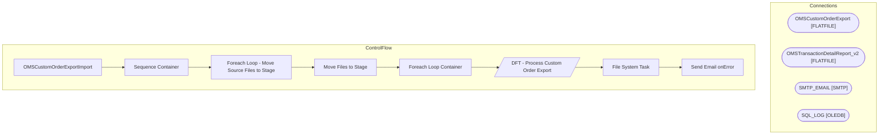

# SSIS Package: OMSCustomOrderExportImport

**Project:** WebOrderProcessing  
**Folder:** SSIS  

## Architecture Diagram

## Connection Managers

| Connection Name | Type |
|---|---|
| OMSCustomOrderExport | FLATFILE |
| OMSTransactionDetailReport_v2 | FLATFILE |
| SMTP_EMAIL | SMTP |
| SQL_LOG | OLEDB |

## Control Flow Tasks

| Task Name | Type |
|---|---|
| OMSCustomOrderExportImport | Microsoft.Package |
| Sequence Container | STOCK:SEQUENCE |
| Foreach Loop - Move Source Files to Stage | STOCK:FOREACHLOOP |
| Move Files to Stage | Microsoft.FileSystemTask |
| Foreach Loop Container | STOCK:FOREACHLOOP |
| DFT - Process Custom Order Export | Microsoft.Pipeline |
| File System Task | Microsoft.FileSystemTask |
| Send Email onError | Microsoft.SendMailTask |

## Data Flow: Sources

| Component | Tables Referenced | SQL Preview |
|---|---|---|
|  |  | SELECT [TransactionID]       ,[TransactionNum]   FROM [WebOrderProcessing].[WM].[Transactions] |

## Data Flow: Destinations

| Component | Destination Table |
|---|---|
|  | [WM].[OMSCustomOrderExport] |

