# SSIS Package: UpdateSoundOrders

**Project:** WebOrderProcessing  
**Folder:** SSIS  

## Architecture Diagram

```mermaid
flowchart TD
    subgraph ControlFlow
        UpdateSoundOrders_task["UpdateSoundOrders"]
        Data_Flow_Task_task[/"Data Flow Task"/]
        UpdateSoundOrders_task --> Data_Flow_Task_task
        Data_Flow_Task_1_task[/"Data Flow Task 1"/]
        Data_Flow_Task_task --> Data_Flow_Task_1_task
        Send_Orders_to_Deck_task["Send Orders to Deck"]
        Data_Flow_Task_1_task --> Send_Orders_to_Deck_task
        Foreach_Loop_Container_task["Foreach Loop Container"]
        Send_Orders_to_Deck_task --> Foreach_Loop_Container_task
        Clear_Old_Item_Status_task["Clear Old Item Status"]
        Foreach_Loop_Container_task --> Clear_Old_Item_Status_task
        Log_Deck_Response_task["Log Deck Response"]
        Clear_Old_Item_Status_task --> Log_Deck_Response_task
        Script_Task_1_task["Script Task 1"]
        Log_Deck_Response_task --> Script_Task_1_task
        Set_Item_status_to_updated_task["Set Item status to updated"]
        Script_Task_1_task --> Set_Item_status_to_updated_task
        List_Recorded_Orders_task["List Recorded Orders"]
        Set_Item_status_to_updated_task --> List_Recorded_Orders_task
        Send_Orders_to_Deck_1_task["Send Orders to Deck 1"]
        List_Recorded_Orders_task --> Send_Orders_to_Deck_1_task
        Foreach_Loop_Container_task["Foreach Loop Container"]
        Send_Orders_to_Deck_1_task --> Foreach_Loop_Container_task
        Clear_Old_Item_Status_task["Clear Old Item Status"]
        Foreach_Loop_Container_task --> Clear_Old_Item_Status_task
        Log_Deck_Response_task["Log Deck Response"]
        Clear_Old_Item_Status_task --> Log_Deck_Response_task
        Script_Task_1_task["Script Task 1"]
        Log_Deck_Response_task --> Script_Task_1_task
        Set_Item_status_to_updated_task["Set Item status to updated"]
        Script_Task_1_task --> Set_Item_status_to_updated_task
        List_Recorded_Orders_task["List Recorded Orders"]
        Set_Item_status_to_updated_task --> List_Recorded_Orders_task
        SQL___EXEC_spUpdateRYVPendingApprovalStatus_task["SQL - EXEC spUpdateRYVPendingApprovalStatus"]
        List_Recorded_Orders_task --> SQL___EXEC_spUpdateRYVPendingApprovalStatus_task
        Send_Email_onError_task["Send Email onError"]
        SQL___EXEC_spUpdateRYVPendingApprovalStatus_task --> Send_Email_onError_task
    end
```

## Connection Managers

_No connections found._

## Control Flow Tasks

| Task Name | Type |
|---|---|
| UpdateSoundOrders | Microsoft.Package |
| Data Flow Task | Microsoft.Pipeline |
| Data Flow Task 1 | Microsoft.Pipeline |
| Send Orders to Deck | STOCK:SEQUENCE |
| Foreach Loop Container | STOCK:FOREACHLOOP |
| Clear Old Item Status | Microsoft.ExecuteSQLTask |
| Log Deck Response | Microsoft.ExecuteSQLTask |
| Script Task 1 | Microsoft.ScriptTask |
| Set Item status to updated | Microsoft.ExecuteSQLTask |
| List Recorded Orders | Microsoft.ExecuteSQLTask |
| Send Orders to Deck 1 | STOCK:SEQUENCE |
| Foreach Loop Container | STOCK:FOREACHLOOP |
| Clear Old Item Status | Microsoft.ExecuteSQLTask |
| Log Deck Response | Microsoft.ExecuteSQLTask |
| Script Task 1 | Microsoft.ScriptTask |
| Set Item status to updated | Microsoft.ExecuteSQLTask |
| List Recorded Orders | Microsoft.ExecuteSQLTask |
| SQL - EXEC spUpdateRYVPendingApprovalStatus | Microsoft.ExecuteSQLTask |
| Send Email onError | Microsoft.SendMailTask |

## Data Flow: Sources

| Component | Tables Referenced | SQL Preview |
|---|---|---|
|  |  | SELECT        WM.Orders.OrderNum, WM.OrderItems.RecordYourVoiceOrder, WM.OrderItems.ItemId, WM.OrderItems.OrderId, WM.OrderItems.OrderItemID, GETDATE() AS StatusDate, WM.ItemStatus.CurrentStatus,                           WM.ItemStatus.Status FROM            WM.Orders INNER JOIN                          WM.OrderItems ON WM.Orders.OrderId = WM.OrderItems.OrderId INNER JOIN                           |
|  |  | INSERT INTO wm.ItemStatus (OrderItemID,Status,StatusDate,CurrentStatus,OrderID,OrderTransactionIdentifier,QTY, Price,DiscountedPrice) SELECT i.OrderItemID,'RYVTransferred',?,?,?,SequenceNO ,i.QTY, i.Price,i.DiscountedPrice FROM wm.OrderItems i  INNER JOIN wm.Orders O on  o.orderid = i.orderid  INNER JOIN wm.ItemStatus ist ON i.OrderItemID = ist.OrderItemID WHERE i.orderItemID = ? --and OrderItemID |
|  |  | Update wm.ItemStatus set CurrentStatus = 0 where OrderItemID = ? and OrderID = ? and currentStatus = 1 and   status not like 'RYV%' |
|  |  | SELECT OrderNumber, OrderDate, AudioTransferDate FROM vwRYVOrdersUpdateSoundOrders v LEFT JOIN dbo.Statuses s ON v.StatusID = s.StatusID WHERE (OrderDate > GETDATE() - 30)  AND (StatusDate > GETDATE() - 1) AND s.Keyword IN ('PENDINGAPPROVAL', 'RECORDINGAPPROVED') |
|  |  | SELECT        WM.Orders.OrderNum, WM.OrderItems.RecordYourVoiceOrder, WM.OrderItems.ItemId, WM.OrderItems.OrderId, WM.OrderItems.OrderItemID, GETDATE() AS StatusDate, WM.ItemStatus.CurrentStatus,                           WM.ItemStatus.Status FROM            WM.Orders INNER JOIN                          WM.OrderItems ON WM.Orders.OrderId = WM.OrderItems.OrderId INNER JOIN                           |
|  |  | INSERT INTO wm.ItemStatus (OrderItemID,Status,StatusDate,CurrentStatus,OrderID,OrderTransactionIdentifier,QTY, Price,DiscountedPrice) SELECT i.OrderItemID,'RYVApproved',?,?,?,SequenceNO ,i.QTY, i.Price,i.DiscountedPrice FROM wm.OrderItems i  INNER JOIN wm.Orders O on  o.orderid = i.orderid  INNER JOIN wm.ItemStatus ist ON i.OrderItemID = ist.OrderItemID WHERE i.orderItemID = ? --and OrderItemID no |
|  |  | Update wm.ItemStatus set CurrentStatus = 0 where OrderItemID = ? and OrderID = ? and currentStatus = 1 AND status NOT IN ('IWVP') |
|  |  | SELECT OrderNumber, OrderDate, AudioTransferDate FROM vwRYVOrdersUpdateSoundOrders v LEFT JOIN dbo.Statuses s ON v.StatusID = s.StatusID WHERE (OrderDate > GETDATE() - 30)  AND (StatusDate > GETDATE() - 1) AND s.Keyword IN ('RECORDINGAPPROVED') |

## Data Flow: Destinations

_No OLE DB data flow destinations detected._

