# SSIS Package: setShipped

**Project:** WebOrderProcessing  
**Folder:** SSIS  

## Architecture Diagram

```mermaid
flowchart TD
    subgraph Connections
        Azure_Service_Bus_Connection_Manager_conn(["Azure Service Bus Connection Manager [Azure Service Bus (KingswaySoft)]"])
    end
    subgraph ControlFlow
        setShipped_task["setShipped"]
        CreateWaveJob_task[/"CreateWaveJob"/]
        setShipped_task --> CreateWaveJob_task
        Data_Flow_Task_1_task[/"Data Flow Task 1"/]
        CreateWaveJob_task --> Data_Flow_Task_1_task
        Update_Shipped_Orders_task["Update Shipped Orders"]
        Data_Flow_Task_1_task --> Update_Shipped_Orders_task
        Foreach_Loop_Container_task["Foreach Loop Container"]
        Update_Shipped_Orders_task --> Foreach_Loop_Container_task
        Add_new_Item_Status_task["Add new Item Status"]
        Foreach_Loop_Container_task --> Add_new_Item_Status_task
        Add_new_Status_task["Add new Status"]
        Add_new_Item_Status_task --> Add_new_Status_task
        Clear_Old_Item_Status_task["Clear Old Item Status"]
        Add_new_Status_task --> Clear_Old_Item_Status_task
        Clear_Old_Status_task["Clear Old Status"]
        Clear_Old_Item_Status_task --> Clear_Old_Status_task
        Log_Deck_Response_task["Log Deck Response"]
        Clear_Old_Status_task --> Log_Deck_Response_task
        UpdateShippedOrders_task["UpdateShippedOrders"]
        Log_Deck_Response_task --> UpdateShippedOrders_task
        List_Shipped_Orders_task["List Shipped Orders"]
        UpdateShippedOrders_task --> List_Shipped_Orders_task
        Send_Email_onError_task["Send Email onError"]
        List_Shipped_Orders_task --> Send_Email_onError_task
    end
```

## Connection Managers

| Connection Name | Type |
|---|---|
| Azure Service Bus Connection Manager | Azure Service Bus (KingswaySoft) |

## Control Flow Tasks

| Task Name | Type |
|---|---|
| setShipped | Microsoft.Package |
| CreateWaveJob | Microsoft.Pipeline |
| Data Flow Task 1 | Microsoft.Pipeline |
| Update Shipped Orders | STOCK:SEQUENCE |
| Foreach Loop Container | STOCK:FOREACHLOOP |
| Add new Item Status | Microsoft.ExecuteSQLTask |
| Add new Status | Microsoft.ExecuteSQLTask |
| Clear Old Item Status | Microsoft.ExecuteSQLTask |
| Clear Old Status | Microsoft.ExecuteSQLTask |
| Log Deck Response | Microsoft.ExecuteSQLTask |
| UpdateShippedOrders | Microsoft.ScriptTask |
| List Shipped Orders | Microsoft.ExecuteSQLTask |
| Send Email onError | Microsoft.SendMailTask |

## Data Flow: Sources

| Component | Tables Referenced | SQL Preview |
|---|---|---|
|  |  | select * from [WMS].[ModeOfDeliveryWeb] |
|  |  | Update wm.Orders set OrderStatus = 'Shipped' ,ShippingMethod = ?  where orderNum = ? and OrderStatus = 'Waved' |
|  |  | Update wm.orderitems set trackingNumber = ? where orderitemid = ? |
|  |  | Update wm.Orders set OrderStatus = 'Shipped' where orderNum = ? and OrderStatus = 'Waved' |
|  |  | SELECT        WM.Orders.OrderNum, WM.OrderItems.OrderItemID FROM            WM.Orders INNER JOIN                          WM.OrderItems ON WM.Orders.OrderId = WM.OrderItems.OrderId where orderStatus = 'Waved' and trackingNumber is null |
|  |  | SELECT [ContainerId] AS CARTON_NBR       ,[DeckSalesOrderReferenceNumber] AS PKT_CTRL_NBR 	  ,[WaveId] AS SHIP_WAVE_NBR 	  ,[ItemId] AS STYLE 	  ,[MasterTrackingNumber] AS TRKG_NBR 	  ,[ModeOfDelivery] AS SHIP_VIA   FROM [IntegrationStaging].[WMS].[SalesOrderStatusUpdateShipped]   WHERE [ShipConfirmDateTime] >= DATEADD(dd, - 2, GETDATE()) |
|  |  | select * from [WMS].[SalesOrderStatusUpdateShipped] |

## Data Flow: Destinations

| Component | Destination Table |
|---|---|
|  | [WMS].[vwRecentlyWavedCartons] |
|  | [WMS].[SalesOrderStatusUpdateShipped] |

