# SSIS Package: WebOrdersDataWarehouse

**Project:** WebOrdersDataWarehouse  
**Folder:** SSIS  

## Architecture Diagram

```mermaid
flowchart TD
    subgraph Connections
        auditworks_conn(["auditworks [OLEDB]"])
        BearClusterO1_conn(["BearClusterO1 [OLEDB]"])
        DW_conn(["DW [OLEDB]"])
        DWStaging_conn(["DWStaging [OLEDB]"])
        FedExCSV__conn(["FedExCSV_ [FLATFILE]"])
        IntegrationStaging_conn(["IntegrationStaging [OLEDB]"])
        kodiak_conn(["kodiak [OLEDB]"])
        Papamart_MSDB_conn(["Papamart.MSDB [OLEDB]"])
        SMTP_EMAIL_conn(["SMTP_EMAIL [SMTP]"])
        SQL_LOG_conn(["SQL_LOG [OLEDB]"])
    end
    subgraph ControlFlow
        WebOrdersDataWarehouse_task["WebOrdersDataWarehouse"]
        Sequence_Container_task["Sequence Container"]
        WebOrdersDataWarehouse_task --> Sequence_Container_task
        Merge_Orders_Sequence_task["Merge Orders Sequence"]
        Sequence_Container_task --> Merge_Orders_Sequence_task
        Merge_ItemDiscounts_task["Merge ItemDiscounts"]
        Merge_Orders_Sequence_task --> Merge_ItemDiscounts_task
        Merge_OrderItems_task["Merge OrderItems"]
        Merge_ItemDiscounts_task --> Merge_OrderItems_task
        Merge_Orders_task["Merge Orders"]
        Merge_OrderItems_task --> Merge_Orders_task
        Merge_ShippingDiscounts_task["Merge ShippingDiscounts"]
        Merge_Orders_task --> Merge_ShippingDiscounts_task
        Merge_Transactions_task["Merge Transactions"]
        Merge_ShippingDiscounts_task --> Merge_Transactions_task
        Shipping_Facts_ETL_task["Shipping Facts ETL"]
        Merge_Transactions_task --> Shipping_Facts_ETL_task
        Sequence___Stage_and_Load_Web_Data_task["Sequence - Stage and Load Web Data"]
        Shipping_Facts_ETL_task --> Sequence___Stage_and_Load_Web_Data_task
        Merge_Data_task["Merge Data"]
        Sequence___Stage_and_Load_Web_Data_task --> Merge_Data_task
        Stage_Web_Data_task[/"Stage Web Data"/]
        Merge_Data_task --> Stage_Web_Data_task
        Sequence___Stage_FedEx_task["Sequence - Stage FedEx"]
        Stage_Web_Data_task --> Sequence___Stage_FedEx_task
        Foreach_Loop_Container_task["Foreach Loop Container"]
        Sequence___Stage_FedEx_task --> Foreach_Loop_Container_task
        Archive_File_task["Archive File"]
        Foreach_Loop_Container_task --> Archive_File_task
        Stage_FedEx_Data_task[/"Stage FedEx Data"/]
        Archive_File_task --> Stage_FedEx_Data_task
        Merge_FedEx_Data_task["Merge FedEx Data"]
        Stage_FedEx_Data_task --> Merge_FedEx_Data_task
        Truncate_Stage_task["Truncate Stage"]
        Merge_FedEx_Data_task --> Truncate_Stage_task
        Stage_Sequence_task["Stage Sequence"]
        Truncate_Stage_task --> Stage_Sequence_task
        Stage_Discounts_task[/"Stage Discounts"/]
        Stage_Sequence_task --> Stage_Discounts_task
        Stage_Order_Items_task[/"Stage Order Items"/]
        Stage_Discounts_task --> Stage_Order_Items_task
        Stage_Orders_task[/"Stage Orders"/]
        Stage_Order_Items_task --> Stage_Orders_task
        Stage_Shipping_Discounts_task[/"Stage Shipping Discounts"/]
        Stage_Orders_task --> Stage_Shipping_Discounts_task
        Stage_Transactions_task[/"Stage Transactions"/]
        Stage_Shipping_Discounts_task --> Stage_Transactions_task
        Truncate_Stage_task["Truncate Stage"]
        Stage_Transactions_task --> Truncate_Stage_task
        Web_Order_Summary_Sequence_task["Web Order Summary Sequence"]
        Truncate_Stage_task --> Web_Order_Summary_Sequence_task
        Merge_ProductionOrderSummary_task["Merge ProductionOrderSummary"]
        Web_Order_Summary_Sequence_task --> Merge_ProductionOrderSummary_task
        Stage_ProductionOrderSummary_task[/"Stage ProductionOrderSummary"/]
        Merge_ProductionOrderSummary_task --> Stage_ProductionOrderSummary_task
        Send_Email_onError_task["Send Email onError"]
        Stage_ProductionOrderSummary_task --> Send_Email_onError_task
    end
```

## Connection Managers

| Connection Name | Type |
|---|---|
| auditworks | OLEDB |
| BearClusterO1 | OLEDB |
| DW | OLEDB |
| DWStaging | OLEDB |
| FedExCSV_ | FLATFILE |
| IntegrationStaging | OLEDB |
| kodiak | OLEDB |
| Papamart.MSDB | OLEDB |
| SMTP_EMAIL | SMTP |
| SQL_LOG | OLEDB |

## Control Flow Tasks

| Task Name | Type |
|---|---|
| WebOrdersDataWarehouse | Microsoft.Package |
| Sequence Container | STOCK:SEQUENCE |
| Merge Orders Sequence | STOCK:SEQUENCE |
| Merge ItemDiscounts | Microsoft.ExecuteSQLTask |
| Merge OrderItems | Microsoft.ExecuteSQLTask |
| Merge Orders | Microsoft.ExecuteSQLTask |
| Merge ShippingDiscounts | Microsoft.ExecuteSQLTask |
| Merge Transactions | Microsoft.ExecuteSQLTask |
| Shipping Facts ETL | STOCK:SEQUENCE |
| Sequence - Stage and Load Web Data | STOCK:SEQUENCE |
| Merge Data | Microsoft.ExecuteSQLTask |
| Stage Web Data | Microsoft.Pipeline |
| Sequence - Stage FedEx | STOCK:SEQUENCE |
| Foreach Loop Container | STOCK:FOREACHLOOP |
| Archive File | Microsoft.FileSystemTask |
| Stage FedEx Data | Microsoft.Pipeline |
| Merge FedEx Data | Microsoft.ExecuteSQLTask |
| Truncate Stage | Microsoft.ExecuteSQLTask |
| Stage Sequence | STOCK:SEQUENCE |
| Stage Discounts | Microsoft.Pipeline |
| Stage Order Items | Microsoft.Pipeline |
| Stage Orders | Microsoft.Pipeline |
| Stage Shipping Discounts | Microsoft.Pipeline |
| Stage Transactions | Microsoft.Pipeline |
| Truncate Stage | Microsoft.ExecuteSQLTask |
| Web Order Summary Sequence | STOCK:SEQUENCE |
| Merge ProductionOrderSummary | Microsoft.ExecuteSQLTask |
| Stage ProductionOrderSummary | Microsoft.Pipeline |
| Send Email onError | Microsoft.SendMailTask |

## Data Flow: Sources

| Component | Tables Referenced | SQL Preview |
|---|---|---|
|  |  | select distinct  	cast(ProductionOrderDateTimeCreated as date) CreateDate, 	ProductionOrderNumber OrderNumber, 	ProductionOrderShippingStateProvince as ShipToState, 	ProductionOrderShippingCountry as ShipToCountry, 	max(ProductionOrderTrackingNumber) as TrackingNumber, 	ProductionOrderShippingAndHandling as Shipping, cast(ProductionOrderSiteCode as varchar(10)) as SiteCode, cast(ProductionOrderDat |
|  |  | select cast(cast(transaction_id as nvarchar) COLLATE Latin1_General_CI_AS as int) as transaction_id, cast(left(reference_no,19) as varchar) as reference_no from transaction_line with (nolock) where line_object = 106 and line_action = 90 union select cast(cast(av_transaction_id as nvarchar) COLLATE Latin1_General_CI_AS as int) as transaction_id, cast(left(reference_no,19) as varchar)  as reference_ |
|  |  | select * from [dbo].[WebOrderFedExData] |
|  |  | select 	cast(cast(th.transaction_id as nvarchar) COLLATE Latin1_General_CI_AS as int) as transaction_id, 	--cast(ltrim(rtrim(right(line_note,len(line_note)-charindex(':',line_note)))) as varchar) COLLATE Latin1_General_CI_AS as OrderNumber	 	cast(left(substring(line_note, (11+ charindex('Web Order: ', line_note, 1)), 30),8) as varchar) COLLATE Latin1_General_CI_AS as OrderNumber	 from transaction_ |
|  |  | select distinct  	cast(ProductionOrderDateTimeCreated as date) CreateDate, 	ProductionOrderNumber OrderNumber, 	left(ProductionOrderNumber,8) as LookUpNumber, 	ProductionOrderShippingStateProvince as ShipToState, 	ProductionOrderShippingCountry as ShipToCountry, 	ProductionOrderTrackingNumber as TrackingNumber, 	ProductionOrderShippingAndHandling as Shipping, 	cast(ProductionOrderSiteCode as varch |
|  |  | select   	style_code, 	jurisdiction_code, 	product_key  from product_dim with (nolock) where style_code is not null and jurisdiction_code in ('US', 'UK') |
|  |  | select CustomerNumber as BillingCustomer, cast(emailAddress as varchar) as EmailAddress from CRMCustomerDim with (Nolock) |

## Data Flow: Destinations

| Component | Destination Table |
|---|---|
|  | [dbo].[WebShippingFactsStage] |
|  | [dbo].[rtpWebOrderDataFedExStage] |
|  | [dbo].[WebItemDiscounts] |
|  | [dbo].[WebOrderItems] |
|  | [dbo].[WebOrders] |
|  | [dbo].[WebShippingDiscounts] |
|  | [dbo].[WebTransactions] |
|  | [dbo].[vwWebProductionOrderSummary] |
|  | [dbo].[WebProductionOrderSummary] |

