# SSIS Package: WebPricebook

**Project:** WebPricebook  
**Folder:** SSIS  

## Architecture Diagram

```mermaid
flowchart TD
    subgraph Connections
        Archive_conn(["Archive [FILE]"])
        Archive_FULL_conn(["Archive_FULL [FILE]"])
        DW_conn(["DW [OLEDB]"])
        IntegrationStaging_conn(["IntegrationStaging [OLEDB]"])
        ME_01_conn(["ME_01 [OLEDB]"])
        pricebook_xsd_conn(["pricebook.xsd [FILE]"])
        SMTP_conn(["SMTP [SMTP]"])
        SQL_LOG_conn(["SQL_LOG [OLEDB]"])
        XML_FILE_conn(["XML FILE [FILE]"])
        XML_FULL_conn(["XML_FULL [FILE]"])
    end
    subgraph ControlFlow
        WebPricebook_task["WebPricebook"]
        Faux_Control_task["Faux Control"]
        WebPricebook_task --> Faux_Control_task
        SeqCont___Deck_Integration_task["SeqCont - Deck Integration"]
        Faux_Control_task --> SeqCont___Deck_Integration_task
        SeqCont___Check_For_Duplicate_Pricebook_Entries_task["SeqCont - Check For Duplicate Pricebook Entries"]
        SeqCont___Deck_Integration_task --> SeqCont___Check_For_Duplicate_Pricebook_Entries_task
        Execute_SQL_Task___Check_Dupe_Count_task["Execute SQL Task - Check Dupe Count"]
        SeqCont___Check_For_Duplicate_Pricebook_Entries_task --> Execute_SQL_Task___Check_Dupe_Count_task
        Send_Mail_Task___Dup_Records_Exist_task["Send Mail Task - Dup Records Exist"]
        Execute_SQL_Task___Check_Dupe_Count_task --> Send_Mail_Task___Dup_Records_Exist_task
        SeqCont___Email__No__Price_Records_To_Send_task["SeqCont - Email  No  Price Records To Send"]
        Send_Mail_Task___Dup_Records_Exist_task --> SeqCont___Email__No__Price_Records_To_Send_task
        Send_Mail_Task_task["Send Mail Task"]
        SeqCont___Email__No__Price_Records_To_Send_task --> Send_Mail_Task_task
        SeqCont___File_Generation_and_Move_task["SeqCont - File Generation and Move"]
        Send_Mail_Task_task --> SeqCont___File_Generation_and_Move_task
        Execute_SQL_Task___Update_Records_As_Exported_task["Execute SQL Task - Update Records As Exported"]
        SeqCont___File_Generation_and_Move_task --> Execute_SQL_Task___Update_Records_As_Exported_task
        PricebookList_task["PricebookList"]
        Execute_SQL_Task___Update_Records_As_Exported_task --> PricebookList_task
        Delete_Old_Files_task["Delete Old Files"]
        PricebookList_task --> Delete_Old_Files_task
        Foreach_Loop_Container_task["Foreach Loop Container"]
        Delete_Old_Files_task --> Foreach_Loop_Container_task
        Archive_Files_task["Archive Files"]
        Foreach_Loop_Container_task --> Archive_Files_task
        Copy_File_to_FTP_Stage_task["Copy File to FTP Stage"]
        Archive_Files_task --> Copy_File_to_FTP_Stage_task
        spOutputPricebooks_task["spOutputPricebooks"]
        Copy_File_to_FTP_Stage_task --> spOutputPricebooks_task
        SeqCont___Stage_Data_task["SeqCont - Stage Data"]
        spOutputPricebooks_task --> SeqCont___Stage_Data_task
        Execute_SQL_Task___Set_Export_Count_task["Execute SQL Task - Set Export Count"]
        SeqCont___Stage_Data_task --> Execute_SQL_Task___Set_Export_Count_task
        Merge_PricebookFact_task["Merge PricebookFact"]
        Execute_SQL_Task___Set_Export_Count_task --> Merge_PricebookFact_task
        PreStage_Price_Data_task["PreStage Price Data"]
        Merge_PricebookFact_task --> PreStage_Price_Data_task
        SeqCont___Stage_and_Merge_Bundle_Pricing___Added_Aug_2024_task["SeqCont - Stage and Merge Bundle Pricing - Added Aug 2024"]
        PreStage_Price_Data_task --> SeqCont___Stage_and_Merge_Bundle_Pricing___Added_Aug_2024_task
        Data_Flow_Task___BundleSkuExtract_to_PricebookFactBundlePreStage_task[/"Data Flow Task - BundleSkuExtract to PricebookFactBundlePreStage"/]
        SeqCont___Stage_and_Merge_Bundle_Pricing___Added_Aug_2024_task --> Data_Flow_Task___BundleSkuExtract_to_PricebookFactBundlePreStage_task
        Execute_SQL_Task___Truncate_Stage_task["Execute SQL Task - Truncate Stage"]
        Data_Flow_Task___BundleSkuExtract_to_PricebookFactBundlePreStage_task --> Execute_SQL_Task___Truncate_Stage_task
        spMergePricebookBundleSkuFact_task["spMergePricebookBundleSkuFact"]
        Execute_SQL_Task___Truncate_Stage_task --> spMergePricebookBundleSkuFact_task
        Sequence_Container_task["Sequence Container"]
        spMergePricebookBundleSkuFact_task --> Sequence_Container_task
        Push_Pricebooks_to_DW_task[/"Push Pricebooks to DW"/]
        Sequence_Container_task --> Push_Pricebooks_to_DW_task
        Truncate_Stage_task["Truncate Stage"]
        Push_Pricebooks_to_DW_task --> Truncate_Stage_task
        Stage_Price_Data_task[/"Stage Price Data"/]
        Truncate_Stage_task --> Stage_Price_Data_task
        Truncate_Stage_task["Truncate Stage"]
        Stage_Price_Data_task --> Truncate_Stage_task
        SeqCont___Feedonomics_Integration_task["SeqCont - Feedonomics Integration"]
        Truncate_Stage_task --> SeqCont___Feedonomics_Integration_task
        SeqCont___File_Generation_and_Upload_task["SeqCont - File Generation and Upload"]
        SeqCont___Feedonomics_Integration_task --> SeqCont___File_Generation_and_Upload_task
        FEL___Archive_Files_task["FEL - Archive Files"]
        SeqCont___File_Generation_and_Upload_task --> FEL___Archive_Files_task
        Archive_Files_task["Archive Files"]
        FEL___Archive_Files_task --> Archive_Files_task
        SeqCont___SFTP_Files_task["SeqCont - SFTP Files"]
        Archive_Files_task --> SeqCont___SFTP_Files_task
        WinSCP___Upload_Files_to_Feedonomics_FTP_task["WinSCP - Upload Files to Feedonomics FTP"]
        SeqCont___SFTP_Files_task --> WinSCP___Upload_Files_to_Feedonomics_FTP_task
        Sequence_Container_task["Sequence Container"]
        WinSCP___Upload_Files_to_Feedonomics_FTP_task --> Sequence_Container_task
        WEB_spOutputPricebooks_FULL_task["WEB_spOutputPricebooks_FULL"]
        Sequence_Container_task --> WEB_spOutputPricebooks_FULL_task
        SeqCont___Stage_Data_task["SeqCont - Stage Data"]
        WEB_spOutputPricebooks_FULL_task --> SeqCont___Stage_Data_task
        Execute_SQL_Task___Set_Export_Count_task["Execute SQL Task - Set Export Count"]
        SeqCont___Stage_Data_task --> Execute_SQL_Task___Set_Export_Count_task
        Merge_PricebookFact_task["Merge PricebookFact"]
        Execute_SQL_Task___Set_Export_Count_task --> Merge_PricebookFact_task
        PreStage_Price_Data_task["PreStage Price Data"]
        Merge_PricebookFact_task --> PreStage_Price_Data_task
        Sequence_Container_task["Sequence Container"]
        PreStage_Price_Data_task --> Sequence_Container_task
        Push_Pricebooks_to_DW_task[/"Push Pricebooks to DW"/]
        Sequence_Container_task --> Push_Pricebooks_to_DW_task
        Truncate_Stage_task["Truncate Stage"]
        Push_Pricebooks_to_DW_task --> Truncate_Stage_task
        Stage_Price_Data_task[/"Stage Price Data"/]
        Truncate_Stage_task --> Stage_Price_Data_task
        Truncate_Stage_task["Truncate Stage"]
        Stage_Price_Data_task --> Truncate_Stage_task
        Send_Email_onError_task["Send Email onError"]
        Truncate_Stage_task --> Send_Email_onError_task
    end
```

## Connection Managers

| Connection Name | Type |
|---|---|
| Archive | FILE |
| Archive_FULL | FILE |
| DW | OLEDB |
| IntegrationStaging | OLEDB |
| ME_01 | OLEDB |
| pricebook.xsd | FILE |
| SMTP | SMTP |
| SQL_LOG | OLEDB |
| XML FILE | FILE |
| XML_FULL | FILE |

## Control Flow Tasks

| Task Name | Type |
|---|---|
| WebPricebook | Microsoft.Package |
| Faux Control | Microsoft.ExecuteSQLTask |
| SeqCont - Deck Integration | STOCK:SEQUENCE |
| SeqCont - Check For Duplicate Pricebook Entries | STOCK:SEQUENCE |
| Execute SQL Task - Check Dupe Count | Microsoft.ExecuteSQLTask |
| Send Mail Task - Dup Records Exist | Microsoft.SendMailTask |
| SeqCont - Email  No  Price Records To Send | STOCK:SEQUENCE |
| Send Mail Task | Microsoft.SendMailTask |
| SeqCont - File Generation and Move | STOCK:SEQUENCE |
| Execute SQL Task - Update Records As Exported | Microsoft.ExecuteSQLTask |
| PricebookList | STOCK:SEQUENCE |
| Delete Old Files | Microsoft.ExecuteSQLTask |
| Foreach Loop Container | STOCK:FOREACHLOOP |
| Archive Files | Microsoft.FileSystemTask |
| Copy File to FTP Stage | Microsoft.FileSystemTask |
| spOutputPricebooks | Microsoft.ExecuteSQLTask |
| SeqCont - Stage Data | STOCK:SEQUENCE |
| Execute SQL Task - Set Export Count | Microsoft.ExecuteSQLTask |
| Merge PricebookFact | Microsoft.ExecuteSQLTask |
| PreStage Price Data | Microsoft.ExecuteSQLTask |
| SeqCont - Stage and Merge Bundle Pricing - Added Aug 2024 | STOCK:SEQUENCE |
| Data Flow Task - BundleSkuExtract to PricebookFactBundlePreStage | Microsoft.Pipeline |
| Execute SQL Task - Truncate Stage | Microsoft.ExecuteSQLTask |
| spMergePricebookBundleSkuFact | Microsoft.ExecuteSQLTask |
| Sequence Container | STOCK:SEQUENCE |
| Push Pricebooks to DW | Microsoft.Pipeline |
| Truncate Stage | Microsoft.ExecuteSQLTask |
| Stage Price Data | Microsoft.Pipeline |
| Truncate Stage | Microsoft.ExecuteSQLTask |
| SeqCont - Feedonomics Integration | STOCK:SEQUENCE |
| SeqCont - File Generation and Upload | STOCK:SEQUENCE |
| FEL - Archive Files | STOCK:FOREACHLOOP |
| Archive Files | Microsoft.FileSystemTask |
| SeqCont - SFTP Files | STOCK:SEQUENCE |
| WinSCP - Upload Files to Feedonomics FTP | Microsoft.ExecuteProcess |
| Sequence Container | STOCK:SEQUENCE |
| WEB_spOutputPricebooks_FULL | Microsoft.ExecuteSQLTask |
| SeqCont - Stage Data | STOCK:SEQUENCE |
| Execute SQL Task - Set Export Count | Microsoft.ExecuteSQLTask |
| Merge PricebookFact | Microsoft.ExecuteSQLTask |
| PreStage Price Data | Microsoft.ExecuteSQLTask |
| Sequence Container | STOCK:SEQUENCE |
| Push Pricebooks to DW | Microsoft.Pipeline |
| Truncate Stage | Microsoft.ExecuteSQLTask |
| Stage Price Data | Microsoft.Pipeline |
| Truncate Stage | Microsoft.ExecuteSQLTask |
| Send Email onError | Microsoft.SendMailTask |

## Data Flow: Sources

| Component | Tables Referenced | SQL Preview |
|---|---|---|
|  |  | with EligibleBundleStage as ( select  p.PrimaryId  ,p.CountComponentProducts ,pf.Catalog ,sum (case when pf.style_code is null then 0  		when pf.style_code is not null then 1 		end ) as PricebookFactRowCount from [dbo].[PimBundleSkuExtract] p (nolock)  join web.PricebookFact pf (nolock) on pf.style_code = p.ComponentProducts and pf.Catalog =  p.Catalog  where 1=1 --and  --( --	p.LocalProductCode = |
|  |  | select   	style_code, 	jurisdiction_code, 	product_key  from product_dim with (nolock) where style_code is not null and jurisdiction_code in ('US', 'UK') |
|  |  | select   	style_code, 	jurisdiction_code, 	product_key  from product_dim with (nolock) where style_code is not null and jurisdiction_code in ('US', 'UK') |

## Data Flow: Destinations

| Component | Destination Table |
|---|---|
|  | [WEB].[BundlePricebookFactPreStage] |
|  | [WEB].[vwPriceLists] |
|  | [Azure].[WebPriceBooks] |
|  | [dbo].[WEBPricebookStage] |
|  | [WEB].[PricebookStage] |
|  | [WEB].[vwPriceLists] |
|  | [Azure].[WebPriceBooks] |
|  | [dbo].[WEBPricebookStage] |
|  | [WEB].[PricebookStage] |

