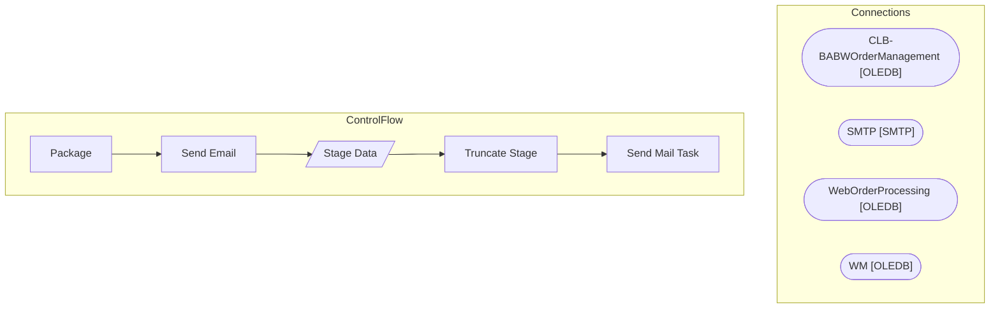

# SSIS Package: PrintingValidations

**Project:** WebPrintingValidations  
**Folder:** SSIS  

## Architecture Diagram

## Connection Managers

| Connection Name | Type |
|---|---|
| CLB-BABWOrderManagement | OLEDB |
| SMTP | SMTP |
| WebOrderProcessing | OLEDB |
| WM | OLEDB |

## Control Flow Tasks

| Task Name | Type |
|---|---|
| Package | Microsoft.Package |
| Send Email | Microsoft.ExecuteSQLTask |
| Stage Data | Microsoft.Pipeline |
| Truncate Stage | Microsoft.ExecuteSQLTask |
| Send Mail Task | Microsoft.SendMailTask |

## Data Flow: Sources

| Component | Tables Referenced | SQL Preview |
|---|---|---|
|  |  | select  	O.OrderNum from wm.Transactions T with (nolock) inner join wm.Orders O with (nolock) on T.TransactionID = O.TransactionID inner join wm.OrderItems OI with (nolock) on O.OrderID = OI.OrderID join (select orderid,waveid from wm.carton group by orderid,waveid) c  on (O.orderID = C.OrderID) join wm.waveJob w on c.waveid = w.waveID group by  	O.OrderNum |
|  |  | select distinct  	phi.pkt_ctrl_nbr as OrderNumber,  	dateadd(hh, -1, phi.mod_date_time) as WaveDateTime, getdate() as CheckDateTime from pkt_hdr_intrnl phi with (nolock) where substring(phi.pkt_ctrl_nbr, 9,1) = '_'  and phi.stat_code >= 20 and phi.stat_code <> 99 and left(phi.pkt_ctrl_nbr, 1) in ('W', '7') and datediff(dd, phi.mod_date_time, getdate()) <1 and datediff(mi, phi.mod_date_time, getdat |

## Data Flow: Destinations

| Component | Destination Table |
|---|---|
|  | [WM].[OrdersNotOnColumbusDB] |

