# SSIS Package: WebIntegrationValidations

**Project:** WebPrintingValidations  
**Folder:** SSIS  

## Architecture Diagram

```mermaid
flowchart TD
    subgraph Connections
        ApplicationResources_conn(["ApplicationResources [OLEDB]"])
        auditworks_conn(["auditworks [OLEDB]"])
        BABWPartyPlanner_conn(["BABWPartyPlanner [OLEDB]"])
        IntegrationStaging_conn(["IntegrationStaging [OLEDB]"])
        LoggedFiles_conn(["LoggedFiles [FILE]"])
        SMTP_EMAIL_conn(["SMTP_EMAIL [SMTP]"])
        SQL_LOG_conn(["SQL_LOG [OLEDB]"])
        UKFailedFiles_conn(["UKFailedFiles [FILE]"])
        UKPendingWaveCSV_conn(["UKPendingWaveCSV [FLATFILE]"])
        UKSuccessFiles_conn(["UKSuccessFiles [FILE]"])
        UKTempFolder_conn(["UKTempFolder [FILE]"])
        USPendingWaveCSV_conn(["USPendingWaveCSV [FLATFILE]"])
        WebOrderProcessing_conn(["WebOrderProcessing [OLEDB]"])
        WM_conn(["WM [OLEDB]"])
    end
    subgraph ControlFlow
        WebIntegrationValidations_task["WebIntegrationValidations"]
        PreValidation_Sequence_task["PreValidation Sequence"]
        WebIntegrationValidations_task --> PreValidation_Sequence_task
        Foreach_Loop___UK_Failed_Folder_task["Foreach Loop - UK Failed Folder"]
        PreValidation_Sequence_task --> Foreach_Loop___UK_Failed_Folder_task
        Move_Failed_to_Temp_task["Move Failed to Temp"]
        Foreach_Loop___UK_Failed_Folder_task --> Move_Failed_to_Temp_task
        Foreach_Loop___UK_Failed_Folder___2nd_Pass_task["Foreach Loop - UK Failed Folder - 2nd Pass"]
        Move_Failed_to_Temp_task --> Foreach_Loop___UK_Failed_Folder___2nd_Pass_task
        Move_Failed_to_Temp_task["Move Failed to Temp"]
        Foreach_Loop___UK_Failed_Folder___2nd_Pass_task --> Move_Failed_to_Temp_task
        Foreach_Loop___UK_Success_Folder_task["Foreach Loop - UK Success Folder"]
        Move_Failed_to_Temp_task --> Foreach_Loop___UK_Success_Folder_task
        Log_Success_Files_task["Log Success Files"]
        Foreach_Loop___UK_Success_Folder_task --> Log_Success_Files_task
        Move_Files_To_LoggedFiles_Folder_task["Move Files To LoggedFiles Folder"]
        Log_Success_Files_task --> Move_Files_To_LoggedFiles_Folder_task
        Restage_Logged_Files_Not_Sent_to_UK_task["Restage Logged Files Not Sent to UK"]
        Move_Files_To_LoggedFiles_Folder_task --> Restage_Logged_Files_Not_Sent_to_UK_task
        Run_FTP_task["Run FTP"]
        Restage_Logged_Files_Not_Sent_to_UK_task --> Run_FTP_task
        Run_FTP_again_task["Run FTP again"]
        Run_FTP_task --> Run_FTP_again_task
        Run_FTP_to_UK_task["Run FTP to UK"]
        Run_FTP_again_task --> Run_FTP_to_UK_task
        Sequence_Container_task["Sequence Container"]
        Run_FTP_to_UK_task --> Sequence_Container_task
        Foreach_Loop_Container_task["Foreach Loop Container"]
        Sequence_Container_task --> Foreach_Loop_Container_task
        Rename_File_task["Rename File"]
        Foreach_Loop_Container_task --> Rename_File_task
        Wait_task["Wait"]
        Rename_File_task --> Wait_task
        OMS_Import_Validations_task[/"OMS Import Validations"/]
        Wait_task --> OMS_Import_Validations_task
        Resend_Orders_to_WM_task["Resend Orders to WM"]
        OMS_Import_Validations_task --> Resend_Orders_to_WM_task
        Run_WM_Pickticket_Bridge_task["Run WM Pickticket Bridge"]
        Resend_Orders_to_WM_task --> Run_WM_Pickticket_Bridge_task
        Run_WM_Pickticket_Bridge___1_task["Run WM Pickticket Bridge - 1"]
        Run_WM_Pickticket_Bridge_task --> Run_WM_Pickticket_Bridge___1_task
        TruncateStage_task["TruncateStage"]
        Run_WM_Pickticket_Bridge___1_task --> TruncateStage_task
        Sequence___Processing_Summary_task["Sequence - Processing Summary"]
        TruncateStage_task --> Sequence___Processing_Summary_task
        Order_Status_Summary_Email_task["Order Status Summary Email"]
        Sequence___Processing_Summary_task --> Order_Status_Summary_Email_task
        UK_Orders_Shipped_Count_task["UK Orders Shipped Count"]
        Order_Status_Summary_Email_task --> UK_Orders_Shipped_Count_task
        UK_Orders_Uploaded_Count_task["UK Orders Uploaded Count"]
        UK_Orders_Shipped_Count_task --> UK_Orders_Uploaded_Count_task
        WM_Orders_Created_Count_task["WM Orders Created Count"]
        UK_Orders_Uploaded_Count_task --> WM_Orders_Created_Count_task
        WM_Orders_Shipped_Count_task["WM Orders Shipped Count"]
        WM_Orders_Created_Count_task --> WM_Orders_Shipped_Count_task
        Validation_Sequence_task["Validation Sequence"]
        WM_Orders_Shipped_Count_task --> Validation_Sequence_task
        Foreach_Loop___XML_Validate_ERR_Folder_task["Foreach Loop - XML Validate ERR Folder"]
        Validation_Sequence_task --> Foreach_Loop___XML_Validate_ERR_Folder_task
        Log_Error_FileNames_To_Table_task["Log Error FileNames To Table"]
        Foreach_Loop___XML_Validate_ERR_Folder_task --> Log_Error_FileNames_To_Table_task
        OMS_Custom_Import_task[/"OMS Custom Import"/]
        Log_Error_FileNames_To_Table_task --> OMS_Custom_Import_task
        OMS_Import_Validations_task[/"OMS Import Validations"/]
        OMS_Custom_Import_task --> OMS_Import_Validations_task
        Order_Status_Validations_task[/"Order Status Validations"/]
        OMS_Import_Validations_task --> Order_Status_Validations_task
        Sales_Audit_Validation_task[/"Sales Audit Validation"/]
        Order_Status_Validations_task --> Sales_Audit_Validation_task
        Send_Emails_task["Send Emails"]
        Sales_Audit_Validation_task --> Send_Emails_task
        Truncate_Stage_task["Truncate Stage"]
        Send_Emails_task --> Truncate_Stage_task
        Send_Email_onError_task["Send Email onError"]
        Truncate_Stage_task --> Send_Email_onError_task
    end
```

## Connection Managers

| Connection Name | Type |
|---|---|
| ApplicationResources | OLEDB |
| auditworks | OLEDB |
| BABWPartyPlanner | OLEDB |
| IntegrationStaging | OLEDB |
| LoggedFiles | FILE |
| SMTP_EMAIL | SMTP |
| SQL_LOG | OLEDB |
| UKFailedFiles | FILE |
| UKPendingWaveCSV | FLATFILE |
| UKSuccessFiles | FILE |
| UKTempFolder | FILE |
| USPendingWaveCSV | FLATFILE |
| WebOrderProcessing | OLEDB |
| WM | OLEDB |

## Control Flow Tasks

| Task Name | Type |
|---|---|
| WebIntegrationValidations | Microsoft.Package |
| PreValidation Sequence | STOCK:SEQUENCE |
| Foreach Loop - UK Failed Folder | STOCK:FOREACHLOOP |
| Move Failed to Temp | Microsoft.FileSystemTask |
| Foreach Loop - UK Failed Folder - 2nd Pass | STOCK:FOREACHLOOP |
| Move Failed to Temp | Microsoft.FileSystemTask |
| Foreach Loop - UK Success Folder | STOCK:FOREACHLOOP |
| Log Success Files | Microsoft.ExecuteSQLTask |
| Move Files To LoggedFiles Folder | Microsoft.FileSystemTask |
| Restage Logged Files Not Sent to UK | Microsoft.ExecuteSQLTask |
| Run FTP | Microsoft.ExecuteSQLTask |
| Run FTP again | Microsoft.ExecuteSQLTask |
| Run FTP to UK | Microsoft.ExecuteSQLTask |
| Sequence Container | STOCK:SEQUENCE |
| Foreach Loop Container | STOCK:FOREACHLOOP |
| Rename File | Microsoft.FileSystemTask |
| Wait | Microsoft.ExecuteSQLTask |
| OMS Import Validations | Microsoft.Pipeline |
| Resend Orders to WM | Microsoft.ExecuteSQLTask |
| Run WM Pickticket Bridge | Microsoft.ExecuteSQLTask |
| Run WM Pickticket Bridge - 1 | Microsoft.ExecuteSQLTask |
| TruncateStage | Microsoft.ExecuteSQLTask |
| Sequence - Processing Summary | STOCK:SEQUENCE |
| Order Status Summary Email | Microsoft.ExecuteSQLTask |
| UK Orders Shipped Count | Microsoft.ExecuteSQLTask |
| UK Orders Uploaded Count | Microsoft.ExecuteSQLTask |
| WM Orders Created Count | Microsoft.ExecuteSQLTask |
| WM Orders Shipped Count | Microsoft.ExecuteSQLTask |
| Validation Sequence | STOCK:SEQUENCE |
| Foreach Loop - XML Validate ERR Folder | STOCK:FOREACHLOOP |
| Log Error FileNames To Table | Microsoft.ExecuteSQLTask |
| OMS Custom Import | Microsoft.Pipeline |
| OMS Import Validations | Microsoft.Pipeline |
| Order Status Validations | Microsoft.Pipeline |
| Sales Audit Validation | Microsoft.Pipeline |
| Send Emails | Microsoft.ExecuteSQLTask |
| Truncate Stage | Microsoft.ExecuteSQLTask |
| Send Email onError | Microsoft.SendMailTask |

## Data Flow: Sources

| Component | Tables Referenced | SQL Preview |
|---|---|---|
|  |  | with  ordersWithCancels as 	( 		select  			distinct o.OrderNum  		from WebOrderProcessing.wm.Orders O   		inner join WebOrderProcessing.wm.Orderstatus s on o.Orderid = s.OrderID and s.currentstatus = 1 		inner join WebOrderProcessing.wm.ItemStatus S2 on O.orderid = s2.OrderID and s2.currentstatus = 1       		where s2.status = 'IV' and s.status = 'Complete' and Isnull(pickticketflag,0) = 0 		and so |
|  |  | select OrderNumber  from wm.OMSCustomOrderExport with (nolock)  where datediff(dd, OrderDateUTC, getdate()) <= 90 and OrderStatus in ('completed', 'cancelled') |
|  |  | select  	o.OrderNum, 	os.Status from WM.Orders o with (nolock) join WM.OrderStatus os with (nolock) on o.OrderID = os.OrderID and os.CurrentStatus = 1 where o.SourceSite = 'BABW-US' and substring(o.OrderNum, 9,1) = '_' and datediff(dd, StatusDate, getdate()) <= 90 |
|  |  | select * from [dbo].[vwImportOMS_ErrorLog] |
|  |  | select OrderNum, WMFileName, SendTime, getdate() as CheckDateTime from WM.OrdersSentToWM with (nolock) where datediff(dd, sendTime, getdate()) <= 90 |
|  |  | select  	o.OrderNum, 	os.Status from WM.Orders o with (nolock) join WM.OrderStatus os with (nolock) on o.OrderID = os.OrderID and os.CurrentStatus = 1 where o.SourceSite = 'BABW-UK' and substring(o.OrderNum, 9,1) = '_' and datediff(dd, StatusDate, getdate()) <= 90 |
|  |  | select distinct  			o.OrderNum, 			right(o.SourceSite ,2) as SourceSite		from WebOrderProcessing.WM.Orders o with (nolock) --		join WM.OrderStatus os with (nolock) on o.OrderID = os.OrderID and os.CurrentStatus = 1 		where 1=1 --		and o.SourceSite = 'BABW-US' 		and substring(o.OrderNum, 9,1) = '_' 		and datediff(dd, OrderDate, getdate()) <= 90 |
|  |  | select  	substring(ftpLog,64,10) as OrderNumber, 	substring(ftpLog,49,43) as OrderFileName, 	LogDateTime from WEB.UKFTPTransmissionLogDump  where ftplog like '%OMSInBoundOrder%' and right(ftpLog,4) = '100%' |
|  |  | select pkt_ctrl_nbr as OrderNumber from pkt_hdr_intrnl with (nolock) where substring(pkt_ctrl_nbr,9,1) = '_' --UNION --select pkt_ctrl_nbr as OrderNumber --from wmprod_archive.dbo.pkt_hdr_intrnl with (nolock) --where substring(pkt_ctrl_nbr,9,1) = '_' |
|  |  | select left(OrderNumber,8) OrderNum  from vwImportOMSOrderFileLog with (nolock) where datediff(dd, LogCreatedDate, getdate()) <= 90 |
|  |  | select distinct OrderNumber  from wm.OMSCustomOrderExport with (nolock)  where ItemStatus in ('Pending Sound') or OrderStatus in ('Completed') and datediff(dd, OrderDateUTC, getdate()) <= 90 |
|  |  | select left(OrderNumber,8) OrderNumber from wm.Orders with (nolock) where datediff(dd, OrderDate, getdate()) <= 60 |
|  |  | select distinct cast(e.OrderNumber as varchar(10)) as OrderNumber, e.OrderDateUTC from wm.OMSCustomOrderExport e with (nolock) where e.OrderStatus in ('New', 'Pending') and e.ItemStatus in ('New','Pending Wave') and e.OrderItemTypeName <> 'eGift' and e.OrderItemCustom1 <> 'Build-A-Bear Donation' and datediff(dd, e.OrderDateUTC, getdate()) <= 30 |
|  |  | with  ordersWithCancels as 	( 		select  			distinct o.OrderNum  		from WebOrderProcessing.wm.Orders O   		inner join WebOrderProcessing.wm.Orderstatus s on o.Orderid = s.OrderID and s.currentstatus = 1 		inner join WebOrderProcessing.wm.ItemStatus S2 on O.orderid = s2.OrderID and s2.currentstatus = 1       		where s2.status = 'IV' and s.status = 'Complete' and Isnull(pickticketflag,0) = 0 		and so |
|  |  | select OrderNumber  from wm.OMSCustomOrderExport with (nolock)  where datediff(dd, OrderDateUTC, getdate()) <= 90 and OrderStatus in ('completed', 'cancelled') |
|  |  | select  	o.OrderNum, 	os.Status from WM.Orders o with (nolock) join WM.OrderStatus os with (nolock) on o.OrderID = os.OrderID and os.CurrentStatus = 1 where o.SourceSite = 'BABW-US' and substring(o.OrderNum, 9,1) = '_' and datediff(dd, StatusDate, getdate()) <= 90 |
|  |  | select * from [dbo].[vwImportOMS_ErrorLog] |
|  |  | select OrderNum, WMFileName, SendTime, getdate() as CheckDateTime from WM.OrdersSentToWM with (nolock) where datediff(dd, sendTime, getdate()) <= 90 |
|  |  | select  	o.OrderNum, 	os.Status from WM.Orders o with (nolock) join WM.OrderStatus os with (nolock) on o.OrderID = os.OrderID and os.CurrentStatus = 1 where o.SourceSite = 'BABW-UK' and substring(o.OrderNum, 9,1) = '_' and datediff(dd, StatusDate, getdate()) <= 90 |
|  |  | select distinct  			o.OrderNum, 			right(o.SourceSite ,2) as SourceSite		from WebOrderProcessing.WM.Orders o with (nolock) --		join WM.OrderStatus os with (nolock) on o.OrderID = os.OrderID and os.CurrentStatus = 1 		where 1=1 --		and o.SourceSite = 'BABW-US' 		and substring(o.OrderNum, 9,1) = '_' 		and datediff(dd, OrderDate, getdate()) <= 90 |
|  |  | select  	substring(ftpLog,64,10) as OrderNumber, 	substring(ftpLog,49,43) as OrderFileName, 	LogDateTime from WEB.UKFTPTransmissionLogDump  where ftplog like '%OMSInBoundOrder%' and right(ftpLog,4) = '100%' |
|  |  | select pkt_ctrl_nbr as OrderNumber from pkt_hdr_intrnl with (nolock) where substring(pkt_ctrl_nbr,9,1) = '_' --UNION --select pkt_ctrl_nbr as OrderNumber --from wmprod_archive.dbo.pkt_hdr_intrnl with (nolock) --where substring(pkt_ctrl_nbr,9,1) = '_' |
|  |  | select  distinct 	cast(substring (ln.line_note, 12,30) as varchar(10)) as OrderNumber from auditworks.dbo.transaction_header th (nolock) join auditworks.dbo.line_note ln (nolock) on th.transaction_id = ln.transaction_id --and datediff(dd, th.transaction_date, getdate()) <=2 and th.store_no = '13' and ln.line_note like 'Web Order%' |
|  |  | select o.OrderNum from WM.Orders o with (nolock) join WM.OrderStatus os with (nolock) on o.OrderID = os.OrderID where os.Status in ('waved','complete','completed', 'shipped', 'cancelled') and os.CurrentStatus = 1 |
|  |  | select o.OrderNum from WM.Orders o join WM.OrderStatus os with (nolock) on o.OrderID = os.OrderID where os.Status in ('complete', 'shipped', 'cancelled') and os.CurrentStatus = 1 and datediff(dd, o.OrderDate, getdate()) <= 90 |
|  |  | select * from [dbo].[vwUpdateShippedOMS_ErrorLog] |
|  |  | select * from [dbo].[vwUpdateWavedOMS_ErrorLog] |
|  |  | select phi.pkt_ctrl_nbr as OrderNumber, phi.create_date_time as ShipDateTime, getdate() as CheckDateTime from outpt_pkt_hdr phi with (nolock) where left(phi.pkt_ctrl_nbr, 1) in ('W', '7') and datediff(mi, phi.create_date_time, getdate()) >= 90 and phi.create_date_time >= '2017-10-03' and phi.stat_code <> 99 |
|  |  | select distinct  	phi.pkt_ctrl_nbr as OrderNumber,  	phi.create_date_time as WaveDateTime, getdate() as CheckDateTime from pkt_hdr_intrnl phi with (nolock) where substring(phi.pkt_ctrl_nbr, 9,1) = '_'  and phi.stat_code >= 20 and phi.stat_code <> 99 and left(phi.pkt_ctrl_nbr, 1) in ('W', '7') and datediff(mi, phi.create_date_time, getdate()) >= 20 --and datediff(dd, swp.create_date_time, getdate() |
|  |  | select  distinct 	cast(substring (ln.line_note, 12,30) as varchar(12)) as OrderNumber from auditworks.dbo.transaction_header th (nolock) join auditworks.dbo.line_note ln (nolock) on th.transaction_id = ln.transaction_id and th.store_no in ( '13', '2013')  and ln.line_note like 'Web Order%' UNION select  distinct 	cast(substring (ln.line_note, 12,30) as varchar(12)) as OrderNumber from auditworks.d |
|  |  | select cast(left(reference_no,19) as varchar) as reference_no from transaction_line with (nolock) where line_object = 106 and line_action = 90 union select cast(left(reference_no,19) as varchar)  as reference_no from av_transaction_line with (nolock) where line_object = 106 and line_action = 90 |
|  |  | select * from [WM].[vwTransactionDetailAll] |
|  |  | select left(EnterpriseSellingID,19) as EnterpriseSellingID from PartyEnterpriseSellingXRef with (nolock) |
|  |  | with  ordersWithCancels as 	( 		select  			distinct o.OrderNum 		from WebOrderProcessing.wm.Orders O   		inner join WebOrderProcessing.wm.Orderstatus s on o.Orderid = s.OrderID and s.currentstatus = 1 		inner join WebOrderProcessing.wm.ItemStatus S2 on O.orderid = s2.OrderID and s2.currentstatus = 1       		where s2.status = 'IV' and s.status = 'Pending' and Isnull(pickticketflag,0) = 0 		and sour |

## Data Flow: Destinations

| Component | Destination Table |
|---|---|
|  | [dbo].[vwImportOMSOrderFileLog] |
|  | [WM].[OrdersNotInWM] |
|  | [WM].[OrdersNotSentToUK] |
|  | [WM].[OrdersNotInImportFileLog] |
|  | [dbo].[vwImportOMSOrderFileLog] |
|  | [WM].[OrdersNotInWM] |
|  | [WM].[OrdersNotSentToUK] |
|  | [WM].[OrdersNotShippedInOMS] |
|  | [WM].[OrdersNotWavedInOMS] |
|  | [WM].[OrdersNotInSalesAudit] |

