# SSIS Package: WebCatalogMaster

**Project:** WebProductCatalogMaster  
**Folder:** SSIS  

## Architecture Diagram

```mermaid
flowchart TD
    subgraph Connections
        AltImagesCSV_conn(["AltImagesCSV [FLATFILE]"])
        AltImageTagsCSV_conn(["AltImageTagsCSV [FLATFILE]"])
        AltImageTagz_csv_conn(["AltImageTagz.csv [FLATFILE]"])
        Archive_conn(["Archive [FILE]"])
        ArchiveFolder_conn(["ArchiveFolder [FILE]"])
        ATGProductExportCSV_conn(["ATGProductExportCSV [FLATFILE]"])
        catalog_xsd_conn(["catalog.xsd [FILE]"])
        DW_conn(["DW [OLEDB]"])
        IntegrationStaging_conn(["IntegrationStaging [OLEDB]"])
        ItemAttributeExceptions_conn(["ItemAttributeExceptions [FLATFILE]"])
        me_01_conn(["me_01 [OLEDB]"])
        SMTP_EMAIL_conn(["SMTP_EMAIL [SMTP]"])
        SQL_LOG_conn(["SQL_LOG [OLEDB]"])
        Validate_xml_conn(["Validate.xml [FILE]"])
        WebOrderProcessing_conn(["WebOrderProcessing [OLEDB]"])
        WebOrderProcessing_CLB_Mirror_conn(["WebOrderProcessing_CLB_Mirror [OLEDB]"])
        XML_FILES_conn(["XML FILES [FILE]"])
    end
    subgraph ControlFlow
        WebCatalogMaster_task["WebCatalogMaster"]
        Attributes_Reload_after_Table_Rebuild_task[/"Attributes Reload after Table Rebuild"/]
        WebCatalogMaster_task --> Attributes_Reload_after_Table_Rebuild_task
        Data_Flow_Task_task[/"Data Flow Task"/]
        Attributes_Reload_after_Table_Rebuild_task --> Data_Flow_Task_task
        File_Generation_and_Move_task["File Generation and Move"]
        Data_Flow_Task_task --> File_Generation_and_Move_task
        Delete_Old_Files_task["Delete Old Files"]
        File_Generation_and_Move_task --> Delete_Old_Files_task
        Foreach_Loop_Container_task["Foreach Loop Container"]
        Delete_Old_Files_task --> Foreach_Loop_Container_task
        Archive_Files_task["Archive Files"]
        Foreach_Loop_Container_task --> Archive_Files_task
        Copy_Files_to_FTP_Server_task["Copy Files to FTP Server"]
        Archive_Files_task --> Copy_Files_to_FTP_Server_task
        spOutputMasterCatalog_task["spOutputMasterCatalog"]
        Copy_Files_to_FTP_Server_task --> spOutputMasterCatalog_task
        Stage_Data_task["Stage Data"]
        spOutputMasterCatalog_task --> Stage_Data_task
        Attributes_task["Attributes"]
        Stage_Data_task --> Attributes_task
        Foreach_Loop___AltImageTags_task["Foreach Loop - AltImageTags"]
        Attributes_task --> Foreach_Loop___AltImageTags_task
        AltImageTags_Dataflow_task[/"AltImageTags Dataflow"/]
        Foreach_Loop___AltImageTags_task --> AltImageTags_Dataflow_task
        Archive_File_task["Archive File"]
        AltImageTags_Dataflow_task --> Archive_File_task
        spMergeAltImageTags_task["spMergeAltImageTags"]
        Archive_File_task --> spMergeAltImageTags_task
        Truncate_Stage_task["Truncate Stage"]
        spMergeAltImageTags_task --> Truncate_Stage_task
        Merge_ProductCatalogMasterAttributes_task["Merge ProductCatalogMasterAttributes"]
        Truncate_Stage_task --> Merge_ProductCatalogMasterAttributes_task
        Online_and_Searchable_Flags_task["Online and Searchable Flags"]
        Merge_ProductCatalogMasterAttributes_task --> Online_and_Searchable_Flags_task
        Pre_Stage_Web_Attributes_task["Pre Stage Web Attributes"]
        Online_and_Searchable_Flags_task --> Pre_Stage_Web_Attributes_task
        Stage_Web_Attributes_task[/"Stage Web Attributes"/]
        Pre_Stage_Web_Attributes_task --> Stage_Web_Attributes_task
        Update_Descriptions_from_ATG_File_task["Update Descriptions from ATG File"]
        Stage_Web_Attributes_task --> Update_Descriptions_from_ATG_File_task
        Clean_XTRAs___Update_Attributes_Table_task["Clean XTRAs - Update Attributes Table"]
        Update_Descriptions_from_ATG_File_task --> Clean_XTRAs___Update_Attributes_Table_task
        Import_Master_Data_Xtras_task[/"Import Master Data Xtras"/]
        Clean_XTRAs___Update_Attributes_Table_task --> Import_Master_Data_Xtras_task
        Merge_AlternateImages_task["Merge AlternateImages"]
        Import_Master_Data_Xtras_task --> Merge_AlternateImages_task
        Categories_task["Categories"]
        Merge_AlternateImages_task --> Categories_task
        Merge_Categories_task["Merge Categories"]
        Categories_task --> Merge_Categories_task
        Stage_Categories_task[/"Stage Categories"/]
        Merge_Categories_task --> Stage_Categories_task
        ProductCategoryMap_task["ProductCategoryMap"]
        Stage_Categories_task --> ProductCategoryMap_task
        Merge_ProductCategoryMap_task["Merge ProductCategoryMap"]
        ProductCategoryMap_task --> Merge_ProductCategoryMap_task
        Stage_ProductCategory_Map_task[/"Stage ProductCategory Map"/]
        Merge_ProductCategoryMap_task --> Stage_ProductCategory_Map_task
        Sequence___Master_Data_to_DW_task["Sequence - Master Data to DW"]
        Stage_ProductCategory_Map_task --> Sequence___Master_Data_to_DW_task
        Load_Master_Data_to_DW_task[/"Load Master Data to DW"/]
        Sequence___Master_Data_to_DW_task --> Load_Master_Data_to_DW_task
        Truncate_DW_task["Truncate DW"]
        Load_Master_Data_to_DW_task --> Truncate_DW_task
        Sequence___Merge_ProductCatalogMasterAttributes_to_WebOrderProcessing_task["Sequence - Merge ProductCatalogMasterAttributes to WebOrderProcessing"]
        Truncate_DW_task --> Sequence___Merge_ProductCatalogMasterAttributes_to_WebOrderProcessing_task
        Merge_ProductCatalogMasterAttributesMirror_task["Merge ProductCatalogMasterAttributesMirror"]
        Sequence___Merge_ProductCatalogMasterAttributes_to_WebOrderProcessing_task --> Merge_ProductCatalogMasterAttributesMirror_task
        Stage_ProductCatalogMasterAttributes_Mirror_task[/"Stage ProductCatalogMasterAttributes Mirror"/]
        Merge_ProductCatalogMasterAttributesMirror_task --> Stage_ProductCatalogMasterAttributes_Mirror_task
        Truncate_Stage___WebOrderProcessing_task["Truncate Stage - WebOrderProcessing"]
        Stage_ProductCatalogMasterAttributes_Mirror_task --> Truncate_Stage___WebOrderProcessing_task
        Sequence___Merge_ProductCatalogMasterAttributes_to_WebOrderProcessing_CLB_Mirror_task["Sequence - Merge ProductCatalogMasterAttributes to WebOrderProcessing_CLB_Mirror"]
        Truncate_Stage___WebOrderProcessing_task --> Sequence___Merge_ProductCatalogMasterAttributes_to_WebOrderProcessing_CLB_Mirror_task
        Merge_ProductCatalogMasterAttributesMirror_task["Merge ProductCatalogMasterAttributesMirror"]
        Sequence___Merge_ProductCatalogMasterAttributes_to_WebOrderProcessing_CLB_Mirror_task --> Merge_ProductCatalogMasterAttributesMirror_task
        Stage_ProductCatalogMasterAttributes_Mirror_task[/"Stage ProductCatalogMasterAttributes Mirror"/]
        Merge_ProductCatalogMasterAttributesMirror_task --> Stage_ProductCatalogMasterAttributes_Mirror_task
        Truncate_Stage___WebOrderProcessing_task["Truncate Stage - WebOrderProcessing"]
        Stage_ProductCatalogMasterAttributes_Mirror_task --> Truncate_Stage___WebOrderProcessing_task
        Truncate_Staging_task["Truncate Staging"]
        Truncate_Stage___WebOrderProcessing_task --> Truncate_Staging_task
        Send_Email_onError_task["Send Email onError"]
        Truncate_Staging_task --> Send_Email_onError_task
    end
```

## Connection Managers

| Connection Name | Type |
|---|---|
| AltImagesCSV | FLATFILE |
| AltImageTagsCSV | FLATFILE |
| AltImageTagz.csv | FLATFILE |
| Archive | FILE |
| ArchiveFolder | FILE |
| ATGProductExportCSV | FLATFILE |
| catalog.xsd | FILE |
| DW | OLEDB |
| IntegrationStaging | OLEDB |
| ItemAttributeExceptions | FLATFILE |
| me_01 | OLEDB |
| SMTP_EMAIL | SMTP |
| SQL_LOG | OLEDB |
| Validate.xml | FILE |
| WebOrderProcessing | OLEDB |
| WebOrderProcessing_CLB_Mirror | OLEDB |
| XML FILES | FILE |

## Control Flow Tasks

| Task Name | Type |
|---|---|
| WebCatalogMaster | Microsoft.Package |
| Attributes Reload after Table Rebuild | Microsoft.Pipeline |
| Data Flow Task | Microsoft.Pipeline |
| File Generation and Move | STOCK:SEQUENCE |
| Delete Old Files | Microsoft.ExecuteSQLTask |
| Foreach Loop Container | STOCK:FOREACHLOOP |
| Archive Files | Microsoft.FileSystemTask |
| Copy Files to FTP Server | Microsoft.FileSystemTask |
| spOutputMasterCatalog | Microsoft.ExecuteSQLTask |
| Stage Data | STOCK:SEQUENCE |
| Attributes | STOCK:SEQUENCE |
| Foreach Loop - AltImageTags | STOCK:FOREACHLOOP |
| AltImageTags Dataflow | Microsoft.Pipeline |
| Archive File | Microsoft.FileSystemTask |
| spMergeAltImageTags | Microsoft.ExecuteSQLTask |
| Truncate Stage | Microsoft.ExecuteSQLTask |
| Merge ProductCatalogMasterAttributes | Microsoft.ExecuteSQLTask |
| Online and Searchable Flags | Microsoft.ExecuteSQLTask |
| Pre Stage Web Attributes | Microsoft.ExecuteSQLTask |
| Stage Web Attributes | Microsoft.Pipeline |
| Update Descriptions from ATG File | STOCK:SEQUENCE |
| Clean XTRAs - Update Attributes Table | Microsoft.ExecuteSQLTask |
| Import Master Data Xtras | Microsoft.Pipeline |
| Merge AlternateImages | Microsoft.ExecuteSQLTask |
| Categories | STOCK:SEQUENCE |
| Merge Categories | Microsoft.ExecuteSQLTask |
| Stage Categories | Microsoft.Pipeline |
| ProductCategoryMap | STOCK:SEQUENCE |
| Merge ProductCategoryMap | Microsoft.ExecuteSQLTask |
| Stage ProductCategory Map | Microsoft.Pipeline |
| Sequence - Master Data to DW | STOCK:SEQUENCE |
| Load Master Data to DW | Microsoft.Pipeline |
| Truncate DW | Microsoft.ExecuteSQLTask |
| Sequence - Merge ProductCatalogMasterAttributes to WebOrderProcessing | STOCK:SEQUENCE |
| Merge ProductCatalogMasterAttributesMirror | Microsoft.ExecuteSQLTask |
| Stage ProductCatalogMasterAttributes Mirror | Microsoft.Pipeline |
| Truncate Stage - WebOrderProcessing | Microsoft.ExecuteSQLTask |
| Sequence - Merge ProductCatalogMasterAttributes to WebOrderProcessing_CLB_Mirror | STOCK:SEQUENCE |
| Merge ProductCatalogMasterAttributesMirror | Microsoft.ExecuteSQLTask |
| Stage ProductCatalogMasterAttributes Mirror | Microsoft.Pipeline |
| Truncate Stage - WebOrderProcessing | Microsoft.ExecuteSQLTask |
| Truncate Staging | Microsoft.ExecuteSQLTask |
| Send Email onError | Microsoft.SendMailTask |

## Data Flow: Sources

| Component | Tables Referenced | SQL Preview |
|---|---|---|
|  |  | select cast(BABWProductID as varchar(6)) as StyleCode from WEB.ProductCatalogMasterAttributes |
|  |  | select cast(style_code as varchar(6)) as StyleCode from style |
|  |  | select BABWProductID  from WEB.ProductCatalogMasterAttributes |
|  |  | select  	Style, 	substring(CategoryID, 4, 999) as PrimaryStorefrontCategory from WEB.ProductStorefrontCategoryMap where PrimaryCategory = 1 |
|  |  | select * from [WEB].[ProductMasterDataXtras] |
|  |  | select * from [WEB].[vwProductInventoryBySellingGeography] |
|  |  | select * from [WEB].[ProductCatalogMasterDataExceptions] |
|  |  | select * from [dbo].[vwWebIncludedStyles] |
|  |  | select   	style_code, 	jurisdiction_code, 	product_key  from product_dim with (nolock) where style_code is not null and jurisdiction_code in ('US', 'UK') |

## Data Flow: Destinations

| Component | Destination Table |
|---|---|
|  | [WEB].[ProductCatalogMasterAttributes] |
|  | [dbo].[tmpAttributes] |
|  | [dbo].[tmpStyle] |
|  | [dbo].[style] |
|  | [WEB].[AltImageTagsStage] |
|  | [WEB].[ProductCatalogMasterAttributesStage] |
|  | [dbo].[WebProductCatalogMasterAttributes] |
|  | [WEB].[AlternateImagesStage] |
|  | [WEB].[ProductCatalogMasterDataExceptions] |
|  | [WEB].[ProductMasterDataXtras] |
|  | [dbo].[vwWebProductMasterCatalogCategories] |
|  | [WEB].[ProductCatalogMasterCategoryStage] |
|  | [WEB].[ProductCategoryMapStage] |
|  | [WEB].[vwProductCategoryMap] |
|  | [WEB].[ProductCatalogMasterAttributes] |
|  | [Azure].[WebProductCatalogMasterAttributes] |
|  | [WEB].[ProductCatalogMasterAttributes] |
|  | [WM].[ProductCatalogMasterAttributes_MirrorStage] |
|  | [WEB].[ProductCatalogMasterAttributes] |
|  | [WM].[ProductCatalogMasterAttributes_MirrorStage] |

