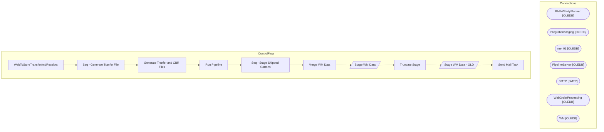

# SSIS Package: WebToStoreTransferAndReceipts

**Project:** WebToStoreTransferAndReceipts  
**Folder:** SSIS  

## Architecture Diagram

## Connection Managers

| Connection Name | Type |
|---|---|
| BABWPartyPlanner | OLEDB |
| IntegrationStaging | OLEDB |
| me_01 | OLEDB |
| PipelineServer | OLEDB |
| SMTP | SMTP |
| WebOrderProcessing | OLEDB |
| WM | OLEDB |

## Control Flow Tasks

| Task Name | Type |
|---|---|
| WebToStoreTransferAndReceipts | Microsoft.Package |
| Seq - Generate Tranfer File | STOCK:SEQUENCE |
| Generate Tranfer and CBR Files | Microsoft.ExecuteSQLTask |
| Run Pipeline | Microsoft.ExecuteSQLTask |
| Seq - Stage Shipped Cartons | STOCK:SEQUENCE |
| Merge WM Data | Microsoft.ExecuteSQLTask |
| Stage WM Data | Microsoft.Pipeline |
| Truncate Stage | Microsoft.ExecuteSQLTask |
| Stage WM Data - OLD | Microsoft.Pipeline |
| Send Mail Task | Microsoft.SendMailTask |

## Data Flow: Sources

| Component | Tables Referenced | SQL Preview |
|---|---|---|
|  |  | select OrderID, OrderNum  from wm.Orders (nolock) |
|  |  | SELECT  	   p.PartyID,  	   max(cast(EventStart as date)) as PartyDate FROM Party p LEFT JOIN Event e 	ON p.EventID = e.EventID LEFT JOIN Occasion o 	ON p.OccasionID = o.OccasionID LEFT JOIN Package pa 	ON p.PackageID = pa.PackageID WHERE   (p.PackageID = 77 -- Girlscout themed party  		OR p.OccasionID IN (110,111,112,113,114) -- All Girl scouts occasions) 	) group by p.PartyID |
|  |  | select OrderID, PartyID  from PartyEnterpriseSellingXRef with (nolock) |
|  |  | select * from [WMS].[ModeOfDeliveryWeb] |
|  |  | with  Shipments as 	( 		SELECT  			o.OrderType as ord_type,  			substring(o.ShipToLName, charindex('BuildaBear - ', o.ShipToLName)+13, 4) as ShipTo, 			'' as carton_nbr, --- need to get carton nuber 			oi.sku as style, 			oi.ItemDescription as sku_desc, 			sum(qty) as qty, 			os.StatusDate as ship_date_time, 			O.OrderNum as WebOrderNumber, 			'GirlScout' as PartyType, 			o.ShippingMethod as ship_ |
|  |  | select OrderID, OrderNum  from wm.Orders (nolock) |
|  |  | SELECT  	   p.PartyID,  	   max(cast(EventStart as date)) as PartyDate FROM Party p LEFT JOIN Event e 	ON p.EventID = e.EventID LEFT JOIN Occasion o 	ON p.OccasionID = o.OccasionID LEFT JOIN Package pa 	ON p.PackageID = pa.PackageID WHERE   (p.PackageID = 77 -- Girlscout themed party  		OR p.OccasionID IN (110,111,112,113,114) -- All Girl scouts occasions) 	) group by p.PartyID |
|  |  | select OrderID, PartyID  from PartyEnterpriseSellingXRef with (nolock) |
|  |  | select  	ph.ord_type, 	substring(shipto_name, charindex('BuildaBear - ', ph.shipto_name)+13, 4) as ShipTo, 	cd.carton_nbr, 	cd.style, 	im.sku_desc, 	sum(cd.units_pakd) Qty, 	ch.create_date_time as ship_date_time, ph.pkt_ctrl_nbr as WebOrderNumber, 'GirlScout' as PartyType, sv.ship_via_desc, ch.trkg_nbr from outpt_carton_dtl cd with (nolock) join pkt_hdr ph with (nolock) on cd.pkt_ctrl_nbr = ph.pkt |

## Data Flow: Destinations

| Component | Destination Table |
|---|---|
|  | [WEB].[WMShippedCartonsStage] |
|  | [WEB].[WMShippedCartonsStage] |

