# SSIS Package: ShopperTrackFactETL

**Project:** ShopperTrackFactETL  
**Folder:** ShopperTrak  

## Architecture Diagram

```mermaid
flowchart TD
    subgraph Connections
        DW_conn(["DW [OLEDB]"])
        DWStaging_conn(["DWStaging [OLEDB]"])
        ShopperTrakSourceFile_conn(["ShopperTrakSourceFile [FLATFILE]"])
    end
    subgraph ControlFlow
        ShopperTrackFactETL_task["ShopperTrackFactETL"]
        Exec_Control_Merge_and__SFTP_Fille_Pull_task["Exec Control Merge and  SFTP Fille Pull"]
        ShopperTrackFactETL_task --> Exec_Control_Merge_and__SFTP_Fille_Pull_task
        Traffic_Contral_Table_Merge_task["Traffic Contral Table Merge"]
        Exec_Control_Merge_and__SFTP_Fille_Pull_task --> Traffic_Contral_Table_Merge_task
        WinSCP___Get_files_and_Archive_task["WinSCP - Get files and Archive"]
        Traffic_Contral_Table_Merge_task --> WinSCP___Get_files_and_Archive_task
        Send_Mail_Task_task["Send Mail Task"]
        WinSCP___Get_files_and_Archive_task --> Send_Mail_Task_task
        Stage_and_Merge_Data_task["Stage and Merge Data"]
        Send_Mail_Task_task --> Stage_and_Merge_Data_task
        Foreach_Loop___Foreach_Shopper_Trak_File_task["Foreach Loop - Foreach Shopper Trak File"]
        Stage_and_Merge_Data_task --> Foreach_Loop___Foreach_Shopper_Trak_File_task
        DFT___ShopperTrak_File_to_ShopperTrackStage_task[/"DFT - ShopperTrak File to ShopperTrackStage"/]
        Foreach_Loop___Foreach_Shopper_Trak_File_task --> DFT___ShopperTrak_File_to_ShopperTrackStage_task
        Execute_SQL____Merge_to_ShopperTrackFact_task["Execute SQL  - Merge to ShopperTrackFact"]
        DFT___ShopperTrak_File_to_ShopperTrackStage_task --> Execute_SQL____Merge_to_ShopperTrackFact_task
        Move_ShopperTrak_File_to_Archive_task["Move ShopperTrak File to Archive"]
        Execute_SQL____Merge_to_ShopperTrackFact_task --> Move_ShopperTrak_File_to_Archive_task
        Reload_HasTraffic_task["Reload HasTraffic"]
        Move_ShopperTrak_File_to_Archive_task --> Reload_HasTraffic_task
        Truncate_Staging_Tables_task["Truncate Staging Tables"]
        Reload_HasTraffic_task --> Truncate_Staging_Tables_task
        Send_Mail_Task_task["Send Mail Task"]
        Truncate_Staging_Tables_task --> Send_Mail_Task_task
    end
```

## Connection Managers

| Connection Name | Type |
|---|---|
| DW | OLEDB |
| DWStaging | OLEDB |
| ShopperTrakSourceFile | FLATFILE |

## Control Flow Tasks

| Task Name | Type |
|---|---|
| ShopperTrackFactETL | Microsoft.Package |
| Exec Control Merge and  SFTP Fille Pull | STOCK:SEQUENCE |
| Traffic Contral Table Merge | Microsoft.ExecuteSQLTask |
| WinSCP - Get files and Archive | Microsoft.ExecuteProcess |
| Send Mail Task | Microsoft.SendMailTask |
| Stage and Merge Data | STOCK:SEQUENCE |
| Foreach Loop - Foreach Shopper Trak File | STOCK:FOREACHLOOP |
| DFT - ShopperTrak File to ShopperTrackStage | Microsoft.Pipeline |
| Execute SQL  - Merge to ShopperTrackFact | Microsoft.ExecuteSQLTask |
| Move ShopperTrak File to Archive | Microsoft.FileSystemTask |
| Reload HasTraffic | Microsoft.ExecuteSQLTask |
| Truncate Staging Tables | Microsoft.ExecuteSQLTask |
| Send Mail Task | Microsoft.SendMailTask |

## Data Flow: Sources

| Component | Tables Referenced | SQL Preview |
|---|---|---|
|  |  | SELECT dd.[date_key]       ,dd.[actual_date]   FROM [dbo].[date_dim] dd with (nolock) |
|  |  | SELECT sd.[store_key]       ,sd.[store_id]   FROM [dbo].[store_dim] sd with (nolock) |
|  |  | SELECT td.[time_key]       ,td.[hour]       ,td.[minute]   FROM [dbo].[time_dim] td with (nolock) |

## Data Flow: Destinations

| Component | Destination Table |
|---|---|
|  | [dbo].[ShopperTrackStage] |

