# SSIS Package: HR_StoreForcePosSalesExtract

**Project:** HR_StoreForcePosSalesExtract  
**Folder:** StoreForce  

## Architecture Diagram

```mermaid
flowchart TD
    subgraph Connections
        Auditworks_conn(["Auditworks [OLEDB]"])
        babwmstrdata_conn(["babwmstrdata [OLEDB]"])
        BABWPartyPlanner_conn(["BABWPartyPlanner [OLEDB]"])
        CRM_conn(["CRM [OLEDB]"])
        DW_conn(["DW [OLEDB]"])
        DWStaging_conn(["DWStaging [OLEDB]"])
        IngestExportedFilesCSV_conn(["IngestExportedFilesCSV [FLATFILE]"])
        IntegrationStaging_conn(["IntegrationStaging [OLEDB]"])
        ME_01_conn(["ME_01 [OLEDB]"])
        SMTP_conn(["SMTP [SMTP]"])
        StoreSalesCSV_conn(["StoreSalesCSV [FLATFILE]"])
        StoreServer1_conn(["StoreServer1 [OLEDB]"])
        StoreServer2_conn(["StoreServer2 [OLEDB]"])
        StoreServer3_conn(["StoreServer3 [OLEDB]"])
        StoreServer4_conn(["StoreServer4 [OLEDB]"])
        StoreServer5_conn(["StoreServer5 [OLEDB]"])
        WebOrderProcessing_conn(["WebOrderProcessing [OLEDB]"])
    end
    subgraph ControlFlow
        HR_StoreForcePosSalesExtract_task["HR_StoreForcePosSalesExtract"]
        Generate_CSV_task[/"Generate CSV"/]
        HR_StoreForcePosSalesExtract_task --> Generate_CSV_task
        OnDemandCSV_task[/"OnDemandCSV"/]
        Generate_CSV_task --> OnDemandCSV_task
        ONE_TIME_USE_FOR_HISTORY_DATA_FILES_task["ONE TIME USE FOR HISTORY DATA FILES"]
        OnDemandCSV_task --> ONE_TIME_USE_FOR_HISTORY_DATA_FILES_task
        SEQ___Multi_CSV_Loop_task["SEQ - Multi CSV Loop"]
        ONE_TIME_USE_FOR_HISTORY_DATA_FILES_task --> SEQ___Multi_CSV_Loop_task
        Foreach_Loop_Container_task["Foreach Loop Container"]
        SEQ___Multi_CSV_Loop_task --> Foreach_Loop_Container_task
        Foreach_Loop_Container_task["Foreach Loop Container"]
        Foreach_Loop_Container_task --> Foreach_Loop_Container_task
        File_System_Task_task["File System Task"]
        Foreach_Loop_Container_task --> File_System_Task_task
        Rename_File_task["Rename File"]
        File_System_Task_task --> Rename_File_task
        Send_Mail_Task_task["Send Mail Task"]
        Rename_File_task --> Send_Mail_Task_task
        Generate_CSV_task[/"Generate CSV"/]
        Send_Mail_Task_task --> Generate_CSV_task
        Stage_Dates_task["Stage Dates"]
        Generate_CSV_task --> Stage_Dates_task
        Sequence_Container_task["Sequence Container"]
        Stage_Dates_task --> Sequence_Container_task
        Foreach_Loop_Container_task["Foreach Loop Container"]
        Sequence_Container_task --> Foreach_Loop_Container_task
        Stage_DeptItemStyle_task[/"Stage DeptItemStyle"/]
        Foreach_Loop_Container_task --> Stage_DeptItemStyle_task
        Store_List_Load_task["Store List Load"]
        Stage_DeptItemStyle_task --> Store_List_Load_task
        Truncate_Stage_task["Truncate Stage"]
        Store_List_Load_task --> Truncate_Stage_task
        SEQ___All_Store_Sales_Stage_task["SEQ - All Store Sales Stage"]
        Truncate_Stage_task --> SEQ___All_Store_Sales_Stage_task
        SEQ_1_task["SEQ 1"]
        SEQ___All_Store_Sales_Stage_task --> SEQ_1_task
        Foreach_Loop_Container_task["Foreach Loop Container"]
        SEQ_1_task --> Foreach_Loop_Container_task
        Data_Flow_from_Store_Stage_task[/"Data Flow from Store Stage"/]
        Foreach_Loop_Container_task --> Data_Flow_from_Store_Stage_task
        Failure_Log_task["Failure Log"]
        Data_Flow_from_Store_Stage_task --> Failure_Log_task
        PreStage_GiftCardBonus_task["PreStage GiftCardBonus"]
        Failure_Log_task --> PreStage_GiftCardBonus_task
        Store_List_Load_task["Store List Load"]
        PreStage_GiftCardBonus_task --> Store_List_Load_task
        SEQ_2_task["SEQ 2"]
        Store_List_Load_task --> SEQ_2_task
        Foreach_Loop_Container_task["Foreach Loop Container"]
        SEQ_2_task --> Foreach_Loop_Container_task
        Data_Flow_from_Store_Stage_task[/"Data Flow from Store Stage"/]
        Foreach_Loop_Container_task --> Data_Flow_from_Store_Stage_task
        Failure_Log_task["Failure Log"]
        Data_Flow_from_Store_Stage_task --> Failure_Log_task
        PreStage_GiftCardBonus_task["PreStage GiftCardBonus"]
        Failure_Log_task --> PreStage_GiftCardBonus_task
        Store_List_Load_task["Store List Load"]
        PreStage_GiftCardBonus_task --> Store_List_Load_task
        SEQ_3_task["SEQ 3"]
        Store_List_Load_task --> SEQ_3_task
        Foreach_Loop_Container_task["Foreach Loop Container"]
        SEQ_3_task --> Foreach_Loop_Container_task
        Data_Flow_from_Store_Stage_task[/"Data Flow from Store Stage"/]
        Foreach_Loop_Container_task --> Data_Flow_from_Store_Stage_task
        Failure_Log_task["Failure Log"]
        Data_Flow_from_Store_Stage_task --> Failure_Log_task
        PreStage_GiftCardBonus_task["PreStage GiftCardBonus"]
        Failure_Log_task --> PreStage_GiftCardBonus_task
        Store_List_Load_task["Store List Load"]
        PreStage_GiftCardBonus_task --> Store_List_Load_task
        SEQ_4_task["SEQ 4"]
        Store_List_Load_task --> SEQ_4_task
        Foreach_Loop_Container_task["Foreach Loop Container"]
        SEQ_4_task --> Foreach_Loop_Container_task
        Data_Flow_from_Store_Stage_task[/"Data Flow from Store Stage"/]
        Foreach_Loop_Container_task --> Data_Flow_from_Store_Stage_task
        Failure_Log_task["Failure Log"]
        Data_Flow_from_Store_Stage_task --> Failure_Log_task
        PreStage_GiftCardBonus_task["PreStage GiftCardBonus"]
        Failure_Log_task --> PreStage_GiftCardBonus_task
        Store_List_Load_task["Store List Load"]
        PreStage_GiftCardBonus_task --> Store_List_Load_task
        SEQ_5_task["SEQ 5"]
        Store_List_Load_task --> SEQ_5_task
        Foreach_Loop_Container_task["Foreach Loop Container"]
        SEQ_5_task --> Foreach_Loop_Container_task
        Data_Flow_from_Store_Stage_task[/"Data Flow from Store Stage"/]
        Foreach_Loop_Container_task --> Data_Flow_from_Store_Stage_task
        Failure_Log_task["Failure Log"]
        Data_Flow_from_Store_Stage_task --> Failure_Log_task
        PreStage_GiftCardBonus_task["PreStage GiftCardBonus"]
        Failure_Log_task --> PreStage_GiftCardBonus_task
        Store_List_Load_task["Store List Load"]
        PreStage_GiftCardBonus_task --> Store_List_Load_task
        SEQ___CSV_task["SEQ - CSV"]
        Store_List_Load_task --> SEQ___CSV_task
        Foreach_Loop___Archive_file_task["Foreach Loop - Archive file"]
        SEQ___CSV_task --> Foreach_Loop___Archive_file_task
        Archive_File_task["Archive File"]
        Foreach_Loop___Archive_file_task --> Archive_File_task
        Foreach_Loop_Container_task["Foreach Loop Container"]
        Archive_File_task --> Foreach_Loop_Container_task
        Rename_File_task["Rename File"]
        Foreach_Loop_Container_task --> Rename_File_task
        Generate_CSV_task[/"Generate CSV"/]
        Rename_File_task --> Generate_CSV_task
        sFTP_Upload_task["sFTP Upload"]
        Generate_CSV_task --> sFTP_Upload_task
        SEQ___CSV_1_task["SEQ - CSV 1"]
        sFTP_Upload_task --> SEQ___CSV_1_task
        Foreach_Loop___Archive_file_task["Foreach Loop - Archive file"]
        SEQ___CSV_1_task --> Foreach_Loop___Archive_file_task
        Archive_File_task["Archive File"]
        Foreach_Loop___Archive_file_task --> Archive_File_task
        Foreach_Loop_Container_task["Foreach Loop Container"]
        Archive_File_task --> Foreach_Loop_Container_task
        Rename_File_task["Rename File"]
        Foreach_Loop_Container_task --> Rename_File_task
        Generate_CSV_task[/"Generate CSV"/]
        Rename_File_task --> Generate_CSV_task
        sFTP_Upload_task["sFTP Upload"]
        Generate_CSV_task --> sFTP_Upload_task
        SEQ___CSV_2_task["SEQ - CSV 2"]
        sFTP_Upload_task --> SEQ___CSV_2_task
        Foreach_Loop___Archive_file_task["Foreach Loop - Archive file"]
        SEQ___CSV_2_task --> Foreach_Loop___Archive_file_task
        Archive_File_task["Archive File"]
        Foreach_Loop___Archive_file_task --> Archive_File_task
        Foreach_Loop_Container_task["Foreach Loop Container"]
        Archive_File_task --> Foreach_Loop_Container_task
        Rename_File_task["Rename File"]
        Foreach_Loop_Container_task --> Rename_File_task
        Generate_CSV_task[/"Generate CSV"/]
        Rename_File_task --> Generate_CSV_task
        sFTP_Upload_task["sFTP Upload"]
        Generate_CSV_task --> sFTP_Upload_task
        SEQ___Merge_Fact_Table_task["SEQ - Merge Fact Table"]
        sFTP_Upload_task --> SEQ___Merge_Fact_Table_task
        Merge_from_JumpMind_task["Merge from JumpMind"]
        SEQ___Merge_Fact_Table_task --> Merge_from_JumpMind_task
        Merge_HR_StoreForcePosSalesFact_task["Merge HR_StoreForcePosSalesFact"]
        Merge_from_JumpMind_task --> Merge_HR_StoreForcePosSalesFact_task
        Merge_HR_StoreForcePosSalesFactFromDW_task["Merge HR_StoreForcePosSalesFactFromDW"]
        Merge_HR_StoreForcePosSalesFact_task --> Merge_HR_StoreForcePosSalesFactFromDW_task
        MergeHR_StoreForcePosSalesFactFromDWDynamics_task["MergeHR_StoreForcePosSalesFactFromDWDynamics"]
        Merge_HR_StoreForcePosSalesFactFromDW_task --> MergeHR_StoreForcePosSalesFactFromDWDynamics_task
        MergeStoreForcePosSalesFactWithPartyBookings_task["MergeStoreForcePosSalesFactWithPartyBookings"]
        MergeHR_StoreForcePosSalesFactFromDWDynamics_task --> MergeStoreForcePosSalesFactWithPartyBookings_task
        SEQ___Merge_Fact_Table_1_task["SEQ - Merge Fact Table 1"]
        MergeStoreForcePosSalesFactWithPartyBookings_task --> SEQ___Merge_Fact_Table_1_task
        Merge_HR_StoreForcePosSalesFact_task["Merge HR_StoreForcePosSalesFact"]
        SEQ___Merge_Fact_Table_1_task --> Merge_HR_StoreForcePosSalesFact_task
        Merge_HR_StoreForcePosSalesFactFromDW_task["Merge HR_StoreForcePosSalesFactFromDW"]
        Merge_HR_StoreForcePosSalesFact_task --> Merge_HR_StoreForcePosSalesFactFromDW_task
        MergeStoreForcePosSalesFactWithPartyBookings_task["MergeStoreForcePosSalesFactWithPartyBookings"]
        Merge_HR_StoreForcePosSalesFactFromDW_task --> MergeStoreForcePosSalesFactWithPartyBookings_task
        SEQ___Merge_Historical_Fact_task["SEQ - Merge Historical Fact"]
        MergeStoreForcePosSalesFactWithPartyBookings_task --> SEQ___Merge_Historical_Fact_task
        Merge_HR_StoreForcePosSalesFactFromDW_task["Merge HR_StoreForcePosSalesFactFromDW"]
        SEQ___Merge_Historical_Fact_task --> Merge_HR_StoreForcePosSalesFactFromDW_task
        MergeStoreForcePosSalesFactWithPartyBookings_task["MergeStoreForcePosSalesFactWithPartyBookings"]
        Merge_HR_StoreForcePosSalesFactFromDW_task --> MergeStoreForcePosSalesFactWithPartyBookings_task
        SEQ___Store_List_task["SEQ - Store List"]
        MergeStoreForcePosSalesFactWithPartyBookings_task --> SEQ___Store_List_task
        BOPIS_task[/"BOPIS"/]
        SEQ___Store_List_task --> BOPIS_task
        CRM_task[/"CRM"/]
        BOPIS_task --> CRM_task
        Get_BackPack_Styles_task["Get BackPack Styles"]
        CRM_task --> Get_BackPack_Styles_task
        Stage_Parties_Booked_task[/"Stage Parties Booked"/]
        Get_BackPack_Styles_task --> Stage_Parties_Booked_task
        Stage_Store_List___New_task[/"Stage Store List - New"/]
        Stage_Parties_Booked_task --> Stage_Store_List___New_task
        Stage_WebToStoreLookup_task["Stage WebToStoreLookup"]
        Stage_Store_List___New_task --> Stage_WebToStoreLookup_task
        Truncate_Stage_task["Truncate Stage"]
        Stage_WebToStoreLookup_task --> Truncate_Stage_task
        Sequence_Container_task["Sequence Container"]
        Truncate_Stage_task --> Sequence_Container_task
        Foreach_Loop_Container_task["Foreach Loop Container"]
        Sequence_Container_task --> Foreach_Loop_Container_task
        Ingest_Exported_Files_task[/"Ingest Exported Files"/]
        Foreach_Loop_Container_task --> Ingest_Exported_Files_task
        Truncate_Stage_task["Truncate Stage"]
        Ingest_Exported_Files_task --> Truncate_Stage_task
        Start_Here_task["Start Here"]
        Truncate_Stage_task --> Start_Here_task
        Send_Mail_Task_task["Send Mail Task"]
        Start_Here_task --> Send_Mail_Task_task
    end
```

## Connection Managers

| Connection Name | Type |
|---|---|
| Auditworks | OLEDB |
| babwmstrdata | OLEDB |
| BABWPartyPlanner | OLEDB |
| CRM | OLEDB |
| DW | OLEDB |
| DWStaging | OLEDB |
| IngestExportedFilesCSV | FLATFILE |
| IntegrationStaging | OLEDB |
| ME_01 | OLEDB |
| SMTP | SMTP |
| StoreSalesCSV | FLATFILE |
| StoreServer1 | OLEDB |
| StoreServer2 | OLEDB |
| StoreServer3 | OLEDB |
| StoreServer4 | OLEDB |
| StoreServer5 | OLEDB |
| WebOrderProcessing | OLEDB |

## Control Flow Tasks

| Task Name | Type |
|---|---|
| HR_StoreForcePosSalesExtract | Microsoft.Package |
| Generate CSV | Microsoft.Pipeline |
| OnDemandCSV | Microsoft.Pipeline |
| ONE TIME USE FOR HISTORY DATA FILES | STOCK:SEQUENCE |
| SEQ - Multi CSV Loop | STOCK:SEQUENCE |
| Foreach Loop Container | STOCK:FOREACHLOOP |
| Foreach Loop Container | STOCK:FOREACHLOOP |
| File System Task | Microsoft.FileSystemTask |
| Rename File | Microsoft.FileSystemTask |
| Send Mail Task | Microsoft.SendMailTask |
| Generate CSV | Microsoft.Pipeline |
| Stage Dates | Microsoft.ExecuteSQLTask |
| Sequence Container | STOCK:SEQUENCE |
| Foreach Loop Container | STOCK:FOREACHLOOP |
| Stage DeptItemStyle | Microsoft.Pipeline |
| Store List Load | Microsoft.ExecuteSQLTask |
| Truncate Stage | Microsoft.ExecuteSQLTask |
| SEQ - All Store Sales Stage | STOCK:SEQUENCE |
| SEQ 1 | STOCK:SEQUENCE |
| Foreach Loop Container | STOCK:FOREACHLOOP |
| Data Flow from Store Stage | Microsoft.Pipeline |
| Failure Log | Microsoft.ExecuteSQLTask |
| PreStage GiftCardBonus | Microsoft.ExecuteSQLTask |
| Store List Load | Microsoft.ExecuteSQLTask |
| SEQ 2 | STOCK:SEQUENCE |
| Foreach Loop Container | STOCK:FOREACHLOOP |
| Data Flow from Store Stage | Microsoft.Pipeline |
| Failure Log | Microsoft.ExecuteSQLTask |
| PreStage GiftCardBonus | Microsoft.ExecuteSQLTask |
| Store List Load | Microsoft.ExecuteSQLTask |
| SEQ 3 | STOCK:SEQUENCE |
| Foreach Loop Container | STOCK:FOREACHLOOP |
| Data Flow from Store Stage | Microsoft.Pipeline |
| Failure Log | Microsoft.ExecuteSQLTask |
| PreStage GiftCardBonus | Microsoft.ExecuteSQLTask |
| Store List Load | Microsoft.ExecuteSQLTask |
| SEQ 4 | STOCK:SEQUENCE |
| Foreach Loop Container | STOCK:FOREACHLOOP |
| Data Flow from Store Stage | Microsoft.Pipeline |
| Failure Log | Microsoft.ExecuteSQLTask |
| PreStage GiftCardBonus | Microsoft.ExecuteSQLTask |
| Store List Load | Microsoft.ExecuteSQLTask |
| SEQ 5 | STOCK:SEQUENCE |
| Foreach Loop Container | STOCK:FOREACHLOOP |
| Data Flow from Store Stage | Microsoft.Pipeline |
| Failure Log | Microsoft.ExecuteSQLTask |
| PreStage GiftCardBonus | Microsoft.ExecuteSQLTask |
| Store List Load | Microsoft.ExecuteSQLTask |
| SEQ - CSV | STOCK:SEQUENCE |
| Foreach Loop - Archive file | STOCK:FOREACHLOOP |
| Archive File | Microsoft.FileSystemTask |
| Foreach Loop Container | STOCK:FOREACHLOOP |
| Rename File | Microsoft.FileSystemTask |
| Generate CSV | Microsoft.Pipeline |
| sFTP Upload | Microsoft.ExecuteSQLTask |
| SEQ - CSV 1 | STOCK:SEQUENCE |
| Foreach Loop - Archive file | STOCK:FOREACHLOOP |
| Archive File | Microsoft.FileSystemTask |
| Foreach Loop Container | STOCK:FOREACHLOOP |
| Rename File | Microsoft.FileSystemTask |
| Generate CSV | Microsoft.Pipeline |
| sFTP Upload | Microsoft.ExecuteSQLTask |
| SEQ - CSV 2 | STOCK:SEQUENCE |
| Foreach Loop - Archive file | STOCK:FOREACHLOOP |
| Archive File | Microsoft.FileSystemTask |
| Foreach Loop Container | STOCK:FOREACHLOOP |
| Rename File | Microsoft.FileSystemTask |
| Generate CSV | Microsoft.Pipeline |
| sFTP Upload | Microsoft.ExecuteSQLTask |
| SEQ - Merge Fact Table | STOCK:SEQUENCE |
| Merge from JumpMind | Microsoft.ExecuteSQLTask |
| Merge HR_StoreForcePosSalesFact | Microsoft.ExecuteSQLTask |
| Merge HR_StoreForcePosSalesFactFromDW | Microsoft.ExecuteSQLTask |
| MergeHR_StoreForcePosSalesFactFromDWDynamics | Microsoft.ExecuteSQLTask |
| MergeStoreForcePosSalesFactWithPartyBookings | Microsoft.ExecuteSQLTask |
| SEQ - Merge Fact Table 1 | STOCK:SEQUENCE |
| Merge HR_StoreForcePosSalesFact | Microsoft.ExecuteSQLTask |
| Merge HR_StoreForcePosSalesFactFromDW | Microsoft.ExecuteSQLTask |
| MergeStoreForcePosSalesFactWithPartyBookings | Microsoft.ExecuteSQLTask |
| SEQ - Merge Historical Fact | STOCK:SEQUENCE |
| Merge HR_StoreForcePosSalesFactFromDW | Microsoft.ExecuteSQLTask |
| MergeStoreForcePosSalesFactWithPartyBookings | Microsoft.ExecuteSQLTask |
| SEQ - Store List | STOCK:SEQUENCE |
| BOPIS | Microsoft.Pipeline |
| CRM | Microsoft.Pipeline |
| Get BackPack Styles | Microsoft.ExecuteSQLTask |
| Stage Parties Booked | Microsoft.Pipeline |
| Stage Store List - New | Microsoft.Pipeline |
| Stage WebToStoreLookup | Microsoft.ExecuteSQLTask |
| Truncate Stage | Microsoft.ExecuteSQLTask |
| Sequence Container | STOCK:SEQUENCE |
| Foreach Loop Container | STOCK:FOREACHLOOP |
| Ingest Exported Files | Microsoft.Pipeline |
| Truncate Stage | Microsoft.ExecuteSQLTask |
| Start Here | Microsoft.ExecuteSQLTask |
| Send Mail Task | Microsoft.SendMailTask |

## Data Flow: Sources

| Component | Tables Referenced | SQL Preview |
|---|---|---|
|  |  | with  AllTime (TimeSlot) as ( 			select '00:00'	UNION	select '00:30'	UNION	select '01:00'	UNION	select '01:30'	UNION	select '02:00'	UNION	select '02:30'	UNION	select '03:00'	UNION	select '03:30' 	UNION	select '04:00'	UNION	select '04:30'	UNION	select '05:00'	UNION	select '05:30'	UNION	select '06:00'	UNION	select '06:30'	UNION	select '07:00'	UNION	select '07:30' 	UNION	select '08:00'	UNION	select ' |
|  |  | with  AllTime (TimeSlot) as ( 			select '00:00'	UNION	select '00:30'	UNION	select '01:00'	UNION	select '01:30'	UNION	select '02:00'	UNION	select '02:30'	UNION	select '03:00'	UNION	select '03:30' 	UNION	select '04:00'	UNION	select '04:30'	UNION	select '05:00'	UNION	select '05:30'	UNION	select '06:00'	UNION	select '06:30'	UNION	select '07:00'	UNION	select '07:30' 	UNION	select '08:00'	UNION	select ' |
|  |  | select distinct dept_no, item_no, style_code from SALE_RTRN_LN_ITEM |
|  |  | select * from [dbo].[HR_StoreDeptItemStyleLookup] |
|  |  | select * from HR_StoreForceBopisStage with (nolock) |
|  |  | select * from HR_StoreforceCustomerMetricsStage with (nolock) |
|  |  | select * from HR_StoreForceBopisStage with (nolock) |
|  |  | select * from HR_StoreforceCustomerMetricsStage with (nolock) |
|  |  | select * from HR_StoreForceBopisStage with (nolock) |
|  |  | select * from HR_StoreforceCustomerMetricsStage with (nolock) |
|  |  | select * from HR_StoreForceBopisStage with (nolock) |
|  |  | select * from HR_StoreforceCustomerMetricsStage with (nolock) |
|  |  | select * from HR_StoreForceBopisStage with (nolock) |
|  |  | select * from HR_StoreforceCustomerMetricsStage with (nolock) |
|  |  | declare 	 @StartDate date,      @EndDate date  select  	@StartDate=getdate()-90, 	@EndDate=getdate()+1   select *  from fnGaapSalesByTimeSlot(@StartDate,@EndDate) where StoreNo not in (13,2013) and WebOrderNumber is not null |
|  |  | select * from [dbo].[WebToStoreLookup] |
|  |  | declare 	 @StartDate date,      @EndDate date  select  	@StartDate=getdate()-45, 	@EndDate=getdate()+1   select *  from fnCustomerMetricsBySlot(@StartDate,@EndDate) where StoreNo not in (13,2013) |
|  |  | select * , ('SW0' + right(('0000' + cast(StoreID as varchar)),4) + '00001') StoreServerName from vwDW_StoreGroupIPs --where StoreID not in  (select StoreCodeRaw from papamart.dwstaging.dbo.HR_StoreForcePosSalesStage) --where StoreID in (212,355,441,2017,2043) |

## Data Flow: Destinations

| Component | Destination Table |
|---|---|
|  | [HR_StoreDeptItemStyleLookup] |
|  | [dbo].[tmpStoreForceGCBonusStage] |
|  | [dbo].[HR_StoreForceBopisStage] |
|  | [dbo].[HR_StoreforceCustomerMetricsStage] |
|  | [dbo].[HR_StoreForcePosSalesStage] |
|  | [dbo].[StoreForceSalesStage] |
|  | [dbo].[tmpStoreForceGCBonusStage] |
|  | [dbo].[HR_StoreForceBopisStage] |
|  | [dbo].[HR_StoreforceCustomerMetricsStage] |
|  | [dbo].[HR_StoreForcePosSalesStage] |
|  | [dbo].[StoreForceSalesStage] |
|  | [dbo].[tmpStoreForceGCBonusStage] |
|  | [dbo].[HR_StoreForceBopisStage] |
|  | [dbo].[HR_StoreforceCustomerMetricsStage] |
|  | [dbo].[HR_StoreForcePosSalesStage] |
|  | [dbo].[StoreForceSalesStage] |
|  | [dbo].[tmpStoreForceGCBonusStage] |
|  | [dbo].[HR_StoreForceBopisStage] |
|  | [dbo].[HR_StoreforceCustomerMetricsStage] |
|  | [dbo].[HR_StoreForcePosSalesStage] |
|  | [dbo].[StoreForceSalesStage] |
|  | [dbo].[tmpStoreForceGCBonusStage] |
|  | [dbo].[HR_StoreForceBopisStage] |
|  | [dbo].[HR_StoreforceCustomerMetricsStage] |
|  | [dbo].[HR_StoreForcePosSalesStage] |
|  | [dbo].[StoreForceSalesStage] |
|  | [HR_StoreForceBopisStage] |
|  | [HR_StoreforceCustomerMetricsStage] |
|  | [dbo].[HR_StoreForcePartiesBookedStage] |
|  | [dbo].[vwPartiesBookedEvery30Minutes] |
|  | [HR_StoreForcePosStoreListStage] |
|  | [dbo].[vwDW_StoreGroupIPs] |
|  | [StoreForceIngestedExportedFile] |

