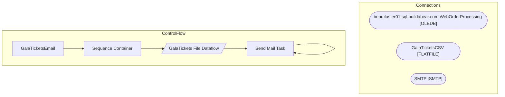

# SSIS Package: GalaTicketsEmail

**Project:** GalaTicketsEmail  
**Folder:** WEB  

## Architecture Diagram

## Connection Managers

| Connection Name | Type |
|---|---|
| bearcluster01.sql.buildabear.com.WebOrderProcessing | OLEDB |
| GalaTicketsCSV | FLATFILE |
| SMTP | SMTP |

## Control Flow Tasks

| Task Name | Type |
|---|---|
| GalaTicketsEmail | Microsoft.Package |
| Sequence Container | STOCK:SEQUENCE |
| GalaTickets File Dataflow | Microsoft.Pipeline |
| Send Mail Task | Microsoft.SendMailTask |
| Send Mail Task | Microsoft.SendMailTask |

## Data Flow: Sources

| Component | Tables Referenced | SQL Preview |
|---|---|---|
|  |  | select	 	o.ShipToEmail,  	o.ShipToFName FirstName,  	o.ShiptoLName LastName, 	oi.SKU,  	oi.ItemDescription,  	sum(qty) Qty, 	count(distinct o.OrderNum) OrderCount, 	max(cast(o.OrderDate as date)) OrderDate from wm.Orders o with (nolock) join wm.OrderItems oi with (nolock) on o.OrderID=oi.OrderID where oi.SKU in ('080187','089173','081678') group by o.ShipToEmail, o.ShipToFName, o.ShiptoLName, oi.S |

## Data Flow: Destinations

_No OLE DB data flow destinations detected._

