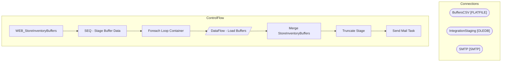

# SSIS Package: WEB_StoreInventoryBuffers

**Project:** WEB_StoreInventoryBuffers  
**Folder:** WEB  

## Architecture Diagram

## Connection Managers

| Connection Name | Type |
|---|---|
| BuffersCSV | FLATFILE |
| IntegrationStaging | OLEDB |
| SMTP | SMTP |

## Control Flow Tasks

| Task Name | Type |
|---|---|
| WEB_StoreInventoryBuffers | Microsoft.Package |
| SEQ - Stage Buffer Data | STOCK:SEQUENCE |
| Foreach Loop Container | STOCK:FOREACHLOOP |
| DataFlow - Load Buffers | Microsoft.Pipeline |
| Merge StoreInventoryBuffers | Microsoft.ExecuteSQLTask |
| Truncate Stage | Microsoft.ExecuteSQLTask |
| Send Mail Task | Microsoft.SendMailTask |

## Data Flow: Sources

_No OLE DB data flow sources detected._

## Data Flow: Destinations

| Component | Destination Table |
|---|---|
|  | [WEB].[StoreInventoryBuffersStage] |

