# SSIS Package: WebDynamicActionProductProperties

**Project:** WebDynamicActionProductProperties  
**Folder:** WEB  

## Architecture Diagram

```mermaid
flowchart TD
    subgraph Connections
        dw_conn(["dw [OLEDB]"])
        IntegrationStaging_conn(["IntegrationStaging [OLEDB]"])
        SMTP_conn(["SMTP [SMTP]"])
        UK_PRODUCTPROPERTIES_conn(["UK_PRODUCTPROPERTIES [FLATFILE]"])
        US_PRODUCTPROPERTIES_conn(["US_PRODUCTPROPERTIES [FLATFILE]"])
    end
    subgraph ControlFlow
        WebDynamicActionProductProperties_task["WebDynamicActionProductProperties"]
        Sequence_Container___Export_Product_Properties_Files_to_CSV_task["Sequence Container - Export Product Properties Files to CSV"]
        WebDynamicActionProductProperties_task --> Sequence_Container___Export_Product_Properties_Files_to_CSV_task
        Data_Flow_Task___Generate_Product_Properties_Files_task[/"Data Flow Task - Generate Product Properties Files"/]
        Sequence_Container___Export_Product_Properties_Files_to_CSV_task --> Data_Flow_Task___Generate_Product_Properties_Files_task
        Sequence_Container___Load_Dynamic_Action_Product_Properties_Table_task["Sequence Container - Load Dynamic Action Product Properties Table"]
        Data_Flow_Task___Generate_Product_Properties_Files_task --> Sequence_Container___Load_Dynamic_Action_Product_Properties_Table_task
        Data_Flow_Task_task[/"Data Flow Task"/]
        Sequence_Container___Load_Dynamic_Action_Product_Properties_Table_task --> Data_Flow_Task_task
        Execute_SQL_Task___Truncate_Stage_task["Execute SQL Task - Truncate Stage"]
        Data_Flow_Task_task --> Execute_SQL_Task___Truncate_Stage_task
        Sequence_Container___Process_Bundle_Book___TBD_task["Sequence Container - Process Bundle Book - TBD"]
        Execute_SQL_Task___Truncate_Stage_task --> Sequence_Container___Process_Bundle_Book___TBD_task
        Sequence_Container_Upload_Files_to_SFTP_Server_task["Sequence Container Upload Files to SFTP Server"]
        Sequence_Container___Process_Bundle_Book___TBD_task --> Sequence_Container_Upload_Files_to_SFTP_Server_task
        FEL___Archive_Files_task["FEL - Archive Files"]
        Sequence_Container_Upload_Files_to_SFTP_Server_task --> FEL___Archive_Files_task
        Archive_Files_task["Archive Files"]
        FEL___Archive_Files_task --> Archive_Files_task
        WinScp___Upload_UK_Files_To_Dynamic_Action_task["WinScp - Upload UK Files To Dynamic Action"]
        Archive_Files_task --> WinScp___Upload_UK_Files_To_Dynamic_Action_task
        WinScp___Upload_US_Files_To_Dynamic_Action_task["WinScp - Upload US Files To Dynamic Action"]
        WinScp___Upload_UK_Files_To_Dynamic_Action_task --> WinScp___Upload_US_Files_To_Dynamic_Action_task
        Send_Mail_Task_task["Send Mail Task"]
        WinScp___Upload_US_Files_To_Dynamic_Action_task --> Send_Mail_Task_task
    end
```

## Connection Managers

| Connection Name | Type |
|---|---|
| dw | OLEDB |
| IntegrationStaging | OLEDB |
| SMTP | SMTP |
| UK_PRODUCTPROPERTIES | FLATFILE |
| US_PRODUCTPROPERTIES | FLATFILE |

## Control Flow Tasks

| Task Name | Type |
|---|---|
| WebDynamicActionProductProperties | Microsoft.Package |
| Sequence Container - Export Product Properties Files to CSV | STOCK:SEQUENCE |
| Data Flow Task - Generate Product Properties Files | Microsoft.Pipeline |
| Sequence Container - Load Dynamic Action Product Properties Table | STOCK:SEQUENCE |
| Data Flow Task | Microsoft.Pipeline |
| Execute SQL Task - Truncate Stage | Microsoft.ExecuteSQLTask |
| Sequence Container - Process Bundle Book - TBD | STOCK:SEQUENCE |
| Sequence Container Upload Files to SFTP Server | STOCK:SEQUENCE |
| FEL - Archive Files | STOCK:FOREACHLOOP |
| Archive Files | Microsoft.FileSystemTask |
| WinScp - Upload UK Files To Dynamic Action | Microsoft.ExecuteProcess |
| WinScp - Upload US Files To Dynamic Action | Microsoft.ExecuteProcess |
| Send Mail Task | Microsoft.SendMailTask |

## Data Flow: Sources

| Component | Tables Referenced | SQL Preview |
|---|---|---|
|  |  | select ProductID,  ProductName,  UPPER(ProductCategory1) AS ProductCategory1,  ProductCategory2,  ProductCategory3 from web.DynamicActionProductPropertiesStage --where ProductSellingGeography = 'US' where ProductSellingGeography = 'UK' order by 1 |
|  |  | select ProductID,  ProductName,  UPPER(ProductCategory1) AS ProductCategory1,  ProductCategory2,  ProductCategory3 from web.DynamicActionProductPropertiesStage where ProductSellingGeography = 'US' --where ProductSellingGeography = 'UK' order by 1 |
|  |  | with Styles as -- This is the eligible styles we use for the WebPricebook ( 	select distinct style_code , ProductSellingGeography 	from [stl-ssis-p-01].IntegrationStaging.Web.ProductCatalogMasterAttributes --- This is on integration staging as well, preferred  	where StoreFrontEligible = 1  	 ),  DynamicsProductName as ( select ProductNumber, ProductName from [stl-ssis-p-01].IntegrationStaging.wms |

## Data Flow: Destinations

| Component | Destination Table |
|---|---|
|  | [WEB].[DynamicActionProductPropertiesStage] |

