# SSIS Package: WebDynamicActionSellingInventoryLocation

**Project:** WebDynamicActionSellingInventoryLocation  
**Folder:** WEB  

## Architecture Diagram

```mermaid
flowchart TD
    subgraph Connections
        dw_conn(["dw [OLEDB]"])
        IntegrationStaging_conn(["IntegrationStaging [OLEDB]"])
        me_01_conn(["me_01 [OLEDB]"])
        SMTP_conn(["SMTP [SMTP]"])
        UK_SellingInventoryLocation_conn(["UK_SellingInventoryLocation [FLATFILE]"])
        US_SellingInventoryLocation_conn(["US_SellingInventoryLocation [FLATFILE]"])
    end
    subgraph ControlFlow
        WebDynamicActionSellingInventoryLocation_task["WebDynamicActionSellingInventoryLocation"]
        Sequence_Container___Export_Selling_Inventory_Location_to_CSV_task["Sequence Container - Export Selling Inventory Location to CSV"]
        WebDynamicActionSellingInventoryLocation_task --> Sequence_Container___Export_Selling_Inventory_Location_to_CSV_task
        Data_Flow_Task_task[/"Data Flow Task"/]
        Sequence_Container___Export_Selling_Inventory_Location_to_CSV_task --> Data_Flow_Task_task
        Sequence_Container___Load_SellingInventoryLocation_Table_task["Sequence Container - Load SellingInventoryLocation Table"]
        Data_Flow_Task_task --> Sequence_Container___Load_SellingInventoryLocation_Table_task
        Data_Flow_Task___SellingInventoryLocation_task[/"Data Flow Task - SellingInventoryLocation"/]
        Sequence_Container___Load_SellingInventoryLocation_Table_task --> Data_Flow_Task___SellingInventoryLocation_task
        Execute_SQL_Task___Truncate_Stage_task["Execute SQL Task - Truncate Stage"]
        Data_Flow_Task___SellingInventoryLocation_task --> Execute_SQL_Task___Truncate_Stage_task
        Sequence_Container___Upload_Files_to_SFTP_Server_task["Sequence Container - Upload Files to SFTP Server"]
        Execute_SQL_Task___Truncate_Stage_task --> Sequence_Container___Upload_Files_to_SFTP_Server_task
        FEL___Archive_UK_Files_task["FEL - Archive UK Files"]
        Sequence_Container___Upload_Files_to_SFTP_Server_task --> FEL___Archive_UK_Files_task
        Archive_File_task["Archive File"]
        FEL___Archive_UK_Files_task --> Archive_File_task
        FEL___Archive_US_Files_task["FEL - Archive US Files"]
        Archive_File_task --> FEL___Archive_US_Files_task
        Archive_File_task["Archive File"]
        FEL___Archive_US_Files_task --> Archive_File_task
        WinScp___Upload_UK_Files_to_Dynamic_Action_task["WinScp - Upload UK Files to Dynamic Action"]
        Archive_File_task --> WinScp___Upload_UK_Files_to_Dynamic_Action_task
        WinScp___Upload_US_Files_to_Dynamic_Action_task["WinScp - Upload US Files to Dynamic Action"]
        WinScp___Upload_UK_Files_to_Dynamic_Action_task --> WinScp___Upload_US_Files_to_Dynamic_Action_task
        Send_Mail_Task_task["Send Mail Task"]
        WinScp___Upload_US_Files_to_Dynamic_Action_task --> Send_Mail_Task_task
    end
```

## Connection Managers

| Connection Name | Type |
|---|---|
| dw | OLEDB |
| IntegrationStaging | OLEDB |
| me_01 | OLEDB |
| SMTP | SMTP |
| UK_SellingInventoryLocation | FLATFILE |
| US_SellingInventoryLocation | FLATFILE |

## Control Flow Tasks

| Task Name | Type |
|---|---|
| WebDynamicActionSellingInventoryLocation | Microsoft.Package |
| Sequence Container - Export Selling Inventory Location to CSV | STOCK:SEQUENCE |
| Data Flow Task | Microsoft.Pipeline |
| Sequence Container - Load SellingInventoryLocation Table | STOCK:SEQUENCE |
| Data Flow Task - SellingInventoryLocation | Microsoft.Pipeline |
| Execute SQL Task - Truncate Stage | Microsoft.ExecuteSQLTask |
| Sequence Container - Upload Files to SFTP Server | STOCK:SEQUENCE |
| FEL - Archive UK Files | STOCK:FOREACHLOOP |
| Archive File | Microsoft.FileSystemTask |
| FEL - Archive US Files | STOCK:FOREACHLOOP |
| Archive File | Microsoft.FileSystemTask |
| WinScp - Upload UK Files to Dynamic Action | Microsoft.ExecuteProcess |
| WinScp - Upload US Files to Dynamic Action | Microsoft.ExecuteProcess |
| Send Mail Task | Microsoft.SendMailTask |

## Data Flow: Sources

| Component | Tables Referenced | SQL Preview |
|---|---|---|
|  |  | select Date,  Site,  ProductID,  SKU,  --PublishDate, -- Omitting Per Dan as of 12/8/2021 IsMarkdown,  IsDiscontinued,  isCore,  SeasonStartDate,  SeasonEndDate,  IsSellable,  IsBackOrder,  IsPreOder,  CurrentPrice,  CurrentPriceExTax,  FullPrice,  FullPriceExTax,  BackorderUnits,  [Pre-OrderUnits],  WaitlistUnits from web.DynamicActionSellingInventoryLocationStage --where site = 'US' where site = |
|  |  | select Date,  Site,  ProductID,  SKU,  --PublishDate, -- Omitting Per Dan as of 12/8/2021 IsMarkdown,  IsDiscontinued,  isCore,  SeasonStartDate,  SeasonEndDate,  IsSellable,  IsBackOrder,  IsPreOder,  CurrentPrice,  CurrentPriceExTax,  FullPrice,  FullPriceExTax,  BackorderUnits,  [Pre-OrderUnits],  WaitlistUnits from web.DynamicActionSellingInventoryLocationStage where site = 'US' --where site = |
|  |  | WITH  PricebookStyles as ( select style_code, Catalog from [dbo].[WEBPricebookStage]  ),  IdATE AS ( select   s.style_code,  ecp.custom_property_value as IDATE  from style s join entity_custom_property ecp on ecp.parent_id=s.style_id join custom_property c on c.custom_property_id=ecp.custom_property_id where c.cust_prop_code in('IDATE') ) ,   ODATE AS (  select   s.style_code,  ecp.custom_property |
|  |  | with UKVatExempt as (  select distinct cast (sku as varchar) as sku from product_dim where (department_code in ('R-B-U-46','R-B-U-80') and jurisdiction_code = 'UK')    ), Styles as -- This is the eligible styles we use for the WebPricebook ( select pf.style_code,  pf.CurrentPrice,  pf.SalePrice, pf.Catalog as ProductSellingGeography,  a.MerchInDate, a.MSTAT from [stl-ssis-p-01].IntegrationStaging. |

## Data Flow: Destinations

| Component | Destination Table |
|---|---|
|  | [WEB].[DynamicActionSellingInventoryLocationStage] |

