# SSIS Package: WebTrueAttachmentReport

**Project:** WebTrueAttachmentReport  
**Folder:** WEB  

## Architecture Diagram

```mermaid
flowchart TD
    subgraph Connections
        DWStaging_conn(["DWStaging [OLEDB]"])
        IntegrationStaging_conn(["IntegrationStaging [OLEDB]"])
        IntegrationStaging2019_conn(["IntegrationStaging2019 [OLEDB]"])
        SMTP_conn(["SMTP [SMTP]"])
        WebOrderProcessing_conn(["WebOrderProcessing [OLEDB]"])
    end
    subgraph ControlFlow
        WebTrueAttachmentReport_task["WebTrueAttachmentReport"]
        SeqCont___Merge_Data_task["SeqCont - Merge Data"]
        WebTrueAttachmentReport_task --> SeqCont___Merge_Data_task
        Execute_SQL_Task___spMergeWebOrderTrueAttachmentConcatenatedSKUs_task["Execute SQL Task - spMergeWebOrderTrueAttachmentConcatenatedSKUs"]
        SeqCont___Merge_Data_task --> Execute_SQL_Task___spMergeWebOrderTrueAttachmentConcatenatedSKUs_task
        SeqCont___Stage_Bundle_Data_task["SeqCont - Stage Bundle Data"]
        Execute_SQL_Task___spMergeWebOrderTrueAttachmentConcatenatedSKUs_task --> SeqCont___Stage_Bundle_Data_task
        SeqCont___IntStaging_to_IntStaging2019_task["SeqCont - IntStaging to IntStaging2019"]
        SeqCont___Stage_Bundle_Data_task --> SeqCont___IntStaging_to_IntStaging2019_task
        Data_Flow_Task___Lookup_KeyStory_and_Mstat_task[/"Data Flow Task - Lookup KeyStory and Mstat"/]
        SeqCont___IntStaging_to_IntStaging2019_task --> Data_Flow_Task___Lookup_KeyStory_and_Mstat_task
        Execute_SQL_Task___Truncate_Stage_task["Execute SQL Task - Truncate Stage"]
        Data_Flow_Task___Lookup_KeyStory_and_Mstat_task --> Execute_SQL_Task___Truncate_Stage_task
        SeqCont___IntStaging2019_to_DWStaging_task["SeqCont - IntStaging2019 to DWStaging"]
        Execute_SQL_Task___Truncate_Stage_task --> SeqCont___IntStaging2019_to_DWStaging_task
        Data_Flow_Task___Trim_Underscores_task[/"Data Flow Task - Trim Underscores"/]
        SeqCont___IntStaging2019_to_DWStaging_task --> Data_Flow_Task___Trim_Underscores_task
        Execute_SQL_Task___Truncate_Stage_task["Execute SQL Task - Truncate Stage"]
        Data_Flow_Task___Trim_Underscores_task --> Execute_SQL_Task___Truncate_Stage_task
        SeqCont___WOP_to_IntStaging_task["SeqCont - WOP to IntStaging"]
        Execute_SQL_Task___Truncate_Stage_task --> SeqCont___WOP_to_IntStaging_task
        Data_Flow_Task___Raw_Data_Concat_task[/"Data Flow Task - Raw Data Concat"/]
        SeqCont___WOP_to_IntStaging_task --> Data_Flow_Task___Raw_Data_Concat_task
        Execute_SQL_Task___Truncate_Stage_task["Execute SQL Task - Truncate Stage"]
        Data_Flow_Task___Raw_Data_Concat_task --> Execute_SQL_Task___Truncate_Stage_task
        Send_Mail_Task_task["Send Mail Task"]
        Execute_SQL_Task___Truncate_Stage_task --> Send_Mail_Task_task
    end
```

## Connection Managers

| Connection Name | Type |
|---|---|
| DWStaging | OLEDB |
| IntegrationStaging | OLEDB |
| IntegrationStaging2019 | OLEDB |
| SMTP | SMTP |
| WebOrderProcessing | OLEDB |

## Control Flow Tasks

| Task Name | Type |
|---|---|
| WebTrueAttachmentReport | Microsoft.Package |
| SeqCont - Merge Data | STOCK:SEQUENCE |
| Execute SQL Task - spMergeWebOrderTrueAttachmentConcatenatedSKUs | Microsoft.ExecuteSQLTask |
| SeqCont - Stage Bundle Data | STOCK:SEQUENCE |
| SeqCont - IntStaging to IntStaging2019 | STOCK:SEQUENCE |
| Data Flow Task - Lookup KeyStory and Mstat | Microsoft.Pipeline |
| Execute SQL Task - Truncate Stage | Microsoft.ExecuteSQLTask |
| SeqCont - IntStaging2019 to DWStaging | STOCK:SEQUENCE |
| Data Flow Task - Trim Underscores | Microsoft.Pipeline |
| Execute SQL Task - Truncate Stage | Microsoft.ExecuteSQLTask |
| SeqCont - WOP to IntStaging | STOCK:SEQUENCE |
| Data Flow Task - Raw Data Concat | Microsoft.Pipeline |
| Execute SQL Task - Truncate Stage | Microsoft.ExecuteSQLTask |
| Send Mail Task | Microsoft.SendMailTask |

## Data Flow: Sources

| Component | Tables Referenced | SQL Preview |
|---|---|---|
|  |  | with Summary1 as ( select t.*,  a1.KeyStory as KeyStorySku1,  a1.MSTAT as MstatSku1, a2.KeyStory as KeyStorySku2,  a2.MSTAT as MstatSku2, a3.KeyStory as KeyStorySku3,  a3.MSTAT as MstatSku3, a4.KeyStory as KeyStorySku4,  a4.MSTAT as MstatSku4, a5.KeyStory as KeyStorySku5,  a5.MSTAT as MstatSku5, a6.KeyStory as KeyStorySku6,  a6.MSTAT as MstatSku6, a7.KeyStory as KeyStorySku7,  a7.MSTAT as MstatSku |
|  |  | select OrderNum,  OrderDate,  SkuString,  DescriptionString,  Quantity,  Price, trim('_' FROM KeyStoryString) as KeyStoryString,  trim('_' FROM MstatString) as MstatString,  Country from WEB.[TrueAttachmentReportStageTwo] |
|  |  |  select o.TransactionID,  case when o.SourceSite = 'BABW-UK' 	then 'UK' 	when o.SourceSite = 'BABW-US' 	then 'US' 	ELSE O.SourceSite END AS Country,  Max(o.OrderId) as MaxOrderId,  max(OrderNum) as MaxOrderNum from wm.Orders O (nolock)  join wm.OrderItems oi (nolock) on o.TransactionID=oi.TransactionID  where DATEDIFF(dd,OrderDate,getdate()) <= 735 group by o.TransactionID,  case when o.SourceSite |
|  |  | use [WebOrderProcessing] --=============================================================================================================================== -- Truncate Temp Tables truncate table tmpWebTrueAttachmentReportMaxOrderNumber truncate table tmpWebTrueAttachmentReportChildItem truncate table tmpWebTrueAttachmentReportParentItem truncate table tmpWebTrueAttachmentReportBundles truncate tabl |

## Data Flow: Destinations

| Component | Destination Table |
|---|---|
|  | [WEB].[TrueAttachmentReportStageTwo] |
|  | [dbo].[WebOrderTrueAttachmentConcatenatedSKUsStage] |
|  | [WEB].[TrueAttachmentReportStage] |

