# SSIS Package: EasyMetricsExtract

**Project:** EasyMetricsExtract  
**Folder:** WMS  

## Architecture Diagram

```mermaid
flowchart TD
    subgraph Connections
        BronzeDeltaLake_conn(["BronzeDeltaLake [OLEDB]"])
        Dynamics_AX_Connection_Manager_conn(["Dynamics AX Connection Manager [DynamicsAX]"])
        EasyMetricsExtractCsv_conn(["EasyMetricsExtractCsv [FLATFILE]"])
        EasyMetricsExtractCsv_v2_conn(["EasyMetricsExtractCsv_v2 [FLATFILE]"])
        EasyMetricsExtractPalletBuildCsv_conn(["EasyMetricsExtractPalletBuildCsv [FLATFILE]"])
        IntegrationStaging_conn(["IntegrationStaging [OLEDB]"])
        SilverDeltaLake_conn(["SilverDeltaLake [OLEDB]"])
        SMTP_conn(["SMTP [SMTP]"])
    end
    subgraph ControlFlow
        EasyMetricsExtract_task["EasyMetricsExtract"]
        FEL___Archive_File_task["FEL - Archive File"]
        EasyMetricsExtract_task --> FEL___Archive_File_task
        Archive_File_task["Archive File"]
        FEL___Archive_File_task --> Archive_File_task
        SeqCont___Amazon_S3_Transmission_task["SeqCont - Amazon S3 Transmission"]
        Archive_File_task --> SeqCont___Amazon_S3_Transmission_task
        WinScp___Upload_Files_To_EasyMetrics_Amazon_S3_Bucket_task["WinScp - Upload Files To EasyMetrics Amazon S3 Bucket"]
        SeqCont___Amazon_S3_Transmission_task --> WinScp___Upload_Files_To_EasyMetrics_Amazon_S3_Bucket_task
        SeqCont___Sandbox___New_Requirements_task["SeqCont - Sandbox - New Requirements"]
        WinScp___Upload_Files_To_EasyMetrics_Amazon_S3_Bucket_task --> SeqCont___Sandbox___New_Requirements_task
        Data_Flow_Task_task[/"Data Flow Task"/]
        SeqCont___Sandbox___New_Requirements_task --> Data_Flow_Task_task
        Execute_SQL_Task_task["Execute SQL Task"]
        Data_Flow_Task_task --> Execute_SQL_Task_task
        SeqCont___Sandbox___Orig_task["SeqCont - Sandbox - Orig"]
        Execute_SQL_Task_task --> SeqCont___Sandbox___Orig_task
        Data_Flow_Task___testing_task[/"Data Flow Task - testing"/]
        SeqCont___Sandbox___Orig_task --> Data_Flow_Task___testing_task
        SeqCont___Stage_Data_from_DataLake___Dec_2023_task["SeqCont - Stage Data from DataLake - Dec 2023"]
        Data_Flow_Task___testing_task --> SeqCont___Stage_Data_from_DataLake___Dec_2023_task
        Execute_SQL_Task___Set_Loop_Count_task["Execute SQL Task - Set Loop Count"]
        SeqCont___Stage_Data_from_DataLake___Dec_2023_task --> Execute_SQL_Task___Set_Loop_Count_task
        Foreach_Loop_Container_task["Foreach Loop Container"]
        Execute_SQL_Task___Set_Loop_Count_task --> Foreach_Loop_Container_task
        SeqCont___Easy_Metric_Extract_and_Transform_task["SeqCont - Easy Metric Extract and Transform"]
        Foreach_Loop_Container_task --> SeqCont___Easy_Metric_Extract_and_Transform_task
        Data_Flow_Task____Export_To_File_task[/"Data Flow Task  - Export To File"/]
        SeqCont___Easy_Metric_Extract_and_Transform_task --> Data_Flow_Task____Export_To_File_task
        Execute_SQL_Task___Get_Row_Count_from_Raw_Staging_task["Execute SQL Task - Get Row Count from Raw Staging"]
        Data_Flow_Task____Export_To_File_task --> Execute_SQL_Task___Get_Row_Count_from_Raw_Staging_task
        Execute_SQL_Task___spEasyMetricsTransform_task["Execute SQL Task - spEasyMetricsTransform"]
        Execute_SQL_Task___Get_Row_Count_from_Raw_Staging_task --> Execute_SQL_Task___spEasyMetricsTransform_task
        For_Loop_Container_task["For Loop Container"]
        Execute_SQL_Task___spEasyMetricsTransform_task --> For_Loop_Container_task
        Data_Flow_Task____Raw_Extract_task[/"Data Flow Task  - Raw Extract"/]
        For_Loop_Container_task --> Data_Flow_Task____Raw_Extract_task
        Execute_SQL_Task___Truncate_Stage_task["Execute SQL Task - Truncate Stage"]
        Data_Flow_Task____Raw_Extract_task --> Execute_SQL_Task___Truncate_Stage_task
        EXIT_task["EXIT"]
        Execute_SQL_Task___Truncate_Stage_task --> EXIT_task
        Reset_task["Reset"]
        EXIT_task --> Reset_task
        WAIT_task["WAIT"]
        Reset_task --> WAIT_task
        Send_Mail_Task_task["Send Mail Task"]
        WAIT_task --> Send_Mail_Task_task
        SeqCont___Stage_from_ODATA_Entity___Eventrually_Will_Be_Retired_and_REplaced_with_DataLake_Queries_Only_task["SeqCont - Stage from ODATA Entity - Eventrually Will Be Retired and REplaced with DataLake Queries Only"]
        Send_Mail_Task_task --> SeqCont___Stage_from_ODATA_Entity___Eventrually_Will_Be_Retired_and_REplaced_with_DataLake_Queries_Only_task
        SeqCont___Easy_Metric_Extract_and_Transform_task["SeqCont - Easy Metric Extract and Transform"]
        SeqCont___Stage_from_ODATA_Entity___Eventrually_Will_Be_Retired_and_REplaced_with_DataLake_Queries_Only_task --> SeqCont___Easy_Metric_Extract_and_Transform_task
        Data_Flow_Task____Export_To_File_task[/"Data Flow Task  - Export To File"/]
        SeqCont___Easy_Metric_Extract_and_Transform_task --> Data_Flow_Task____Export_To_File_task
        Data_Flow_Task___Raw_Extract_task[/"Data Flow Task - Raw Extract"/]
        Data_Flow_Task____Export_To_File_task --> Data_Flow_Task___Raw_Extract_task
        Execute_SQL_Task___spEasyMetricsTransform_task["Execute SQL Task - spEasyMetricsTransform"]
        Data_Flow_Task___Raw_Extract_task --> Execute_SQL_Task___spEasyMetricsTransform_task
        Execute_SQL_Task___Truncate_Stage_task["Execute SQL Task - Truncate Stage"]
        Execute_SQL_Task___spEasyMetricsTransform_task --> Execute_SQL_Task___Truncate_Stage_task
        SeqCont___Pallet_Build_Extract_task["SeqCont - Pallet Build Extract"]
        Execute_SQL_Task___Truncate_Stage_task --> SeqCont___Pallet_Build_Extract_task
        Data_Flow_Task____Export_to_PalletBuildFile_task[/"Data Flow Task  - Export to PalletBuildFile"/]
        SeqCont___Pallet_Build_Extract_task --> Data_Flow_Task____Export_to_PalletBuildFile_task
        Data_Flow_Task___Raw_Extract_task[/"Data Flow Task - Raw Extract"/]
        Data_Flow_Task____Export_to_PalletBuildFile_task --> Data_Flow_Task___Raw_Extract_task
        Execute_SQL_Task___Truncate_Stage_task["Execute SQL Task - Truncate Stage"]
        Data_Flow_Task___Raw_Extract_task --> Execute_SQL_Task___Truncate_Stage_task
        SeqCont___Stage_from_ODATA_Entity___Original_task["SeqCont - Stage from ODATA Entity - Original"]
        Execute_SQL_Task___Truncate_Stage_task --> SeqCont___Stage_from_ODATA_Entity___Original_task
        Data_Flow_Task___Export_to_File_task[/"Data Flow Task - Export to File"/]
        SeqCont___Stage_from_ODATA_Entity___Original_task --> Data_Flow_Task___Export_to_File_task
        Data_Flow_Task___Raw_Extract_task[/"Data Flow Task - Raw Extract"/]
        Data_Flow_Task___Export_to_File_task --> Data_Flow_Task___Raw_Extract_task
        Execute_SQL_Task_task["Execute SQL Task"]
        Data_Flow_Task___Raw_Extract_task --> Execute_SQL_Task_task
        Send_Mail_Task_task["Send Mail Task"]
        Execute_SQL_Task_task --> Send_Mail_Task_task
    end
```

## Connection Managers

| Connection Name | Type |
|---|---|
| BronzeDeltaLake | OLEDB |
| Dynamics AX Connection Manager | DynamicsAX |
| EasyMetricsExtractCsv | FLATFILE |
| EasyMetricsExtractCsv_v2 | FLATFILE |
| EasyMetricsExtractPalletBuildCsv | FLATFILE |
| IntegrationStaging | OLEDB |
| SilverDeltaLake | OLEDB |
| SMTP | SMTP |

## Control Flow Tasks

| Task Name | Type |
|---|---|
| EasyMetricsExtract | Microsoft.Package |
| FEL - Archive File | STOCK:FOREACHLOOP |
| Archive File | Microsoft.FileSystemTask |
| SeqCont - Amazon S3 Transmission | STOCK:SEQUENCE |
| WinScp - Upload Files To EasyMetrics Amazon S3 Bucket | Microsoft.ExecuteProcess |
| SeqCont - Sandbox - New Requirements | STOCK:SEQUENCE |
| Data Flow Task | Microsoft.Pipeline |
| Execute SQL Task | Microsoft.ExecuteSQLTask |
| SeqCont - Sandbox - Orig | STOCK:SEQUENCE |
| Data Flow Task - testing | Microsoft.Pipeline |
| SeqCont - Stage Data from DataLake - Dec 2023 | STOCK:SEQUENCE |
| Execute SQL Task - Set Loop Count | Microsoft.ExecuteSQLTask |
| Foreach Loop Container | STOCK:FOREACHLOOP |
| SeqCont - Easy Metric Extract and Transform | STOCK:SEQUENCE |
| Data Flow Task  - Export To File | Microsoft.Pipeline |
| Execute SQL Task - Get Row Count from Raw Staging | Microsoft.ExecuteSQLTask |
| Execute SQL Task - spEasyMetricsTransform | Microsoft.ExecuteSQLTask |
| For Loop Container | STOCK:FORLOOP |
| Data Flow Task  - Raw Extract | Microsoft.Pipeline |
| Execute SQL Task - Truncate Stage | Microsoft.ExecuteSQLTask |
| EXIT | Microsoft.ExpressionTask |
| Reset | Microsoft.ExpressionTask |
| WAIT | Microsoft.ExecuteSQLTask |
| Send Mail Task | Microsoft.SendMailTask |
| SeqCont - Stage from ODATA Entity - Eventrually Will Be Retired and REplaced with DataLake Queries Only | STOCK:SEQUENCE |
| SeqCont - Easy Metric Extract and Transform | STOCK:SEQUENCE |
| Data Flow Task  - Export To File | Microsoft.Pipeline |
| Data Flow Task - Raw Extract | Microsoft.Pipeline |
| Execute SQL Task - spEasyMetricsTransform | Microsoft.ExecuteSQLTask |
| Execute SQL Task - Truncate Stage | Microsoft.ExecuteSQLTask |
| SeqCont - Pallet Build Extract | STOCK:SEQUENCE |
| Data Flow Task  - Export to PalletBuildFile | Microsoft.Pipeline |
| Data Flow Task - Raw Extract | Microsoft.Pipeline |
| Execute SQL Task - Truncate Stage | Microsoft.ExecuteSQLTask |
| SeqCont - Stage from ODATA Entity - Original | STOCK:SEQUENCE |
| Data Flow Task - Export to File | Microsoft.Pipeline |
| Data Flow Task - Raw Extract | Microsoft.Pipeline |
| Execute SQL Task | Microsoft.ExecuteSQLTask |
| Send Mail Task | Microsoft.SendMailTask |

## Data Flow: Sources

| Component | Tables Referenced | SQL Preview |
|---|---|---|
|  |  | select t.Cube,  t.Level,  replace(t.StartEndLocationType,'&','and') as StartEndLocationType,  --t.QuantityUOM, -- Replaced with below on  11/30/2023 per JIRA BIB708 --case when t.QuantityUOM = '' case when isnull(t.QuantityUOM,'') = '' -- Replaced on 12/13/2023 As it may come through as null with the DeltaLake Query  		--then isnull(im.InventoryUnitSymbol,'EA') -- Added on 11/30/2023 		then 'EA'-- |
|  |  | select e.ACCOUNTNUM,  e.CREATEDDATETIMEWORKLINE,  e.CUBE,  e.DATAAREAID,  e.INVENTLOCATIONIDFROM,  e.INVENTLOCATIONIDTO,  e.INVENTQTYWORK,  e.ITEMID,  e.Level,  e.LINENUM,  e.LOCPROFILEID,  e.LOCTYPE,  e.ORDERNUM,  e.ProcessType,  e.QTYWORK,  e.STATE,  e.UNITID,  e.USERID,  e.WEIGHT,  e.WHSWORKTABLE_CONTAINERID,  e.WHSWORKTABLE_INVENTLOCATIONID,  e.WHSWORKTABLE_INVENTSITEID,  e.WHSWORKTABLE_TARGET |
|  |  | select t.Cube,  t.Level,  replace(t.StartEndLocationType,'&','and') as StartEndLocationType,  --t.QuantityUOM, -- Replaced with below on  11/30/2023 per JIRA BIB708 case when t.QuantityUOM = '' 		--then isnull(im.InventoryUnitSymbol,'EA') -- Added on 11/30/2023 		then 'EA'-- Modified 12/07/2023 per latest JIRA BIB708 updates  	else t.QuantityUOM  end as QuantityUOM, -- Modified 12/07/2023 per late |
|  |  | select  p.[Log],  p.[Timestamp],  p.UserId, p.WorkExecuteMode from BabEasyMetricsPalletBuildStage p group by  p.[Log],  p.[Timestamp],  p.UserId, p.WorkExecuteMode order by 2, 3 |
|  |  | select   [Cube],  [Level],   LocType as [StartEndLocationType],   UnitId as QuantityUOM,  [Weight],  ProcessType,   WHSWorkTable_InventSiteId as [Site],   WHSWorkTable_InventLocationId as Facility,  WHSWorkTable_ContainerId as CaseId,  WHSWorkTable_TargetLicensePlateId  as PalletLpId,   WorkType as Directionality,  UserId as Employee,   WorkInProcessUTCDateTime as StartDateTime,   WorkClosedUTCDat |

## Data Flow: Destinations

| Component | Destination Table |
|---|---|
|  | [dbo].[BabEasyMetricsWmsStaging] |
|  | [dbo].[BabEasyMetricsWmsStaging] |
|  | [dbo].[BabEasyMetricsWmsStaging] |
|  | [dbo].[BabEasyMetricsPalletBuildStage] |
|  | [dbo].[BabEasyMetricsWmsStaging] |

