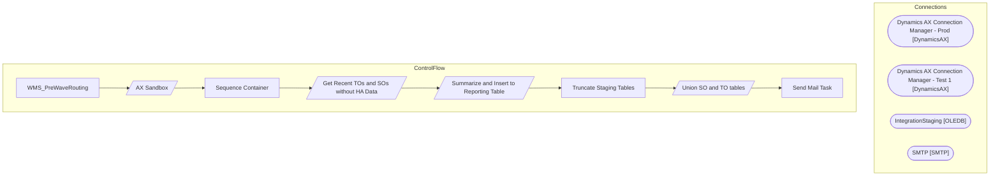

# SSIS Package: WMS_PreWaveRouting

**Project:** PreWaveRoutingReport  
**Folder:** WMS  

## Architecture Diagram

## Connection Managers

| Connection Name | Type |
|---|---|
| Dynamics AX Connection Manager - Prod | DynamicsAX |
| Dynamics AX Connection Manager - Test 1 | DynamicsAX |
| IntegrationStaging | OLEDB |
| SMTP | SMTP |

## Control Flow Tasks

| Task Name | Type |
|---|---|
| WMS_PreWaveRouting | Microsoft.Package |
| AX Sandbox | Microsoft.Pipeline |
| Sequence Container | STOCK:SEQUENCE |
| Get Recent TOs and SOs without HA Data | Microsoft.Pipeline |
| Summarize and Insert to Reporting Table | Microsoft.Pipeline |
| Truncate Staging Tables | Microsoft.ExecuteSQLTask |
| Union SO and TO tables | Microsoft.Pipeline |
| Send Mail Task | Microsoft.SendMailTask |

## Data Flow: Sources

| Component | Tables Referenced | SQL Preview |
|---|---|---|
|  |  | select distinct OrderNumber, warehouse from wms.CartonsSummaryToHA where warehouse in ('9980','8175') and left(OrderNumber,2) = 'TO' |
|  |  | select distinct OrderNumber, warehouse from wms.CartonsSummaryToHA where warehouse in ('9980','8175') and (left(OrderNumber,2) = 'SO' or left(OrderNumber,4) = '1700') |
|  |  | with uom_conv as ( select     ProductNumber,     BAG,BALE,BDL,BX,CS,IP,KT,LB,PK,PLT,RL,ROLL,[SET] from     (         select             ProductNumber,             FromUnitSymbol,             Factor as Qty         from wms.ItemsUOM         where Entity=1100         and ToUnitSymbol='ea'     ) as UOM PIVOT     (         sum(QTy)         for FromUnitSymbol in ([BAG],[BALE],[BDL],[BX],[CS],[ip],[KT],[ |

## Data Flow: Destinations

| Component | Destination Table |
|---|---|
|  | [WMS].[TimC_AXSandbox] |
|  | [WMS].[TimC_AXSandbox_SalesOrder] |
|  | [WMS].[timc_axsandbox_hdr] |
|  | [WMS].[PreWaveSalesOrderStage] |
|  | [WMS].[PreWaveTransferOrderStage] |
|  | [WMS].[PreWaveRoutingReport] |
|  | [WMS].[PreWaveUnionSalesAndTransferOrdersSTage] |
|  | [WMS].[PreWaveTransferOrderStage] |
|  | [WMS].[PreWaveSalesOrderStage] |

