# SSIS Package: Validation_DynamicsSalesData

**Project:** Validation_DynamicsSalesData  
**Folder:** WMS  

## Architecture Diagram

```mermaid
flowchart TD
    subgraph Connections
        BronzeDataLake_conn(["BronzeDataLake [OLEDB]"])
        dw_conn(["dw [OLEDB]"])
        Dynamics_conn(["Dynamics [DynamicsAX]"])
        GL_CsvFile_conn(["GL_CsvFile [FLATFILE]"])
        IntegrationStaging_conn(["IntegrationStaging [OLEDB]"])
        SMTP_conn(["SMTP [SMTP]"])
    end
    subgraph ControlFlow
        Validation_DynamicsSalesData_task["Validation_DynamicsSalesData"]
        SeqCont___All_Discount_Data_via_DataLake_task["SeqCont - All Discount Data via DataLake"]
        Validation_DynamicsSalesData_task --> SeqCont___All_Discount_Data_via_DataLake_task
        Data_Flow_Task____Stage_Data_for_PowerBI_Reporting_task[/"Data Flow Task  - Stage Data for PowerBI Reporting"/]
        SeqCont___All_Discount_Data_via_DataLake_task --> Data_Flow_Task____Stage_Data_for_PowerBI_Reporting_task
        For_Loop_Container_task["For Loop Container"]
        Data_Flow_Task____Stage_Data_for_PowerBI_Reporting_task --> For_Loop_Container_task
        Data_Flow_Task___Extract_Dyn_Data_to_DW_task[/"Data Flow Task - Extract Dyn Data to DW"/]
        For_Loop_Container_task --> Data_Flow_Task___Extract_Dyn_Data_to_DW_task
        Execute_SQL_Task_task["Execute SQL Task"]
        Data_Flow_Task___Extract_Dyn_Data_to_DW_task --> Execute_SQL_Task_task
        EXIT_task["EXIT"]
        Execute_SQL_Task_task --> EXIT_task
        RESET_task["RESET"]
        EXIT_task --> RESET_task
        WAIT_task["WAIT"]
        RESET_task --> WAIT_task
        SeqCont___Gift_Card_Discount_Data_via_DataLake_task["SeqCont - Gift Card Discount Data via DataLake"]
        WAIT_task --> SeqCont___Gift_Card_Discount_Data_via_DataLake_task
        For_Loop_Container_task["For Loop Container"]
        SeqCont___Gift_Card_Discount_Data_via_DataLake_task --> For_Loop_Container_task
        Data_Flow_Task_task[/"Data Flow Task"/]
        For_Loop_Container_task --> Data_Flow_Task_task
        Execute_SQL_Task___Truncate_Stage_task["Execute SQL Task - Truncate Stage"]
        Data_Flow_Task_task --> Execute_SQL_Task___Truncate_Stage_task
        EXIT_task["EXIT"]
        Execute_SQL_Task___Truncate_Stage_task --> EXIT_task
        RESET_task["RESET"]
        EXIT_task --> RESET_task
        WAIT_task["WAIT"]
        RESET_task --> WAIT_task
        SeqCont___GL_Reporting_via_DataLake_task["SeqCont - GL Reporting via DataLake"]
        WAIT_task --> SeqCont___GL_Reporting_via_DataLake_task
        Data_Flow_Task_task[/"Data Flow Task"/]
        SeqCont___GL_Reporting_via_DataLake_task --> Data_Flow_Task_task
        Truncate_Stage_task["Truncate Stage"]
        Data_Flow_Task_task --> Truncate_Stage_task
        Sequence_Container_task["Sequence Container"]
        Truncate_Stage_task --> Sequence_Container_task
        Data_Flow_Task___Capture_Sales_Line_Records_by_Data_and_Store_task[/"Data Flow Task - Capture Sales Line Records by Data and Store"/]
        Sequence_Container_task --> Data_Flow_Task___Capture_Sales_Line_Records_by_Data_and_Store_task
        Foreach_Loop_Container_task["Foreach Loop Container"]
        Data_Flow_Task___Capture_Sales_Line_Records_by_Data_and_Store_task --> Foreach_Loop_Container_task
        Data_Flow_Task___Capture_Discount_Line_Data_by_Order_Number_task[/"Data Flow Task - Capture Discount Line Data by Order Number"/]
        Foreach_Loop_Container_task --> Data_Flow_Task___Capture_Discount_Line_Data_by_Order_Number_task
        Get_Transaction_Numbers_task["Get Transaction Numbers"]
        Data_Flow_Task___Capture_Discount_Line_Data_by_Order_Number_task --> Get_Transaction_Numbers_task
        Truncate_Stage_task["Truncate Stage"]
        Get_Transaction_Numbers_task --> Truncate_Stage_task
        Send_Mail_Task_task["Send Mail Task"]
        Truncate_Stage_task --> Send_Mail_Task_task
    end
```

## Connection Managers

| Connection Name | Type |
|---|---|
| BronzeDataLake | OLEDB |
| dw | OLEDB |
| Dynamics | DynamicsAX |
| GL_CsvFile | FLATFILE |
| IntegrationStaging | OLEDB |
| SMTP | SMTP |

## Control Flow Tasks

| Task Name | Type |
|---|---|
| Validation_DynamicsSalesData | Microsoft.Package |
| SeqCont - All Discount Data via DataLake | STOCK:SEQUENCE |
| Data Flow Task  - Stage Data for PowerBI Reporting | Microsoft.Pipeline |
| For Loop Container | STOCK:FORLOOP |
| Data Flow Task - Extract Dyn Data to DW | Microsoft.Pipeline |
| Execute SQL Task | Microsoft.ExecuteSQLTask |
| EXIT | Microsoft.ExpressionTask |
| RESET | Microsoft.ExpressionTask |
| WAIT | Microsoft.ExecuteSQLTask |
| SeqCont - Gift Card Discount Data via DataLake | STOCK:SEQUENCE |
| For Loop Container | STOCK:FORLOOP |
| Data Flow Task | Microsoft.Pipeline |
| Execute SQL Task - Truncate Stage | Microsoft.ExecuteSQLTask |
| EXIT | Microsoft.ExpressionTask |
| RESET | Microsoft.ExpressionTask |
| WAIT | Microsoft.ExecuteSQLTask |
| SeqCont - GL Reporting via DataLake | STOCK:SEQUENCE |
| Data Flow Task | Microsoft.Pipeline |
| Truncate Stage | Microsoft.ExecuteSQLTask |
| Sequence Container | STOCK:SEQUENCE |
| Data Flow Task - Capture Sales Line Records by Data and Store | Microsoft.Pipeline |
| Foreach Loop Container | STOCK:FOREACHLOOP |
| Data Flow Task - Capture Discount Line Data by Order Number | Microsoft.Pipeline |
| Get Transaction Numbers | Microsoft.ExecuteSQLTask |
| Truncate Stage | Microsoft.ExecuteSQLTask |
| Send Mail Task | Microsoft.SendMailTask |

## Data Flow: Sources

| Component | Tables Referenced | SQL Preview |
|---|---|---|
|  |  | select  hf.Entity, hf.TransDate,  hf.InventLocationId,  bd.RetailTransactionId as DataLakeRetailTransactionId, bd.Amount as DataLakeAmount,  bd.DiscountOriginType as DatalakeDiscountOriginType,  bd.PeriodicDiscountOfferId as DataLakePeriodicDiscountOfferId,  df.RetailTransactionId, df.Amount,  df.DiscountOriginType,  df.PeriodicDiscountOfferId,  df.BatchID,  df.CurrentSentDate, df.InsertDate   --i |
|  |  | select  cast (rt.businessDate as date) as TransactionDate,  rt.store as InventLocationId,  cast (dt.DiscountAmount as numeric (14,2)) as Amount,  cast (dt.DiscountCost as numeric (14,2)) as DiscountCost,  case when dt.DiscountOriginType = '3' -- Manual  	then 'Manual' when dt.DiscountOriginType = '2'  	then 'Periodic' else 'uknonwn' end as DiscountOriginType,  dt.TerminalId as RetailTerminalId,  r |
|  |  | select  cast (rt.businessDate as date) as TransactionDate,  rt.store as InventLocationId,  rt.TransactionId as RetailTransactionId, case when dt.DiscountOriginType = '3' -- Manual  	then 'Manual' when dt.DiscountOriginType = '2'  	then 'Periodic' else 'uknonwn' end as DiscountOriginType,  dt.PeriodicDiscountOfferId,  cast (dt.DiscountAmount as numeric (14,2)) as Amount,  dt.[DataAreaId] as Entity  |
|  |  | select  substring(gl.LedgerAccount,8,4)  as InventLocationId, ma.MainAccountId,  ma.Name as MainAccountName,  mc.AccountCategory, cast (e.AccountingDate as Date) as AccountingDate,  cast (e.DocumentDate as Date) as DocumentDate, e.SubledgerVoucher as Voucher, e.DocumentNumber ,  e.JournalNumber,  e.SubledgerVoucherDataAreaId as Entity,  gl.LedgerAccount,  gl.PostingType, gl.IsCredit,  gl.Accountin |

## Data Flow: Destinations

| Component | Destination Table |
|---|---|
|  | [dbo].[tmpDataLakeVsDynDiscounts] |
|  | [dbo].[BronzeDataLakeAllDiscountLineData] |
|  | [dbo].[BronzeDataLakeGiftCardDiscountData] |
|  | [dbo].[BronzeDataLakeGeneralLedgerData] |
|  | [WMS].[DynamicsSalesLineDataStage] |
|  | [WMS].[DynamicsDiscountLineDataStage] |

