# SSIS Package: WMS_CartonsCancelledToHA

**Project:** WMS_CartonsCancelledToHA  
**Folder:** WMS  

## Architecture Diagram

```mermaid
flowchart TD
    subgraph Connections
        Archive_conn(["Archive [FILE]"])
        Azure_Service_Bus_conn(["Azure Service Bus [Azure Service Bus (KingswaySoft)]"])
        Cancelled_File_conn(["Cancelled File [FLATFILE]"])
        CartonCancelFolder_conn(["CartonCancelFolder [FILE]"])
        HA_FTP_conn(["HA_FTP [FTP]"])
        IntegrationStaging_conn(["IntegrationStaging [OLEDB]"])
        SMTP_conn(["SMTP [SMTP]"])
    end
    subgraph ControlFlow
        WMS_CartonsCancelledToHA_task["WMS_CartonsCancelledToHA"]
        Create_CSV_and_Upload_task["Create CSV and Upload"]
        WMS_CartonsCancelledToHA_task --> Create_CSV_and_Upload_task
        CountAll_task["CountAll"]
        Create_CSV_and_Upload_task --> CountAll_task
        Create_CSV_Files_task[/"Create CSV Files"/]
        CountAll_task --> Create_CSV_Files_task
        Foreach_Loop_Container_task["Foreach Loop Container"]
        Create_CSV_Files_task --> Foreach_Loop_Container_task
        Archive_File_task["Archive File"]
        Foreach_Loop_Container_task --> Archive_File_task
        Upload_to_FTP_task["Upload to FTP"]
        Archive_File_task --> Upload_to_FTP_task
        Sequence_Container_task["Sequence Container"]
        Upload_to_FTP_task --> Sequence_Container_task
        Data_Flow___outboundsocancel_ha_task[/"Data Flow - outboundsocancel-ha"/]
        Sequence_Container_task --> Data_Flow___outboundsocancel_ha_task
        Data_Flow___outboundtocancel_ha_task[/"Data Flow - outboundtocancel-ha"/]
        Data_Flow___outboundsocancel_ha_task --> Data_Flow___outboundtocancel_ha_task
        Merge_CartonsCancelledToHA_task["Merge CartonsCancelledToHA"]
        Data_Flow___outboundtocancel_ha_task --> Merge_CartonsCancelledToHA_task
        Truncate_Stage_Table_task["Truncate Stage Table"]
        Merge_CartonsCancelledToHA_task --> Truncate_Stage_Table_task
        Send_Mail_Task_task["Send Mail Task"]
        Truncate_Stage_Table_task --> Send_Mail_Task_task
    end
```

## Connection Managers

| Connection Name | Type |
|---|---|
| Archive | FILE |
| Azure Service Bus | Azure Service Bus (KingswaySoft) |
| Cancelled File | FLATFILE |
| CartonCancelFolder | FILE |
| HA_FTP | FTP |
| IntegrationStaging | OLEDB |
| SMTP | SMTP |

## Control Flow Tasks

| Task Name | Type |
|---|---|
| WMS_CartonsCancelledToHA | Microsoft.Package |
| Create CSV and Upload | STOCK:SEQUENCE |
| CountAll | Microsoft.ExecuteSQLTask |
| Create CSV Files | Microsoft.Pipeline |
| Foreach Loop Container | STOCK:FOREACHLOOP |
| Archive File | Microsoft.FileSystemTask |
| Upload to FTP | Microsoft.FtpTask |
| Sequence Container | STOCK:SEQUENCE |
| Data Flow - outboundsocancel-ha | Microsoft.Pipeline |
| Data Flow - outboundtocancel-ha | Microsoft.Pipeline |
| Merge CartonsCancelledToHA | Microsoft.ExecuteSQLTask |
| Truncate Stage Table | Microsoft.ExecuteSQLTask |
| Send Mail Task | Microsoft.SendMailTask |

## Data Flow: Sources

| Component | Tables Referenced | SQL Preview |
|---|---|---|
|  |  | select distinct  containerId  from wms.CartonsCancelledToHA where SentToHa is NULL |
|  |  | select containerID from wms.CartonsSummaryToHA where warehouse in ('9980', '8175') |
|  |  | Update [WMS].[CartonsCancelledToHA]  set [SentToHA] = getdate() Where containerID = ? |

## Data Flow: Destinations

| Component | Destination Table |
|---|---|
|  | [WMS].[CartonsCancelledToHAStage] |
|  | [WMS].[CartonsCancelledToHAStage] |

