# SSIS Package: WMS_CostcoPurchaseOrdersToDynamics

**Project:** WMS_CostcoPurchaseOrdersToDynamics  
**Folder:** WMS  

## Architecture Diagram

```mermaid
flowchart TD
    subgraph Connections
        createSO_API_conn(["createSO API [HTTP (KingswaySoft)]"])
        GiftCardMstrData_conn(["GiftCardMstrData [OLEDB]"])
        IntegrationStaging_conn(["IntegrationStaging [OLEDB]"])
        PO_CSV_conn(["PO_CSV [FLATFILE]"])
        SMTP_EMAIL_conn(["SMTP_EMAIL [SMTP]"])
    end
    subgraph ControlFlow
        WMS_CostcoPurchaseOrdersToDynamics_task["WMS_CostcoPurchaseOrdersToDynamics"]
        SEQ___PO_CSV_INGESTION_task["SEQ - PO CSV INGESTION"]
        WMS_CostcoPurchaseOrdersToDynamics_task --> SEQ___PO_CSV_INGESTION_task
        Insert_POs_into_GiftCardMstrDB_task["Insert POs into GiftCardMstrDB"]
        SEQ___PO_CSV_INGESTION_task --> Insert_POs_into_GiftCardMstrDB_task
        Merge_GiftCard_Detail_task["Merge GiftCard Detail"]
        Insert_POs_into_GiftCardMstrDB_task --> Merge_GiftCard_Detail_task
        Merge_GiftCard_Header_task["Merge GiftCard Header"]
        Merge_GiftCard_Detail_task --> Merge_GiftCard_Header_task
        PO_CSV_For_Each_Loop_task["PO CSV For Each Loop"]
        Merge_GiftCard_Header_task --> PO_CSV_For_Each_Loop_task
        PO_CSV_DataFlow_task[/"PO CSV DataFlow"/]
        PO_CSV_For_Each_Loop_task --> PO_CSV_DataFlow_task
        Stage_PO_Data_to_IntegrationStaging_task[/"Stage PO Data to IntegrationStaging"/]
        PO_CSV_DataFlow_task --> Stage_PO_Data_to_IntegrationStaging_task
        Truncate_CSV_Stage_task["Truncate CSV Stage"]
        Stage_PO_Data_to_IntegrationStaging_task --> Truncate_CSV_Stage_task
        Update_PO_Status_in_GiftCardMstrDB_task[/"Update PO Status in GiftCardMstrDB"/]
        Truncate_CSV_Stage_task --> Update_PO_Status_in_GiftCardMstrDB_task
        SEQ___Push_to_Dynamics_task["SEQ - Push to Dynamics"]
        Update_PO_Status_in_GiftCardMstrDB_task --> SEQ___Push_to_Dynamics_task
        Email_Summary_task["Email Summary"]
        SEQ___Push_to_Dynamics_task --> Email_Summary_task
        Foreach_Loop_Container_task["Foreach Loop Container"]
        Email_Summary_task --> Foreach_Loop_Container_task
        DataFlow_createSO_API_task[/"DataFlow createSO API"/]
        Foreach_Loop_Container_task --> DataFlow_createSO_API_task
        Set_Transmitted_task["Set Transmitted"]
        DataFlow_createSO_API_task --> Set_Transmitted_task
        PreStage_Costco_Order_Numbers_task["PreStage Costco Order Numbers"]
        Set_Transmitted_task --> PreStage_Costco_Order_Numbers_task
        Stage_Purchase_Orders_task["Stage Purchase Orders"]
        PreStage_Costco_Order_Numbers_task --> Stage_Purchase_Orders_task
        FTP_Get_Files_task["FTP Get Files"]
        Stage_Purchase_Orders_task --> FTP_Get_Files_task
        Insert_POs_into_GiftCardMstrDB_task["Insert POs into GiftCardMstrDB"]
        FTP_Get_Files_task --> Insert_POs_into_GiftCardMstrDB_task
        Merge_GiftCard_Detail_task["Merge GiftCard Detail"]
        Insert_POs_into_GiftCardMstrDB_task --> Merge_GiftCard_Detail_task
        Merge_GiftCard_Header_task["Merge GiftCard Header"]
        Merge_GiftCard_Detail_task --> Merge_GiftCard_Header_task
        Stage_PO_Data_to_IntegrationStaging_task[/"Stage PO Data to IntegrationStaging"/]
        Merge_GiftCard_Header_task --> Stage_PO_Data_to_IntegrationStaging_task
        Truncate_Stage_task["Truncate Stage"]
        Stage_PO_Data_to_IntegrationStaging_task --> Truncate_Stage_task
        Update_PO_Status_in_GiftCardMstrDB_task[/"Update PO Status in GiftCardMstrDB"/]
        Truncate_Stage_task --> Update_PO_Status_in_GiftCardMstrDB_task
        Send_Email_onError_task["Send Email onError"]
        Update_PO_Status_in_GiftCardMstrDB_task --> Send_Email_onError_task
    end
```

## Connection Managers

| Connection Name | Type |
|---|---|
| createSO API | HTTP (KingswaySoft) |
| GiftCardMstrData | OLEDB |
| IntegrationStaging | OLEDB |
| PO_CSV | FLATFILE |
| SMTP_EMAIL | SMTP |

## Control Flow Tasks

| Task Name | Type |
|---|---|
| WMS_CostcoPurchaseOrdersToDynamics | Microsoft.Package |
| SEQ - PO CSV INGESTION | STOCK:SEQUENCE |
| Insert POs into GiftCardMstrDB | Microsoft.ExecuteSQLTask |
| Merge GiftCard Detail | Microsoft.ExecuteSQLTask |
| Merge GiftCard Header | Microsoft.ExecuteSQLTask |
| PO CSV For Each Loop | STOCK:FOREACHLOOP |
| PO CSV DataFlow | Microsoft.Pipeline |
| Stage PO Data to IntegrationStaging | Microsoft.Pipeline |
| Truncate CSV Stage | Microsoft.ExecuteSQLTask |
| Update PO Status in GiftCardMstrDB | Microsoft.Pipeline |
| SEQ - Push to Dynamics | STOCK:SEQUENCE |
| Email Summary | Microsoft.ExecuteSQLTask |
| Foreach Loop Container | STOCK:FOREACHLOOP |
| DataFlow createSO API | Microsoft.Pipeline |
| Set Transmitted | Microsoft.ExecuteSQLTask |
| PreStage Costco Order Numbers | Microsoft.ExecuteSQLTask |
| Stage Purchase Orders | STOCK:SEQUENCE |
| FTP Get Files | Microsoft.ExecuteProcess |
| Insert POs into GiftCardMstrDB | Microsoft.ExecuteSQLTask |
| Merge GiftCard Detail | Microsoft.ExecuteSQLTask |
| Merge GiftCard Header | Microsoft.ExecuteSQLTask |
| Stage PO Data to IntegrationStaging | Microsoft.Pipeline |
| Truncate Stage | Microsoft.ExecuteSQLTask |
| Update PO Status in GiftCardMstrDB | Microsoft.Pipeline |
| Send Email onError | Microsoft.SendMailTask |

## Data Flow: Sources

| Component | Tables Referenced | SQL Preview |
|---|---|---|
|  |  | select distinct                     PurchaseOrderID, 	CUSTOMERREQUISITIONNUMBER, 	CUSTOMERSORDERREFERENCE, 	INVOICECUSTOMERACCOUNTNUMBER, 	ORDERINGCUSTOMERACCOUNTNUMBER, 	REQUESTEDSHIPPINGDATE, 	DELIVERYADDRESSDESCRIPTION, 	DELIVERYADDRESSNAME, 	DELIVERYADDRESSSTREET, 	DELIVERYADDRESSCITY, 	DELIVERYADDRESSSTATEID, 	DELIVERYADDRESSZIPCODE, 	DELIVERYADDRESSCOUNTRYREGIONID from vwCostcoPO_ERPStage |
|  |  | select  PurchaseOrderID,	 CUSTOMERREQUISITIONNUMBER, 	CUSTOMERSLINENUMBER, 	ITEMNUMBER, 	ORDEREDSALESQUANTITY, 	SALESPRICE, 	SALESUNITSYMBOL from vwCostcoPO_ERPStage |
|  |  | select * from [dbo].[PurchaseOrderStatus] |
|  |  | select * from wms.vwCostcoPOtoDynamicsSO  where eCommOrderRefNum = ? |
|  |  | select distinct                     PurchaseOrderID, 	CUSTOMERREQUISITIONNUMBER, 	CUSTOMERSORDERREFERENCE, 	INVOICECUSTOMERACCOUNTNUMBER, 	ORDERINGCUSTOMERACCOUNTNUMBER, 	REQUESTEDSHIPPINGDATE, 	DELIVERYADDRESSDESCRIPTION, 	DELIVERYADDRESSNAME, 	DELIVERYADDRESSSTREET, 	DELIVERYADDRESSCITY, 	DELIVERYADDRESSSTATEID, 	DELIVERYADDRESSZIPCODE, 	DELIVERYADDRESSCOUNTRYREGIONID from vwCostcoPO_ERPStage |
|  |  | select  PurchaseOrderID,	 CUSTOMERREQUISITIONNUMBER, 	CUSTOMERSLINENUMBER, 	ITEMNUMBER, 	ORDEREDSALESQUANTITY, 	SALESPRICE, 	SALESUNITSYMBOL from vwCostcoPO_ERPStage |
|  |  | select PurchaseOrderID, StatusID from PurchaseOrderStatus where StatusID=1 |

## Data Flow: Destinations

| Component | Destination Table |
|---|---|
|  | [dbo].[CostcoCSVPODetailStage] |
|  | [dbo].[CostcoCSVPOHeaderStage] |
|  | [ERP].[CostcoInboundPODetailStage] |
|  | [ERP].[CostcoInboundPOHeaderStage] |
|  | [ERP].[CostcoInboundPOHeaderStage] |
|  | [dbo].[PurchaseOrderStatus] |
|  | [WMS].[DynamicsAPILog] |
|  | [WMS].[vwCostcoPOtoDynamicsSO] |
|  | [ERP].[CostcoInboundPODetailStage] |
|  | [ERP].[CostcoInboundPOHeaderStage] |
|  | [ERP].[CostcoInboundPOHeaderStage] |
|  | [dbo].[PurchaseOrderStatus] |

