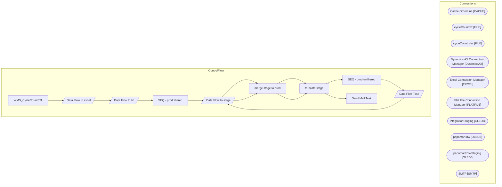

# SSIS Package: WMS_CycleCountETL

**Project:** WMS_CycleCountETL  
**Folder:** WMS  

## Architecture Diagram

## Connection Managers

| Connection Name | Type |
|---|---|
| Cache OrderLine | CACHE |
| cycleCount.txt | FILE |
| cycleCount.xlsx | FILE |
| Dynamics AX Connection Manager | DynamicsAX |
| Excel Connection Manager | EXCEL |
| Flat File Connection Manager | FLATFILE |
| IntegrationStaging | OLEDB |
| papamart.dw | OLEDB |
| papamart.DWStaging | OLEDB |
| SMTP | SMTP |

## Control Flow Tasks

| Task Name | Type |
|---|---|
| WMS_CycleCountETL | Microsoft.Package |
| Data Flow to excel | Microsoft.Pipeline |
| Data Flow to txt | Microsoft.Pipeline |
| SEQ - prod filtered | STOCK:SEQUENCE |
| Data Flow to stage | Microsoft.Pipeline |
| merge stage to prod | Microsoft.ExecuteSQLTask |
| truncate stage | Microsoft.ExecuteSQLTask |
| SEQ - prod unfiltered | STOCK:SEQUENCE |
| Data Flow Task | Microsoft.Pipeline |
| Data Flow to stage | Microsoft.Pipeline |
| merge stage to prod | Microsoft.ExecuteSQLTask |
| truncate stage | Microsoft.ExecuteSQLTask |
| Send Mail Task | Microsoft.SendMailTask |

## Data Flow: Sources

_No OLE DB data flow sources detected._

## Data Flow: Destinations

| Component | Destination Table |
|---|---|
|  | [dbo].[WMS_cycleCount_stage] |
|  | [dbo].[WMS_cycleCount_stage] |
|  | [dbo].[WMS_cycleCount_stage] |

