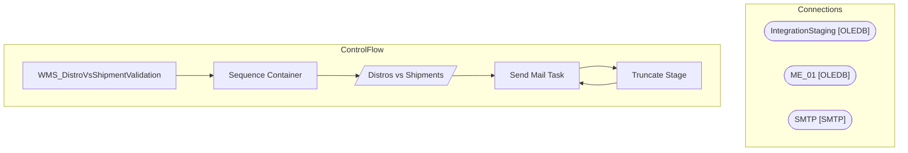

# SSIS Package: WMS_DistroVsShipmentValidation

**Project:** WMS_DistroVsShipmentValidation  
**Folder:** WMS  

## Architecture Diagram

## Connection Managers

| Connection Name | Type |
|---|---|
| IntegrationStaging | OLEDB |
| ME_01 | OLEDB |
| SMTP | SMTP |

## Control Flow Tasks

| Task Name | Type |
|---|---|
| WMS_DistroVsShipmentValidation | Microsoft.Package |
| Sequence Container | STOCK:SEQUENCE |
| Distros vs Shipments | Microsoft.Pipeline |
| Send Mail Task | Microsoft.SendMailTask |
| Truncate Stage | Microsoft.ExecuteSQLTask |
| Send Mail Task | Microsoft.SendMailTask |

## Data Flow: Sources

| Component | Tables Referenced | SQL Preview |
|---|---|---|
|  |  | select  	cast(sh.document_no as varchar) as ShipmentNumber, 	cast(ssd.distribution_no as varchar) as Distro, 	cast(s.style_code as varchar) as Style, cast('YES' as nvarchar(3)) as AptosShipmentDistroItemLogged from store_shipment sh with (nolock) join store_shipment_detail ssd with (nolock) 	on sh.store_shipment_id=ssd.store_shipment_id  join style s with (nolock) on ssd.style_id=s.style_id group  |
|  |  | select  	cast(sh.document_no as varchar) as ShipmentNumber, 	CAST('YES' as nvarchar(3)) as AptosShipmentLogged from store_shipment sh with (nolock) join store_shipment_detail ssd with (nolock) 	on sh.store_shipment_id=ssd.store_shipment_id  join style s with (nolock) on ssd.style_id=s.style_id group by  	sh.document_no |

## Data Flow: Destinations

| Component | Destination Table |
|---|---|
|  | [WMS].[AptosDistrosWithoutShipments] |
|  | [WMS].[vwAptosDistrosVsShipments] |

