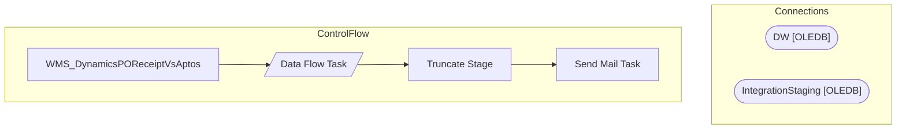

# SSIS Package: WMS_DynamicsPOReceiptVsAptos

**Project:** WMS_DynamicsPOReceiptVsAptos  
**Folder:** WMS  

## Architecture Diagram

## Connection Managers

| Connection Name | Type |
|---|---|
| DW | OLEDB |
| IntegrationStaging | OLEDB |

## Control Flow Tasks

| Task Name | Type |
|---|---|
| WMS_DynamicsPOReceiptVsAptos | Microsoft.Package |
| Data Flow Task | Microsoft.Pipeline |
| Truncate Stage | Microsoft.ExecuteSQLTask |
| Send Mail Task | Microsoft.SendMailTask |

## Data Flow: Sources

| Component | Tables Referenced | SQL Preview |
|---|---|---|
|  |  | select * from WMS.vwDynamicsPOReceiptVarianceVsAptos |

## Data Flow: Destinations

| Component | Destination Table |
|---|---|
|  | [Azure].[DynamicsPOReceiptVariances] |

