# SSIS Package: WMS_DynamicsPurchaseOrderExtract

**Project:** WMS_DynamicsPurchaseOrderExtract  
**Folder:** WMS  

## Architecture Diagram

```mermaid
flowchart TD
    subgraph Connections
        Dynamics_AX_Connection_Manager_conn(["Dynamics AX Connection Manager [DynamicsAX]"])
        IntegrationStaging_conn(["IntegrationStaging [OLEDB]"])
        me_01_conn(["me_01 [OLEDB]"])
        SMTP_conn(["SMTP [SMTP]"])
    end
    subgraph ControlFlow
        WMS_DynamicsPurchaseOrderExtract_task["WMS_DynamicsPurchaseOrderExtract"]
        Merge_PO_Data_task["Merge PO Data"]
        WMS_DynamicsPurchaseOrderExtract_task --> Merge_PO_Data_task
        Merge_PO_Detail_task["Merge PO Detail"]
        Merge_PO_Data_task --> Merge_PO_Detail_task
        Merge_PO_Detail___Service_Items_task["Merge PO Detail - Service Items"]
        Merge_PO_Detail_task --> Merge_PO_Detail___Service_Items_task
        Merge_PO_Header_task["Merge PO Header"]
        Merge_PO_Detail___Service_Items_task --> Merge_PO_Header_task
        Update_Send_Data_task["Update Send Data"]
        Merge_PO_Header_task --> Update_Send_Data_task
        Stage_PO_Data_From_Dynamics_Connector_task["Stage PO Data From Dynamics Connector"]
        Update_Send_Data_task --> Stage_PO_Data_From_Dynamics_Connector_task
        Data_Flow_Task_Research_AX_Data_task[/"Data Flow Task Research AX Data"/]
        Stage_PO_Data_From_Dynamics_Connector_task --> Data_Flow_Task_Research_AX_Data_task
        Load_Dynamics_PO_Header_Data_task[/"Load Dynamics PO Header Data"/]
        Data_Flow_Task_Research_AX_Data_task --> Load_Dynamics_PO_Header_Data_task
        Load_Dynamics_PO_Line_Data_task[/"Load Dynamics PO Line Data"/]
        Load_Dynamics_PO_Header_Data_task --> Load_Dynamics_PO_Line_Data_task
        Load_Factory_Address_task[/"Load Factory Address"/]
        Load_Dynamics_PO_Line_Data_task --> Load_Factory_Address_task
        Set_FactoryAddress_task["Set FactoryAddress"]
        Load_Factory_Address_task --> Set_FactoryAddress_task
        Truncate_Stage_task["Truncate Stage"]
        Set_FactoryAddress_task --> Truncate_Stage_task
        Testing_task["Testing"]
        Truncate_Stage_task --> Testing_task
        Data_Flow_Task_task[/"Data Flow Task"/]
        Testing_task --> Data_Flow_Task_task
        Send_Mail_Task_task["Send Mail Task"]
        Data_Flow_Task_task --> Send_Mail_Task_task
    end
```

## Connection Managers

| Connection Name | Type |
|---|---|
| Dynamics AX Connection Manager | DynamicsAX |
| IntegrationStaging | OLEDB |
| me_01 | OLEDB |
| SMTP | SMTP |

## Control Flow Tasks

| Task Name | Type |
|---|---|
| WMS_DynamicsPurchaseOrderExtract | Microsoft.Package |
| Merge PO Data | STOCK:SEQUENCE |
| Merge PO Detail | Microsoft.ExecuteSQLTask |
| Merge PO Detail - Service Items | Microsoft.ExecuteSQLTask |
| Merge PO Header | Microsoft.ExecuteSQLTask |
| Update Send Data | Microsoft.ExecuteSQLTask |
| Stage PO Data From Dynamics Connector | STOCK:SEQUENCE |
| Data Flow Task Research AX Data | Microsoft.Pipeline |
| Load Dynamics PO Header Data | Microsoft.Pipeline |
| Load Dynamics PO Line Data | Microsoft.Pipeline |
| Load Factory Address | Microsoft.Pipeline |
| Set FactoryAddress | Microsoft.ExecuteSQLTask |
| Truncate Stage | Microsoft.ExecuteSQLTask |
| Testing | STOCK:SEQUENCE |
| Data Flow Task | Microsoft.Pipeline |
| Send Mail Task | Microsoft.SendMailTask |

## Data Flow: Sources

| Component | Tables Referenced | SQL Preview |
|---|---|---|
|  |  | select cast (ProductNumber as varchar) as ProductNumber,  cast (ProductName as varchar) as ProductName from [WMS].[ItemMasterProducts] (nolock)  order by 1 |

## Data Flow: Destinations

| Component | Destination Table |
|---|---|
|  | [WMS].[TestDynamicsPersonnel] |
|  | [WMS].[TestDynamicsPurchaseOrderDetail] |
|  | [WMS].[TestDynamicsPurchaseOrderHeader] |
|  | [WMS].[TestPurchaseOrderConfirmationHeader] |
|  | [WMS].[TestPurchaseOrderConfirmationLine] |
|  | [ERP].[PurchaseOrderHeaderStage] |
|  | [ERP].[PurchaseOrderLinesStage] |
|  | [ERP].[FactoryAddress] |
|  | [dbo].[factory_address] |
|  | [ERP].[PurchaseOrderHeaderStage] |

